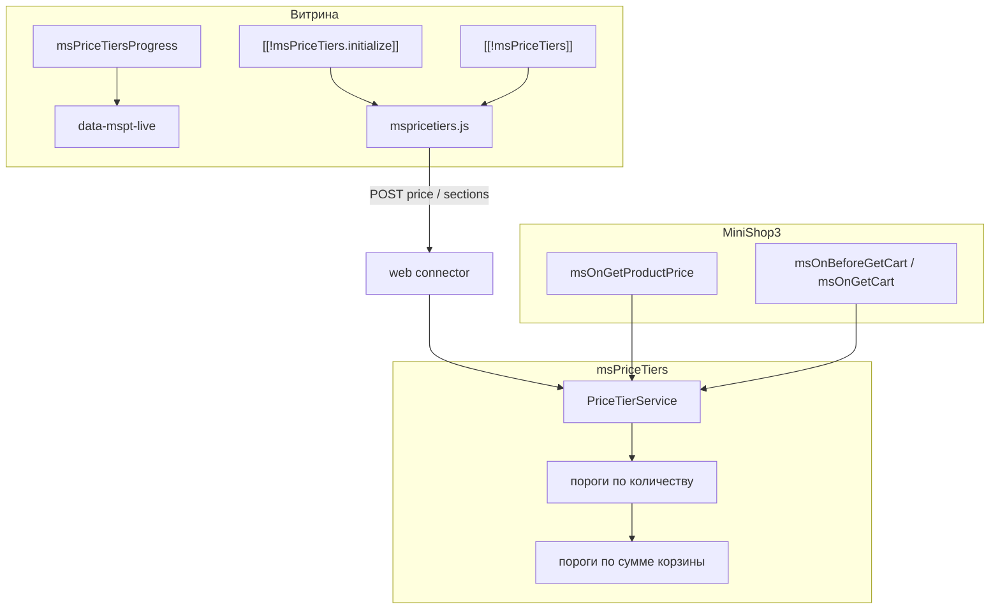

# msPriceTiers

**msPriceTiers** — дополнение для [MODX Revolution 3](https://modx.com/) и [MiniShop3](/components/minishop3/): оптовые цены от количества, наследование от категории, скидки по сумме корзины, интеграция с [ms3Variants](/components/ms3variants/).

Старт: [Быстрый старт](quick-start).

## Минимальный путь на витрине

1. Установите пакет через **ModStore**. Нужны **MiniShop3** и **VueTools** (вкладка в админке).
2. В области **`mspricetiers`** включите компонент и при необходимости ms3Variants.
3. На товаре создайте пороги во вкладке **«Оптовые цены»** (Мини-магазин → Товары).
4. На шаблоне `msProduct` выведите `[[!msPriceTiers.initialize]]` и `[[!msPriceTiers]]`.
5. **Очистите кэш**. Смена количества пересчитывает цену на карточке; в корзине применяется цена по порогу.

## Быстрые ссылки

| Нужно | Документ |
| --- | --- |
| Установить и вывести таблицу порогов | [Быстрый старт](quick-start) |
| Все ключи `mspricetiers_*` | [Системные настройки](settings) |
| Сниппеты и параметры | [Сниппеты](snippets/index) |
| CSS-классы, JS API, `data-mspt-live` | [Подключение на сайте](frontend) |
| Шаблон товара, корзина, пороги по сумме | [Интеграция](integration) |
| Вкладка MS3, Extras → msPriceTiers, массовые операции | [Управление порогами](manager) |
| connector, сервис PHP | [AJAX API и PHP](api) |
| `mspricetiersOn*` | [События MODX](events) |
| Диагностика | [FAQ](faq) |

## Возможности

- **Пороги товара** — скидка **%** или **фикс. цена ₽** от `count_from`
- **Пороги категории** — только **процент** от базовой цены; товары без своих порогов наследуют сетку категории
- **Пороги по сумме корзины** — скидка от общей суммы заказа
- **Корзина MS3** — пересчёт при добавлении и изменении позиций: сначала пороги по количеству, затем по сумме корзины
- **Шаблоны порогов** — сохранение сетки, применение к товару/категории (`merge` / `replace`)
- **Массовые операции в админке** — импорт CSV, копирование порогов, поиск и замена, применение шаблона к товарам
- **Группы пользователей** — поле `user_group` (JSON ID групп MODX)
- **Временные акции** — `valid_from` / `valid_until`
- **Прогресс-бар** — до следующего порога на товаре, в корзине и по сумме корзины
- **ms3Variants** — базовая цена от выбранного варианта
- **Админка** — вкладки на товаре и категории, раздел **Extras → msPriceTiers**, Vue + PrimeVue

## Системные требования

| Требование | Версия |
|------------|--------|
| MODX Revolution | 3.0+ |
| PHP | 8.2+ |
| MiniShop3 | 1.0+ |
| pdoTools | 3.0+ (Fenom-чанки через Fetch) |
| VueTools | вкладки MiniShop3 в админке |

### Зависимости

- **[MiniShop3](/components/minishop3/)** — товары, корзина, цены

### ms3Variants и VueTools

- **[ms3Variants](/components/ms3variants/)** — варианты и цена варианта как база для порогов (`mspricetiers_integrate_ms3variants`)
- **[VueTools](https://modstore.pro/)** — без него Vue-вкладки MS3 не загрузятся

## Установка

1. [Подключите репозиторий ModStore](https://modstore.pro/info/connection).
2. **Extras → Installer** → **Download Extras** — **msPriceTiers** → **Download** → **Install**.
3. Установите **MiniShop3** и **VueTools**, если ещё не установлены.
4. Настройте область **`mspricetiers`** в системных настройках.
5. **Настройки → Очистить кэш**.

Каталог: [modstore.pro/packages/ecommerce/mspricetiers](https://modstore.pro/packages/ecommerce/mspricetiers).

После установки: namespace `mspricetiers`, сниппеты `msPriceTiers`, `msPriceTiers.initialize`, `msPriceTiersProgress`, чанки `mspricetiers_*`, плагины Bootstrap/Events/Product Tab/Category Tab, таблицы порогов товара, категории и корзины, шаблоны.

## Термины

| Термин | Описание |
|--------|----------|
| **Порог (tier)** | Правило: от N штук — цена или скидка |
| **Порог товара** | На товаре: **скидка %** или **фикс. цена ₽** |
| **Порог категории** | На категории: только **скидка %** от базовой цены MS3 |
| **Порог по сумме корзины** | Скидка от общей суммы заказа (настраивается в Extras → msPriceTiers) |
| **Каскад** | Пороги товара → пороги категории → базовая цена MS3 / варианта; в корзине: количество, затем сумма |
| **Шаблон** | Сохранённая сетка порогов; на витрину попадает после применения к товару/категории |
| **merge / replace** | Добавить пороги из шаблона или полностью заменить текущие |

Зачёркнутая **old_price** на витрине берётся из карточки товара или варианта MS3, не из формы порога.

## Архитектура (кратко)

Подробнее: [Подключение на сайте](frontend), [AJAX API](api), [Управление порогами](manager).
