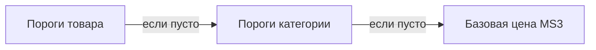

# Управление порогами

Интерфейс в **Мини-магазин → Товары** и **Категории**: вкладка **«Оптовые цены»** (Vue + PrimeVue, как нативные вкладки MS3).

## Требования

- Установлен **msPriceTiers**
- Установлен **VueTools** (иначе нет `importmap` и Vue-вкладок MS3)
- После обновления пакета — **жёсткое обновление** страницы (Cmd+Shift+R) и **Очистить кэш**

## Вкладка на товаре

**Мини-магазин → Товары** → карточка товара → **Оптовые цены**.

| Поле | Описание |
|------|----------|
| Количество от | Минимум штук для цены (`count_from`) |
| Цена | Цена за единицу на этом пороге |
| Старая цена | Зачёркнутая цена на витрине |
| Порядок | Сортировка (`rank`) |

Дополнительно (Phase 1): группы пользователей, даты действия, флаг активности.

### Правила

- Два порога с одинаковым **Количество от** — **нельзя** (конфликт при merge шаблонов).
- При расчёте выбирается порог с **максимальным** `count_from`, не превышающим заказанное количество.

## Категорийные пороги

**Мини-магазин → Категории** → вкладка **«Оптовые цены»** (после «Товары»).

Товары **без своих активных порогов** наследуют сетку категории.

Исключение: задайте пороги на конкретном товаре — они имеют приоритет над категорией.

## Шаблоны порогов

Шаблон — сохранённая сетка. **Сам по себе на витрину не влияет** — только после применения.

### Создать шаблон

1. Настройте пороги на товаре или категории.
2. **Создать шаблон** / **Создать шаблон из категории** — укажите название.

### Редактировать

Иконка карандаша у **пользовательского** шаблона. Системные (`is_system`) — только применение, без редактирования и удаления.

### Применить шаблон

Кнопка **Применить к товару** / **Применить к категории**. В диалоге — **Заменить текущие пороги**:

| Режим | Поведение |
|-------|-----------|
| **Добавить** (`merge`) | Пороги из шаблона **добавляются**. При совпадении `count_from` — ошибка, операция отменяется |
| **Заменить** (`replace`) | Все пороги цели **удаляются**, затем создаются из шаблона |

Если после нескольких применений порогов «слишком много» — скорее всего использовался режим **Добавить**. Для полной замены включите **Заменить**.

## Диагностика в админке

| Симптом | Решение |
|---------|---------|
| Нет вкладки «Оптовые цены» | Установить VueTools, обновить msPriceTiers |
| Подписи `mspricetiers_*` вместо текста | Очистить кэш, обновить лексикон пакета |
| Vue-ошибки в консоли | `npm run build:mgr` в сборке пакета (для разработчиков extras). На ModStore — обновить пакет |

## См. также

- [Быстрый старт](quick-start)
- [Системные настройки](settings#категории-и-шаблоны)
- [FAQ](faq)
