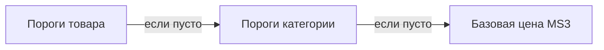

# Управление порогами

Интерфейс в **Мини-магазин → Товары / Категории** (вкладка **«Оптовые цены»**) и **Extras → msPriceTiers** (главная страница компонента). Vue + PrimeVue, как нативные вкладки MS3.

## Требования

- Установлен **msPriceTiers**
- Установлен **VueTools** (иначе нет `importmap` и Vue-вкладок MS3)
- После обновления пакета — **жёсткое обновление** страницы (Cmd+Shift+R) и **Очистить кэш**

## Вкладка на товаре

**Мини-магазин → Товары** → карточка товара → **Оптовые цены**.

Таблица порогов — только просмотр. Создание и правка — в **модальном окне** (**+ Добавить** или ✏️ в строке).

| Поле | Описание |
|------|----------|
| Количество от | Минимум штук (`count_from`) |
| Режим цены | **Скидка %** или **Фикс. цена ₽** |
| Скидка % | При режиме «%» — скидка от базовой цены MS3 / варианта |
| Цена | При режиме «Фикс.» — абсолютная цена за единицу |
| Порядок | Сортировка (`rank`) |
| Группы пользователей | Пусто = для всех; иначе только выбранные группы MODX |
| Действует с / до | Период акции (`YYYY-MM-DD HH:mm:ss`) |
| Активен | Выключите, чтобы скрыть порог без удаления |

**old_price** в форме порога нет. Зачёркнутая цена на витрине — из карточки товара или варианта MS3.

Настройки `mspricetiers_user_groups_enabled` и `mspricetiers_time_based_enabled` влияют на **витрину и корзину**, не на видимость полей в админке.

### Правила

- Два порога с одинаковым **Количество от** — **нельзя** (конфликт при merge шаблонов).
- При расчёте выбирается порог с **максимальным** `count_from`, не превышающим заказанное количество.

## Категорийные пороги

**Мини-магазин → Категории** → вкладка **«Оптовые цены»**.

Только **скидка %** от базовой цены. Товары **без своих активных порогов** наследуют сетку категории.

Пороги на конкретном товаре перекрывают категорию.

## Пороги по сумме корзины

**Extras → msPriceTiers** → вкладка **«Пороги по сумме корзины»**.

Скидка считается от **общей суммы заказа**, не от количества одной позиции. Пример: «от 50 000 ₽ — скидка 5% на весь заказ». Пороги глобальные, без привязки к товару.

Работают при **`mspricetiers_cart_tiers_enabled`** = Да. В корзине применяются **после** порогов по количеству по каждой позиции.

## Массовые операции (Extras → msPriceTiers)

**Extras → msPriceTiers** — пять вкладок:

| Вкладка | Назначение |
|---------|------------|
| Пороги по сумме корзины | Создание и правка глобальных порогов по сумме заказа |
| Применить шаблон | Шаблон → один или несколько товаров (`merge` / `replace`) |
| Копировать пороги | С товара/категории на другие цели |
| Импорт CSV | Массовая загрузка порогов из файла |
| Поиск и замена | Замена значений в существующих порогах |

Массовые операции требуют прав MS3 на редактирование товаров/категорий.

## Шаблоны порогов

Шаблон хранит сохранённую сетку порогов. На витрину попадает только после применения к товару или категории.

### Создать шаблон

1. Настройте пороги на товаре или категории.
2. **Создать шаблон** / **Создать шаблон из категории** — укажите название.

### Редактировать

Иконка карандаша у **пользовательского** шаблона. Системные (`is_system`) — только применение, без редактирования и удаления.

### Применить шаблон

Кнопка **Применить к товару** / **Применить к категории** или вкладка **Применить шаблон** в Extras → msPriceTiers. В диалоге — **Заменить текущие пороги**:

| Режим | Поведение |
|-------|-----------|
| **Добавить** (`merge`) | Пороги из шаблона **добавляются**. При совпадении `count_from` — ошибка, операция отменяется |
| **Заменить** (`replace`) | Все пороги цели **удаляются**, затем создаются из шаблона |

Если после нескольких применений порогов «слишком много» — использовался режим **Добавить**. Для полной замены включите **Заменить**.

## Диагностика в админке

| Симптом | Решение |
|---------|---------|
| Нет вкладки «Оптовые цены» | Установить VueTools, обновить msPriceTiers |
| Подписи `mspricetiers_*` вместо текста | Очистить кэш, обновить лексикон пакета |
| Vue-ошибки в консоли | Обновить пакет с ModStore |

## См. также

- [Быстрый старт](quick-start)
- [Системные настройки](settings#категории-пороги-по-сумме-и-шаблоны)
- [FAQ](faq)
