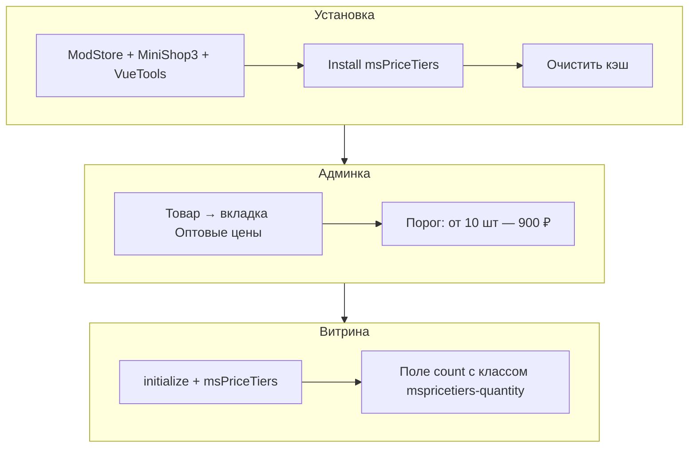

# Быстрый старт

Как за 15 минут включить оптовые цены на странице товара.



## Требования

| Требование | Версия |
|------------|--------|
| MODX Revolution | 3.0+ |
| PHP | 8.2+ |
| MiniShop3 | установлен |
| pdoTools | 3.x (для примеров Fenom) |
| VueTools | для вкладки «Оптовые цены» в MS3 |

## Шаг 1: Установка пакета

1. [Подключите ModStore](https://modstore.pro/info/connection).
2. **Extras → Installer → Download Extras** — **msPriceTiers** → **Download** → **Install**.
3. Убедитесь, что установлены **MiniShop3** и **VueTools**.
4. **Настройки → Очистить кэш**.

Пакет: [msPriceTiers на modstore.pro](https://modstore.pro/packages/ecommerce/mspricetiers).

### После установки

| Элемент | Ожидание |
|---------|----------|
| Сервис `mspricetiers` | В `$modx->services` |
| Сниппеты | `msPriceTiers`, `msPriceTiers.initialize`, `msPriceTiersProgress` |
| Плагин `mspricetiers_events` | Включён, подписка на события MS3 |
| Таблицы | `mspricetiers_product_tier`, шаблоны, категорийные пороги |
| Вкладка на товаре | «Оптовые цены» (при установленном VueTools) |

## Шаг 2: Системные настройки

**Настройки → Системные настройки**, фильтр **`mspricetiers`**.

Минимум для витрины:

| Ключ | Значение |
|------|----------|
| `mspricetiers_enabled` | Да |
| `mspricetiers_apply_on_product_page` | Да |
| `mspricetiers_apply_in_cart` | Да |
| `mspricetiers_integrate_ms3variants` | Да, если используете [ms3Variants](/components/ms3variants/) |

Полный список: [Системные настройки](settings).

## Шаг 3: Пороги в админке

1. **Мини-магазин → Товары** — откройте товар.
2. Вкладка **«Оптовые цены»** → **+ Добавить**.
3. Пример: **Количество от** `10`, **Цена** `900`, **Старая цена** `1000`, **Порядок** `0`.
4. Сохраните.

Подробнее: [Управление порогами](manager).

## Шаг 4: Сниппеты на карточке товара

На шаблоне ресурса **msProduct** (некэшированно):

::: code-group

```fenom
{* Подключение CSS/JS и конфигурации *}
{'!msPriceTiers.initialize' | snippet}

<section class="price-tiers">
  <h3>{'mspricetiers_price_tiers' | lexicon}</h3>
  {'!msPriceTiers' | snippet : ['product' => $_modx->resource.id]}
</section>
```

```modx
[[!msPriceTiers.initialize]]

<section class="price-tiers">
  <h3>[[%mspricetiers_price_tiers]]</h3>
  [[!msPriceTiers?
    &product=`[[*id]]`
  ]]
</section>
```

:::

## Шаг 5: Разметка количества

Чтобы цена пересчитывалась при смене количества, поле должно быть в форме с классами компонента:

::: code-group

```fenom
<form method="post" class="ms3_form mspricetiers-form">
  <input type="hidden" name="id" value="{$_modx->resource.id}">
  <label>Количество</label>
  <input type="number" name="count" class="mspricetiers-quantity" value="1" min="1">
  <button type="submit" name="ms3_action" value="cart/add">В корзину</button>
</form>
```

```modx
<form method="post" class="ms3_form mspricetiers-form">
  <input type="hidden" name="id" value="[[*id]]">
  <label>Количество</label>
  <input type="number" name="count" class="mspricetiers-quantity" value="1" min="1">
  <button type="submit" name="ms3_action" value="cart/add">В корзину</button>
</form>
```

:::

С [ms3Variants](/components/ms3variants/) — форма вариантов на странице (см. [Интеграция](integration#ms3variants)).

## Шаг 6: Проверка

| Действие | Ожидание |
|----------|----------|
| Открыть карточку товара | Таблица порогов видна |
| Увеличить количество до 10+ | Цена на странице меняется |
| Добавить в корзину 10+ шт. | В корзине цена по порогу |
| Вкладка не появилась | Установить VueTools, жёсткое обновление страницы (Cmd+Shift+R) |

Опционально — прогресс-бар:

::: code-group

```fenom
{'!msPriceTiersProgress' | snippet : ['product' => $_modx->resource.id]}
```

```modx
[[!msPriceTiersProgress?
  &product=`[[*id]]`
]]
```

:::

Требует `mspricetiers_progress_bar_enabled` = Да. См. [Сниппет msPriceTiersProgress](snippets/msPriceTiersProgress).

## Дальше

- [Интеграция](integration) — корзина, каталог, категории
- [Подключение на сайте](frontend) — JS API и стили
- [FAQ](faq) — если таблица пустая или цена не меняется
