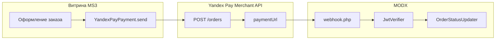

# mspYandexPay

**mspYandexPay** подключает [Яндекс Пэй](https://pay.yandex.ru/) ([Merchant API](https://pay.yandex.ru/docs/ru/custom/backend/merchant-api/)) к [MiniShop3](/components/minishop3/) в MODX Revolution 3.x: создание заказа, редирект на `paymentUrl`, webhook с JWT (ES256 / JWKS) и смена статуса заказа.

Пространство имён настроек: **`mspyandexpay`**. Callback URL: `assets/components/mspyandexpay/webhook.php`.

С чего начать: [Быстрый старт](quick-start). Там же sandbox с тестовыми картами и выход в production.

## Возможности

- **Redirect-оплата**: `YandexPayPayment::send()` вызывает `POST /orders` и возвращает `paymentUrl`.
- **Webhook**: тело JWT, проверка подписи по JWKS sandbox/production, события `ORDER_STATUS_UPDATED` и `OPERATION_STATUS_UPDATED`.
- **Одностадийная схема**: способ «Яндекс Пэй», после `CAPTURED` / `CONFIRMED` заказ становится оплаченным.
- **Двухстадийная схема**: способ «Яндекс Пэй (двухстадийная)», холд `AUTHORIZED`, затем capture/cancel через connector.
- **Сплит**: способ «Яндекс Пэй + Сплит» или глобальные `mspyandexpay_payment_methods` / `preferred_payment_method`.
- **QR**: способ «Яндекс Пэй QR» при `mspyandexpay_qr_enabled`.
- **Возврат**: connector `refund` (полный или частичный), статус после полного возврата из `mspyandexpay_refunded_status_id`.
- **Кнопка на витрине**: сниппет `mspYandexPayButton`.
- **Checkout endpoints**: `checkout/render.php` и `checkout/create.php` для сценария Yandex Checkout (MVP).
- **Sandbox / production**: `mspyandexpay_environment`, по умолчанию `sandbox`.

Фискализацию чеков настраиваете в кабинете Яндекс Пэй или через свой ОФД. Компонент чек 54-ФЗ в Merchant API не собирает.

## Системные требования

| Требование | Версия |
| --- | --- |
| MODX Revolution | 3.0+ |
| PHP | 8.2+ (`curl`, `json`, `openssl`) |
| MiniShop3 | 1.0+ |
| HTTPS | обязателен для webhook и Checkout |

### Зависимости

- [MiniShop3](/components/minishop3/): заказы, способы оплаты, статусы (`ms3_status_paid`, `ms3_status_canceled` и др.).

PHP-зависимости (`vendor/`) входят в пакет. Отдельно запускать Composer на сайте не нужно.

## Регистрация в Яндекс Пэй

Подключите сервис **Яндекс Пэй и Сплит** в [консоли](https://console.pay.yandex.ru/). Скопируйте:

- **Merchant ID** → [`mspyandexpay_merchant_id`](settings)
- **Ключ Merchant API** → [`mspyandexpay_api_key`](settings) (в sandbox совпадает с Merchant ID)

Официально: [регистрация](https://pay.yandex.ru/docs/ru/console/registration), [настройки магазина](https://pay.yandex.ru/docs/ru/console/settings-pay-split), [тестирование](https://pay.yandex.ru/docs/ru/testing).

Подробные шаги sandbox и production: [Быстрый старт](quick-start).

## Установка

1. Установите **MiniShop3**.
2. Установите пакет **mspYandexPay** через **Управление пакетами**.
3. **Очистите кэш** MODX.
4. В **Системные настройки → `mspyandexpay`** задайте [Merchant ID, API Key и среду](settings).
5. В кабинете Яндекс Пэй укажите Callback URL (см. ниже).
6. Проверьте способы оплаты и привязку к доставкам.

Резолвер создаёт четыре `msPayment`:

| Название | Класс | По умолчанию |
| --- | --- | --- |
| Яндекс Пэй | `MspYandexPay\Payment\YandexPayPayment` | active |
| Яндекс Пэй (двухстадийная) | `MspYandexPay\Payment\YandexPayTwoStagePayment` | active |
| Яндекс Пэй + Сплит | `MspYandexPay\Payment\YandexPaySplitPayment` | active |
| Яндекс Пэй QR | `MspYandexPay\Payment\YandexPayQrPayment` | inactive |

При установке и обновлении резолвер линкует активные способы ко всем активным доставкам (`msDeliveryMember`). Если оплаты нет на чекауте: **MiniShop3 → Доставки** → у нужной доставки отметьте способы «Яндекс Пэй*».

Плагин **`mspyandexpay_bootstrap`** на **`OnMODXInit`** подключает автозагрузку `MspYandexPay\`. Плагин должен быть включён.

## Быстрая настройка webhook

В кабинете Яндекс Пэй укажите **Callback URL**:

```text
https://ваш-домен.ru/assets/components/mspyandexpay/webhook.php
```

URL для sandbox и production задаются отдельно (переключатель **Тестовые данные**). Без доступного webhook заказ может остаться неоплаченным после успешной оплаты.

## Архитектура



## Быстрые ссылки

| Нужно | Документ |
| --- | --- |
| Установить и принять первый платёж | [Быстрый старт](quick-start) |
| Все ключи `mspyandexpay_*` | [Системные настройки](settings) |
| Webhook, capture, Split, QR, сниппет | [Интеграция](integration) |
| Webhook 401, sandbox, статусы | [FAQ](faq) |
| Оформление заказа MS3 | [MiniShop3: заказ](/components/minishop3/frontend/order) |

## Документация по разделам

- [Быстрый старт](quick-start): установка, sandbox, Callback URL, тестовая оплата.
- [Системные настройки](settings): таблицы `mspyandexpay_*`, связанные ключи MiniShop3.
- [Интеграция и сценарии](integration): API ↔ код, webhook, двухстадийная, возврат, кнопка, Checkout.
- [FAQ](faq): типовые ошибки и диагностика.

Лицензия пакета: GPLv2 и новее.
