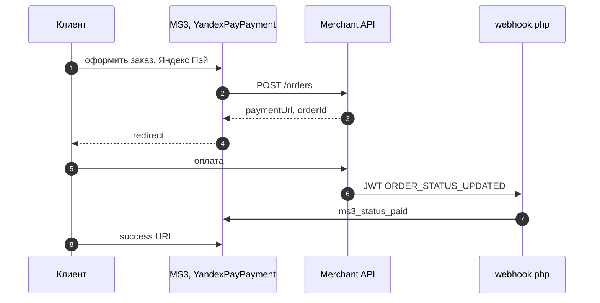
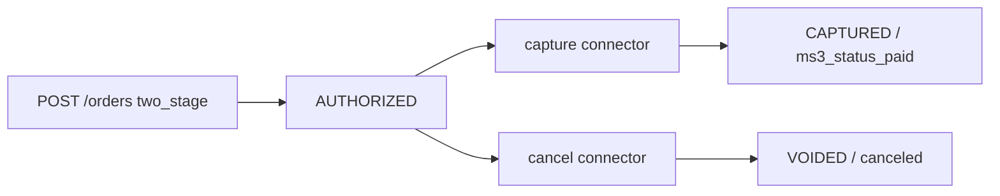

# Интеграция mspYandexPay

Нужны только шаги установки? Откройте [Быстрый старт](quick-start). Ниже сопоставлены методы [Merchant API](https://pay.yandex.ru/docs/ru/custom/backend/merchant-api/) и классы **mspYandexPay** для MiniShop3.

## API ↔ код

| Метод / точка | Класс / файл | Назначение |
| --- | --- | --- |
| `POST /orders` | `YandexPayClient::createOrder()`, `YandexPay*Payment::send()`, `PaymentService` | Создание заказа, получение `paymentUrl` |
| `GET /orders/{id}` | `YandexPayClient::getOrder()` | Статус заказа в API |
| Capture | `YandexPayClient::captureOrder()`, processor `capture` | Списание после `AUTHORIZED` |
| Cancel / VOID | `YandexPayClient::cancelOrder()`, processor `cancel` | Отмена холда |
| Refund (v2) | `YandexPayClient::refundOrder()`, processor `refund` | Полный или частичный возврат |
| Webhook JWT | `webhook.php`, `JwtVerifier`, `WebhookService` | Уведомления, смена статуса MS3 |
| Cash Register / QR | `CashRegisterClient`, `YandexPayQrPayment` | Заказ с `orderSource=QR` |
| Кнопка на сайте | сниппет `mspYandexPayButton`, connector `payment/create` | Создание paymentUrl с витрины |

## Webhook {#webhook}

**URL на сайте:**

```text
https://ваш-домен.ru/assets/components/mspyandexpay/webhook.php
```

Официально: [Webhook Merchant API](https://pay.yandex.ru/docs/ru/custom/backend/merchant-api/webhook).

**Обработка:**

1. Тело запроса — JWT (`Content-Type: application/octet-stream`).
2. `JwtVerifier` проверяет ES256 по JWKS текущей среды и `merchantId` / `exp`.
3. `WebhookService` обрабатывает события и пишет идемпотентность в `msp_yandex_pay_webhook_events` (UNIQUE `event_key`).
4. Повтор того же события → HTTP 200 без повторной смены статуса.

| Событие | Действие |
| --- | --- |
| `ORDER_STATUS_UPDATED` | маппинг `paymentStatus` → статус MS3 |
| `OPERATION_STATUS_UPDATED` + `SUCCESS` | `CAPTURE` → `CAPTURED`, `REFUND` → `REFUNDED`, `VOID`/`CANCEL` → `VOIDED` |

| Статус Yandex | Действие MS3 |
| --- | --- |
| `CAPTURED`, `CONFIRMED` | `ms3_status_paid` |
| `FAILED`, `VOIDED` | `ms3_status_canceled` |
| `REFUNDED` | `mspyandexpay_refunded_status_id` или `ms3_status_canceled` |
| `PENDING`, `AUTHORIZED`, `PARTIALLY_REFUNDED` | без смены статуса |

Заказ **не** помечается оплаченным при получении `paymentUrl`. `AUTHORIZED` (холд) тоже не paid.

IP whitelist не заменяет проверку JWT.

## Поток одностадийной оплаты

1. Покупатель оформляет заказ и выбирает **Яндекс Пэй**.
2. `YandexPayPayment::send()` собирает сумму из `msOrder` (`OrderBuilder`) и вызывает `POST /orders`.
3. Компонент сохраняет транзакцию в `msp_yandex_pay_transactions` и отдаёт redirect на `paymentUrl`.
4. Покупатель платит в форме Яндекс Пэй.
5. Webhook приносит `CAPTURED` / `CONFIRMED`.
6. `OrderStatusUpdater` выставляет **`ms3_status_paid`**.



## Двухстадийная схема {#двухстадийная}

1. В кабинете Яндекс Пэй включите двухстадийные платежи.
2. Используйте способ **«Яндекс Пэй (двухстадийная)»** (`YandexPayTwoStagePayment`).
3. После оплаты webhook приносит **`AUTHORIZED`**. Заказ в MS3 ещё не paid.
4. Спишите или отмените холд через connector (нужна mgr-сессия):

```text
assets/components/mspyandexpay/connector.php?action=capture&order_id=<id>&ctx=mgr
assets/components/mspyandexpay/connector.php?action=cancel&order_id=<id>&reason=...&ctx=mgr
```

Опционально передайте `amount` для partial capture. Финальный статус также приходит webhook’ом (`CAPTURE` / `VOID`).



## Возврат {#возврат}

После `CAPTURED` / `CONFIRMED` (и при `PARTIALLY_REFUNDED` для следующего частичного):

```text
assets/components/mspyandexpay/connector.php?action=refund&order_id=<id>&ctx=mgr
assets/components/mspyandexpay/connector.php?action=refund&order_id=<id>&amount=10.00&ctx=mgr
```

Частичный возврат собирает `targetCart`. Полный — статус из `mspyandexpay_refunded_status_id`.

## Split

- Глобально: `mspyandexpay_payment_methods=CARD,SPLIT` (или только `SPLIT`) и при необходимости `preferred_payment_method=SPLIT`.
- Или способ **«Яндекс Пэй + Сплит»**: методы `CARD`+`SPLIT`, preferred `SPLIT`.
- `mspyandexpay_is_prepayment=false` типичен для оплаты при получении.

## QR / Cash Register

1. Включите `mspyandexpay_qr_enabled`.
2. Активируйте способ **«Яндекс Пэй QR»** и привяжите к доставкам.
3. `YandexPayQrPayment::send()` создаёт заказ с `orderSource=QR` и channel в metadata.

## Кнопка на витрине

Сниппет **`mspYandexPayButton`** регистрирует `button.js` и кнопку, которая дергает connector `payment/create` и редиректит на `paymentUrl`.

Параметры:

| Параметр | Описание |
| --- | --- |
| `order_id` | ID заказа MS3. Если пусто, берётся `msorder.id` или заказ по `?msorder=<uuid>`. |
| `text` | Текст кнопки (по умолчанию «Оплатить Яндекс Пэй»). |
| `class` | CSS-класс (по умолчанию `ms3yp-button`). |

::: code-group

```fenom
{'!mspYandexPayButton' | snippet : [
    'order_id' => $id,
    'text' => 'Оплатить Яндекс Пэй',
]}
```

```modx
[[!mspYandexPayButton?
  &order_id=`[[+id]]`
  &text=`Оплатить Яндекс Пэй`
]]
```

:::

Показывайте кнопку только для заказов, которые ещё нужно оплатить. Повторный `send` при существующей транзакции переиспользует `payment_url` (idempotency).

## Checkout (MVP)

Endpoints для сценария Yandex Checkout по уже существующему заказу MS3 (`ms3-{id}` / `cart.externalId`):

```text
https://ваш-домен.ru/assets/components/mspyandexpay/checkout/render.php
https://ваш-домен.ru/assets/components/mspyandexpay/checkout/create.php
```

Авторизация: JWT в `Authorization: Bearer …`. Полная доставка Yandex Logistics в пакет не входит.

## Хранение транзакций

| Таблица | Назначение |
| --- | --- |
| `{prefix}msp_yandex_pay_transactions` | order_id, UNIQUE yandex_order_id, payment_url, статусы, сумма, environment |
| `{prefix}msp_yandex_pay_webhook_events` | идемпотентность webhook (UNIQUE `event_key`) |

В `msOrder.properties` пишутся `yandex_pay_order_id`, `yandex_pay_payment_url`, статусы после webhook / операций.

## Безопасность

- JWT обязателен. IP whitelist не заменяет подпись.
- Сумма заказа берётся с сервера из `msOrder`, не из request покупателя.
- API key не попадает во frontend и маскируется в логах.
- Capture / cancel / refund через connector требуют сессию mgr.
- Default environment — sandbox.

## Ограничения

- Фискализация чеков настраивается в кабинете Yandex или своим ОФД, не в payload компонента.
- Two-stage и часть sandbox-сценариев могут требовать включения у поддержки Yandex.
- Checkout — MVP без логистики Yandex.
- Ядро MiniShop3 пакет не меняет.

## Что дальше

- [Системные настройки](settings)
- [FAQ](faq)
- Официально: [план интеграции](https://pay.yandex.ru/docs/ru/custom/integration-guide), [фискализация](https://pay.yandex.ru/docs/ru/fiscalization)
