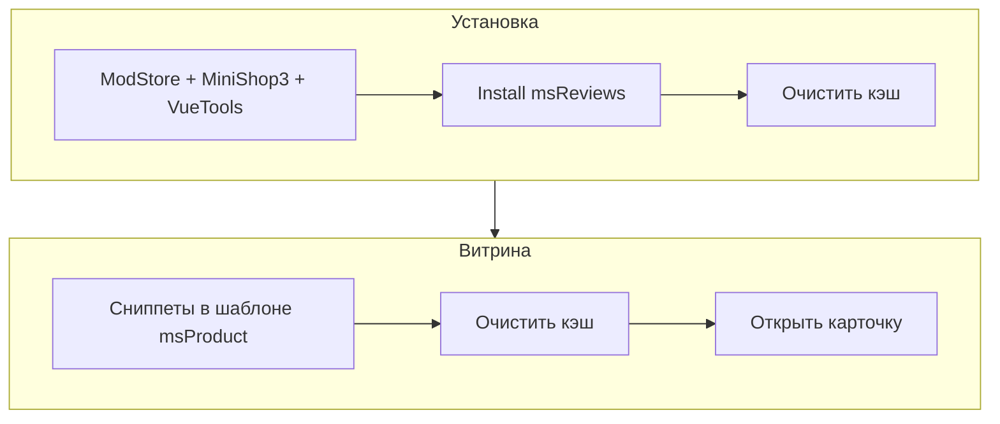

# Быстрый старт

За несколько минут выведете на карточке сводку рейтинга, список отзывов, форму и JSON-LD.



## Требования

| Требование | Версия |
| --- | --- |
| MODX Revolution | 3.0.3+ |
| PHP | 8.2+ |
| MiniShop3 | установлен |
| VueTools | 1.1.2+ (для CMP) |
| pdoTools | 3.x (для примеров Fenom) |

## Шаг 1: Установка пакета

1. [Подключите ModStore](https://modstore.pro/info/connection).
2. **Extras → Installer → Download Extras** — **msReviews** → **Download** → **Install**.
3. Убедитесь, что установлен **MiniShop3**.
4. **Настройки → Очистить кэш**.

Пакет: [msReviews на modstore.pro](https://modstore.pro/packages/ecommerce/msreviews).

### После установки

| Элемент | Ожидание |
| --- | --- |
| Сниппеты | 17 сниппетов витрины (см. [обзор](snippets/index)) |
| Чанки | `tplReviewItem`, `tplReviewForm`, `tplRatingSummary` и др. |
| Плагины | **msReviews Order status**, **msReviews Product resource tab**, **msReviews Storefront cache** — включены |
| CMP | **Extras → msReviews** (Vue 3) |
| Таблицы | `msreviews_reviews`, `msreviews_aggregate`, … |

<!--  -->

## Шаг 2: Блок на карточке товара

В шаблоне **msProduct** некэшированные вызовы. `product_id` — id ресурса страницы.

::: code-group

```fenom
{'!msReviewsLexiconScript' | snippet}
{'!msRatingSummary' | snippet : ['product_id' => $_modx->resource.id]}
{'!msReviews' | snippet : ['product_id' => $_modx->resource.id, 'showStats' => 0]}
{'!msReviewForm' | snippet : ['product_id' => $_modx->resource.id]}
<div class="msreviews-qna-stack">
  {'!msQuestionForm' | snippet : ['product_id' => $_modx->resource.id, 'showHeading' => 0]}
  {'!msQuestions' | snippet : ['product_id' => $_modx->resource.id]}
</div>
{raw ('!msReviewSchema' | snippet : ['product_id' => $_modx->resource.id])}
```

```modx
[[!msReviewsLexiconScript]]
[[!msRatingSummary? &product_id=`[[*id]]`]]
[[!msReviews? &product_id=`[[*id]]` &showStats=`0`]]
[[!msReviewForm? &product_id=`[[*id]]`]]
<div class="msreviews-qna-stack">
[[!msQuestionForm? &product_id=`[[*id]]` &showHeading=`0`]]
[[!msQuestions? &product_id=`[[*id]]`]]
</div>
[[!msReviewSchema? &product_id=`[[*id]]`]]
```

:::

Порядок вызовов и альтернативы (`msReviewsHub`, вкладки): [Страница товара](frontend/product).

<!--  -->

### Fenom и JSON-LD

При `auto_escape` оборачивайте `msReviewSchema` в `{raw (...)}`, иначе тег `<script type="application/ld+json">` экранируется.

Перед формами нужен **`msReviewsLexiconScript`** — переводы для JS (`window.msrLexicon`).

## Шаг 3: Системные настройки

Минимум для старта:

| Ключ | Рекомендация |
| --- | --- |
| `msreviews_request_order_statuses` | ID статусов MS3 для письма «оставьте отзыв» |
| `msreviews_cron_key` | Секрет для cron-обработки очереди писем |
| `msreviews_auto_publish_verified` | `1`, если verified-отзывы публикуются сразу |
| `msreviews_auto_publish_guest` | `0`, если гостевые отзывы идут на модерацию |

Полный справочник: [Системные настройки](settings).

## Шаг 4: Очередь писем (cron)

Плагин **msReviews Order status** ставит записи в очередь при смене статуса заказа. Отправка:

- кнопка **Обработать очередь** во вкладке **Операции** CMP;
- или cron по URL:

```text
https://ваш-сайт/assets/components/msreviews/connector.php?action=request/process&key=ВАШ_msreviews_cron_key
```

Ключ задаётся в **`msreviews_cron_key`**. Пустой ключ — запрос вернёт 403.

## Шаг 5: Проверка

1. **Настройки → Очистить кэш**.
2. Откройте карточку товара: сводка, форма, список (если есть опубликованные отзывы).
3. Отправьте тестовый отзыв — проверьте **Extras → msReviews → Отзывы**.
4. На ресурсе товара — вкладка **Отзывы** (read-only сводка).

## Дальше

- [Интеграция](integration) — каталог, главная, фильтры, pdoPage
- [Сниппеты](snippets/index) — параметры каждого вызова
- [Админка](manager) — модерация и импорт CSV
