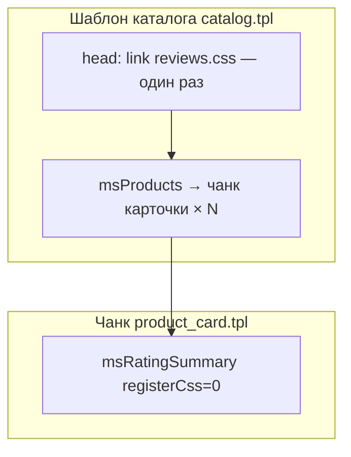

# Сниппет msRatingSummary

Выводит HTML-сводку рейтинга: средняя оценка, число отзывов, разбивка по звёздам (режим `full`) или компактная строка ★ 4.4 (32) (режим `aggregate`).

## Назначение

- **Страница товара** — полная сводка над списком отзывов (`summaryMode=full`, чанк `tplRatingSummary`).
- **Каталог** — одна строка в карточке товара (`summaryMode=aggregate`, чанк `tplRatingCatalog`).

## Где вызывать

| Место | Режим | Чанк |
| --- | --- | --- |
| Шаблон `msProduct` | `full` | `tplRatingSummary` (по умолчанию) |
| Чанк карточки в `msProducts` | `aggregate` | `tplRatingCatalog` |

## Зависимости

- **MiniShop3**, **msReviews**
- Агрегат рейтинга из БД msReviews (не требует pdoTools)

## Параметры

| Параметр | По умолчанию | Описание |
| --- | --- | --- |
| `product_id` | id текущего ресурса | ID товара MS3. При `product_id < 1` — пустой вывод |
| `tpl` | `tplRatingSummary` | Чанк вывода. В каталоге: `tplRatingCatalog` |
| `summaryMode` | `full` | `full` — полная сводка; `aggregate` — только средняя и count |
| `hideEmpty` | `0` | `1` — не выводить при нуле отзывов |
| `registerCss` | `1` | `0` — не подключать `reviews.css` повторно. См. [Подключение reviews.css](#подключение-reviewscss) |
| `connectorUrl` | auto | URL `connector.php` (редко нужен override) |

## Подключение reviews.css

Файл стилей: `assets/components/msreviews/css/reviews.css`.

На **карточке товара** (`msProduct`) сниппет подключает CSS сам.

В **каталоге** (`msProducts`) карточка вызывается много раз. Два варианта:

### Вариант A — автоматически (по умолчанию)

Не передавайте `registerCss` или оставьте `registerCss=1`. CSS подключится, когда у первого товара с отзывами появится рейтинг. Повторно в сетке файл не грузится.

### Вариант B — `<link>` в шаблоне каталога

**Шаблон страницы каталога** (не чанк карточки), один раз в `<head>`:

::: code-group

```fenom
<link rel="stylesheet" href="{$_modx->getOption('assets_url')}components/msreviews/css/reviews.css">
```

```modx
<link rel="stylesheet" href="[[++assets_url]]components/msreviews/css/reviews.css">
```

:::

**Чанк карточки** — с `registerCss=0` (см. пример «Компактная строка в каталоге» ниже).

Полное описание с третьим способом (`regClientCSS`): [Каталог — подключение reviews.css](../frontend/catalog#подключение-reviewscss-в-каталоге).



## Полная сводка на странице товара

::: code-group

```fenom
{'!msRatingSummary' | snippet : ['product_id' => $_modx->resource.id]}
```

```modx
[[!msRatingSummary? &product_id=`[[*id]]`]]
```

:::

## Компактная строка в каталоге

### Без `<link>` в шаблоне

::: code-group

```fenom
{'!msRatingSummary' | snippet : [
  'product_id' => $id,
  'tpl' => 'tplRatingCatalog',
  'summaryMode' => 'aggregate',
  'hideEmpty' => 1
]}
```

```modx
[[!msRatingSummary?
  &product_id=`[[+id]]`
  &tpl=`tplRatingCatalog`
  &summaryMode=`aggregate`
  &hideEmpty=`1`
]]
```

:::

### CSS уже в шаблоне каталога (`registerCss=0`)

Используйте, если в `catalog.tpl` добавили `<link>` на `reviews.css` (см. [Подключение reviews.css](#подключение-reviewscss)).

::: code-group

```fenom
{'!msRatingSummary' | snippet : [
  'product_id' => $id,
  'tpl' => 'tplRatingCatalog',
  'summaryMode' => 'aggregate',
  'hideEmpty' => 1,
  'registerCss' => 0
]}
```

```modx
[[!msRatingSummary?
  &product_id=`[[+id]]`
  &tpl=`tplRatingCatalog`
  &summaryMode=`aggregate`
  &hideEmpty=`1`
  &registerCss=`0`
]]
```

:::

## hideEmpty в листинге

При `hideEmpty=1` карточка без отзывов не показывает пустую строку рейтинга:

::: code-group

```fenom
{'!msRatingSummary' | snippet : [
  'product_id' => $id,
  'summaryMode' => 'aggregate',
  'hideEmpty' => 1
]}
```

```modx
[[!msRatingSummary?
  &product_id=`[[+id]]`
  &summaryMode=`aggregate`
  &hideEmpty=`1`
]]
```

:::

## Связь со списком отзывов

Если над списком стоит `msRatingSummary`, передайте в [msReviews](msReviews) **`showStats=0`**, чтобы не дублировать строку verified / медиа / ответ / рекомендуют.

## См. также

- [msRatingBadge](msRatingBadge) — ещё компактнее для каталога
- [Чанки — tplRatingCatalog](../chunks)
- [Каталог товаров](../frontend/catalog)
- [Интеграция](../integration)
