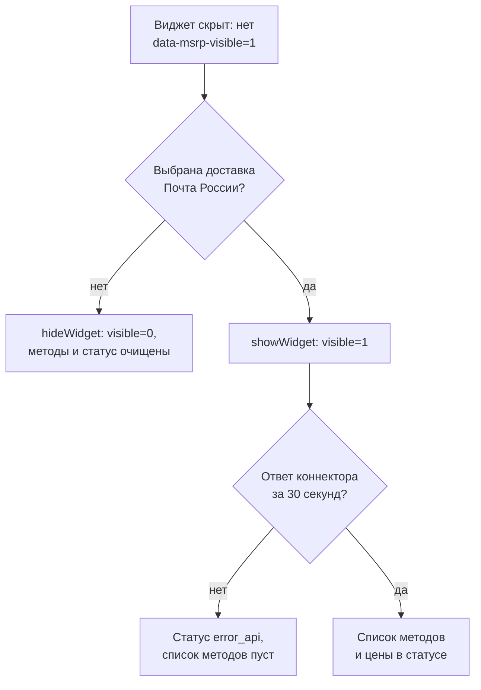
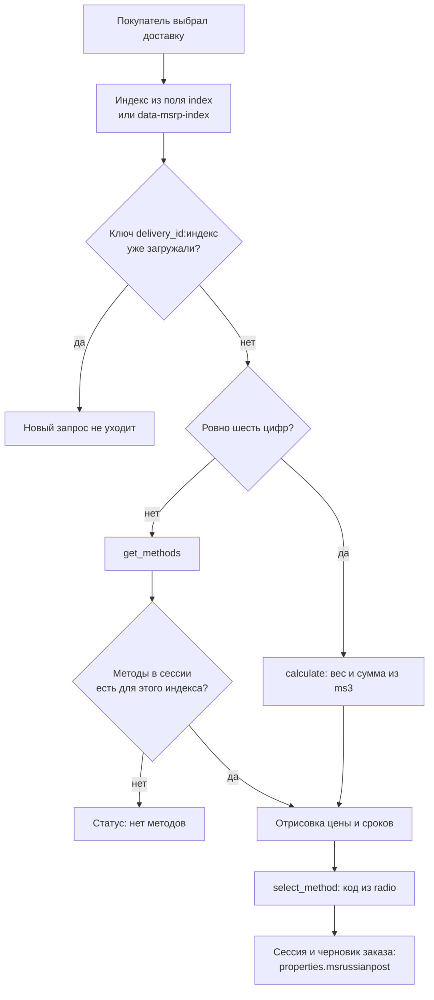

# Подключение на сайте

Порядок подключения лексикона, сниппета и чанков описан в разделе [Быстрый старт](quick-start). Ниже — коннектор, чанки и проверка интеграции.

## Проверка интеграции

### Чек-лист

- В чанке заказа есть обёртка `msrp__wrapper` или `[data-msrp-widget]` **один раз** на страницу. Скрипт привязывается к **первому** такому корню в порядке DOM и ищет `.msrp__status` и `.msrp__methods` **только внутри него**.
- **Не** оборачивайте чанки `tplRussianPostStatus` и `tplRussianPostMethods` во внешние `<div class="msrp__status">` / `<div class="msrp__methods">` — эти классы уже внутри чанков. Иначе получится вложенность и возможны пустой блок и «залипший» индикатор загрузки.
- Если внутри обёртки случайно оказалось **несколько** блоков `.msrp__status` или `.msrp__methods`, скрипт берёт **последний** из них в порядке DOM (обычно это разметка из чанка). Корнем при этом остаётся **первый** `.msrp__wrapper` / `[data-msrp-widget]`.
- Вызовы идут в порядке: **`msrpLexiconScript`** → **`msRussianPost`** → чанки (сниппет уже подключает `russianpost.css` и `russianpost.js`). Без лексикона виджет показывает посетителю имена ключей, поэтому `msrpLexiconScript` на витрине обязателен.
- В MiniShop3 создана доставка с классом `msrussianpost\Delivery\RussianPostDelivery`, в настройках указан корректный **`delivery_id`** (или настроен авто-режим осознанно).
- Поле индекса доступно под именем `index`, `order[data][index]` или задан **`indexSelector`** в сниппете.
- Радио/селект доставки используют имена `delivery_id`, `delivery`, `order[data][delivery_id]`, `order[data][delivery]` — виджет отслеживает выбор.

Если форма заказа подгружается AJAX’ом после `russianpost.js`, скрипт повторяет попытки: привязка хука **`ms3Hooks.afterAddOrder`** повторяется через 300 мс и на событии `window.load`, а проверка выбранной доставки и загрузка данных идут на таймерах 0, 200 и 600 мс. Хук срабатывает и на ключ **`city`** в дополнение к полям индекса.

После инициализации в браузере доступен глобальный объект **`window.msRussianPost`**: например **`recalculate()`**, **`selectMethod(code)`**, **`loadCachedMethods()`**, **`getLexicon(key)`** — для кастомных сценариев и принудительного пересчёта.

Повторный пересчёт в рамках одной страницы скрипт отсекает по ключу `delivery_id:индекс`: если доставка и индекс не менялись, `runWidgetDataLoad` не делает новый запрос.

## Работа без JavaScript {#no-js}

Блок не просто «не обновляется» без скрипта, а полностью скрыт. В `russianpost.css` первые строки файла:

```css
.msrp__wrapper:not([data-msrp-visible='1']),
[data-msrp-widget]:not([data-msrp-visible='1']) {
  display: none;
}
```

Атрибут `data-msrp-visible` выставляет только JavaScript: `showWidget()` ставит `data-msrp-visible="1"` и дополнительно `style.display = 'block'` (явное значение нужно, потому что `removeProperty` не снимет `display: none` из CSS темы), `hideWidget()` ставит `data-msrp-visible="0"` и `style.display = 'none'`.

Отсюда два следствия:

- у посетителя с отключённым JavaScript (или при ошибке в скрипте) виджет не виден вообще, хотя разметка чанков лежит в HTML;
- поисковик, который выполняет JavaScript, увидит блок после инициализации, а тот, кто не выполняет, проиндексирует только исходную разметку чанков.

Значение `data-msrp-visible="0"` ставит `hideWidget()` — это выбранная доставка не «Почта России» либо `deliveryIds` пуст при источнике не `any`. В этом случае скрипт дополнительно чистит список методов и обнуляет текст статуса, чтобы при возврате к доставке Почты России не показывался устаревший расчёт.

Ошибка запроса — не то же самое, что скрытие: при недоступном `connector.php`, неуспешном ответе или таймауте в 30 секунд виджет остаётся видимым, но с текстом ошибки и пустым списком методов.



::: warning Без сниппета msrpLexiconScript
Правило скрытия работает независимо от лексикона, но без него показанный блок говорит посетителю именами ключей (`msrussianpost_error_api`). Подробности — в разделе [Почему сниппет обязателен](snippets/msrpLexiconScript#why-required).
:::

## Автокомплит адреса и индекс (mxDadata) {#mxdadata}

В **msRussianPost** нет встроенных подсказок DaData: только расчёт тарифов и виджет методов. Чтобы покупатель вводил адрес с подсказками и чтобы подставлялся **индекс** (и связанные поля), установите пакет **[mxDadata](/components/mxdadata/)** для MiniShop3, получите токен в [личном кабинете DaData](https://dadata.ru/profile/) и укажите его в **системных настройках mxDadata** — см. [документацию mxDadata](/components/mxdadata/quick-start).

**Порядок на странице заказа:**

1. Поля адреса заказа (как в вашей вёрстке MiniShop3).
2. Сниппет **`[[!mxDadataAddressSuggest]]`** (или эквивалент в Fenom) — **до** лексикона и виджета Почты России.
3. **`msrpLexiconScript`** → **`msRussianPost`** → чанки `tplRussianPostStatus` и `tplRussianPostMethods`.

Так **`window.msRussianPostConfig`** окажется на странице **до** загрузки `russianpost.js`, а после выбора подсказки адреса mxDadata отправит данные в заказ и сгенерирует на `document` событие **`mxdadata:order-address-updated`**. Скрипт **msRussianPost** на него подписан: при активной доставке «Почта России» вызывается **`recalculate()`**, потому что после **`order/set`** хук **`ms3Hooks.afterAddOrder`** иногда не срабатывает.

Имена полей формы и вложенность должны совпадать с ожиданиями **mxDadata** и MiniShop3 — таблицы имён и порядок подключения см. в [Подключение на сайте (mxDadata)](/components/mxdadata/frontend). Техническая связка с хуками MS3 — в разделе [Интеграция с хуками MiniShop3](integration#интеграция-с-хуками-minishop3).

## Коннектор

**URL:** `assets/components/msrussianpost/connector.php` (в конфигурацию для JS попадает абсолютный URL-адрес сайта).

Запросы идут методом **POST** (AJAX из `russianpost.js`), тело — `application/x-www-form-urlencoded`, куки отправляются как `same-origin`. Контракт задан непосредственно в `assets/components/msrussianpost/connector.php`: каталога процессоров в пакете нет.

### Фронтовые действия

| `action` | Когда вызывает `russianpost.js` | Параметры | Ответ |
|----------|-------------------------------|-----------|-------|
| `calculate` | `recalculate()` — при шестизначном индексе | `index` (или `zip` как альтернативное имя) | `{"success":true,"data":[…],"selected":"<код>"}` |
| `get_methods` | `loadCachedMethods()` — при неполном индексе, чтобы показать ранее рассчитанные методы | `index` (или `zip`) | `{"success":true,"selected":"<код>","data":[…]}` |
| `select_method` | `selectMethod(code)` — после выбора метода | `code` | `{"success":true}` |

`calculate` берёт вес и стоимость корзины из MiniShop3, а если сервис `ms3` недоступен — вес из настройки `msrussianpost_default_weight`. Рассчитанные методы он кладёт в сессию, откуда их читает `get_methods`.

`select_method` сохраняет код в сессию и, если в куках есть `ms3_token` (имя берётся из настройки `ms3_token_name`), сразу дописывает `properties.msrussianpost.object_code` и `properties.msrussianpost.method_label` в черновик заказа.

Полный путь расчёта на витрине — от смены доставки до кода в заказе:



Два момента, из-за которых схема не линейная. Первый: `runWidgetDataLoad` отсекает повтор по ключу `delivery_id:индекс`, поэтому хук `afterAddOrder` и таймеры `0, 200, 600 мс` не превращаются в пачку одинаковых запросов. Второй: `get_methods` не пересчитывает тариф, а читает сессию от последнего `calculate` и отдаёт пустой список, если шестизначный индекс не совпал с тем, что был в расчёте, — при неполном индексе это и есть ожидаемый ответ. Отдельно отмечу, что `select_method` вызывается без клика покупателем: `renderMethods` берёт отмеченный radio, а если отметки нет, единственный метод в списке.

### Поля метода в ответе

Оба действия `calculate` и `get_methods` возвращают в `data` массив объектов с одинаковым набором полей:

| Поле | Тип | Как используется |
|------|-----|------------------|
| `code` | строка | значение `radio` в группе `msrp_method`, передаётся в `select_method` |
| `name` | строка | подпись метода |
| `cost` | число | стоимость в рублях; если `cost_formatted` пуст, рендерится `cost` с двумя знаками |
| `cost_formatted` | строка | готовая строка цены, приоритетнее `cost` |
| `min_days`, `max_days` | число | срок в днях, выводится как `min_days–max_days` |
| `selected` | `true` / `false` | отмечает метод, сохранённый в сессии |

Пример ответа `calculate`:

```json
{
  "success": true,
  "data": [
    {
      "code": "23030",
      "name": "Заказное письмо",
      "cost": 350,
      "cost_formatted": "350 руб.",
      "min_days": 2,
      "max_days": 5,
      "selected": true
    }
  ],
  "selected": "23030"
}
```

### Ошибки

Коннектор не возвращает HTTP-код ошибки, а отдаёт `success: false` с полем `message`:

| `message` | Когда |
|-----------|-------|
| `invalid_index` | индекс не прошёл проверку шести цифр |
| `unknown_action` | неизвестное имя `action` |

Действия `test_calculate`, `get_log`, `clear_log`, `get_dictionary`, `clear_cache`, `get_order_tariff` относятся к панели управления: они требуют авторизации в контексте `mgr` и на витрине не используются.

На стороне JS неуспешный ответ (`success: false` или не-JSON), сетевая ошибка и таймаут в 30 секунд (`AbortController`) дают один результат: в статус ставится лексикон `msrussianpost_error_api`, отправляется событие `msrussianpost:calculated` с пустым списком методов, а сам список методов остаётся пустым. У `get_methods` таймаут обрабатывается мягче: он пишет в консоль, а в статус ставит `msrussianpost_no_methods` (при шестизначном индексе) или `msrussianpost_error_no_index`.

При необходимости переопределите URL через параметр сниппета **`connectorUrl`**.

## Чанки

| Чанк | Назначение |
|------|------------|
| `tplRussianPostStatus` | Блок статуса: загрузка, ошибка, стоимость и сроки (класс `msrp__status`) |
| `tplRussianPostMethods` | Список методов с `radio` `name="msrp_method"` (контейнер `msrp__methods`) |

После расчёта JS обновляет разметку внутри этих контейнеров. Чанки задают начальную структуру и стили.

Поле радио в чанке методов имеет имя `msrp_method`. Если покупатель не кликнул по методу, скрипт всё равно отправляет `select_method`: он берёт отмеченный вариант, а если отметки нет, единственный метод в списке. Если в `.msrp__methods` нет ни одного `.msrp__method-input`, код в заказ не попадёт — это и есть причина «метод на экране есть, а в заказе пусто».

### Плейсхолдеры `tplRussianPostStatus`

| Переменная | Назначение |
|------------|------------|
| `$loading` | Показать состояние «рассчитываем» |
| `$error` | Текст ошибки |
| `$cost` | Отформатированная стоимость |
| `$min_days`, `$max_days` | Срок доставки в днях |

### Плейсхолдеры `tplRussianPostMethods`

Цикл `$methods`: у каждого элемента `code`, `name`, `cost_formatted`, `min_days`, `max_days`, `selected`.

## Стили и BEM

Префикс классов: **`msrp__`** (`msrp__wrapper`, `msrp__method`, `msrp__status`, `msrp__error-message` и т.д.). Файл: `assets/components/msrussianpost/css/russianpost.css`.

Классы `msrp__cost` и `msrp__period` из чанка `tplRussianPostStatus` в `russianpost.css` не описаны: если копируете чанк в свой, задайте им стили сами.

### CSS-переменные

```css
:root {
    --msrp-method-background: #fff;
    --msrp-method-border-color: #e5e7eb;
    --msrp-method-selected-border-color: #2563eb;
    --msrp-error-color: #b91c1c;
    --msrp-loading-color: #64748b;
    --msrp-gap: 1rem;
    --msrp-radius: 0.5rem;
}
```

Переопределите в своём CSS после подключения `russianpost.css`.

Из этих семи переменных в самом `russianpost.css` используются пять: отступы записаны литералами (`0.5rem`, `0.75rem`, `1rem`). Переменная **`--msrp-gap`** ни на что не влияет, но остаётся точкой расширения: задайте её, если хотите управлять отступами через обёртку вида `.msrp__methods { gap: var(--msrp-gap); }`.

## Кастомное поле индекса

Помимо `indexSelector` в сниппете можно пометить поле атрибутом **`data-msrp-index`** — он участвует в автопоиске индекса. Порядок и правила поиска описаны в разделе [Автопоиск поля индекса](snippets/msRussianPost#автопоиск-поля-индекса).
