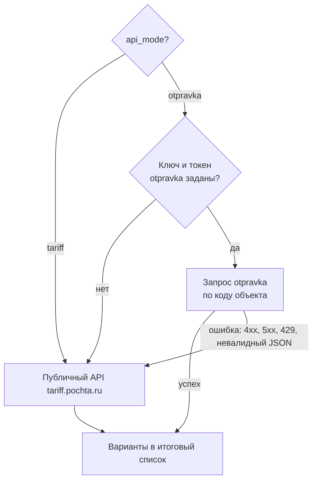
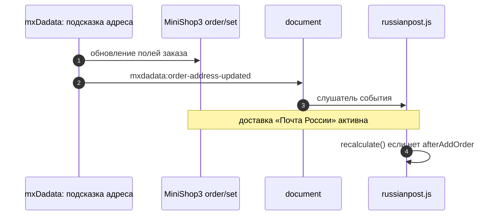

# Интеграция и кастомизация

Расширенные сценарии: режимы API, события в браузере, хуки MiniShop3 и mxDadata, отладка, кастомизация внешнего вида. Раздел **Extras → Почта России** в панели MODX описан на странице [Админка в MODX](admin-ui).

## Режимы API и fallback {#api-fallback}

| Режим (`api_mode`) | Источник тарифов | Когда использовать |
|--------------------|------------------|---------------------|
| `tariff` | `tariff.pochta.ru` | По умолчанию: без регистрации и ключей |
| `otpravka` | `otpravka.pochta.ru` | Договор с Почтой России, персональные тарифы (лимиты объёма отправлений — см. [системные настройки → API](settings#api)) |

Как получить значения для `msrussianpost_otpravka_key` и `msrussianpost_otpravka_token` в личном кабинете Отправки — в разделе [Системные настройки → Где взять ключи для API Отправки](settings#otpravka-credentials).

Логика fallback (упрощённо):

1. В режиме `otpravka`, если токен и ключ пусты, персональный запрос не выполняется — сразу полный расчёт через публичный API.
2. При заданных ключах сначала вызывается otpravka **по каждому коду** объекта. При ошибке (429, 401, 5xx, невалидный JSON) для конкретного кода этот код пропускается и **добирается** через публичный API.
3. В итоговый список методов попадают варианты из успешных ответов API. Покупатель видит максимально полный набор вариантов, пока доступен публичный API.



Подробнее о полях API — в официальной документации Почты России.

## Кастомные DOM-события

Скрипт `russianpost.js` после соответствующих действий генерирует на **`document`** кастомные события:

| Событие | Когда | `detail` (обычно) |
|---------|--------|-------------------|
| `msrussianpost:calculated` | После завершения расчёта списка методов (в т.ч. при ошибке) | объект с данными методов или пустой результат |
| `msrussianpost:method-selected` | После выбора метода покупателем | `{ code }` — код выбранной услуги |

Их можно использовать для аналитики или дополнительной логики интерфейса:

```js
document.addEventListener('msrussianpost:calculated', function (e) {
  console.log('methods', e.detail);
});
```

## Плагины

1. **msRussianPost Autoload** — событие **`OnMODXInit`** (ранний приоритет). Подключает файл с классом доставки, чтобы MiniShop3 мог создать `msrussianpost\Delivery\RussianPostDelivery` без отдельной записи в корневом Composer. Без этого плагина MiniShop3 может писать в лог об ошибке загрузки класса доставки, возвращать стоимость **0** и не вызывать **`msOnGetDeliveryCost`** для расчёта.
2. **msRussianPost Delivery** — событие **`msOnGetDeliveryCost`**. Подставляет в заказ стоимость метода, выбранного в сессии виджета, для доставок с нужным классом. Не отключайте его, если нет собственной реализации расчёта стоимости для этой доставки.
3. **msRussianPost Order tariff** — события **`msOnSubmitOrder`**, **`msOnBeforeCreateOrder`**, **`msOnCreateOrder`**. Сохраняет выбранный покупателем код типа отправления (из сессии виджета и запроса `select_method` к коннектору) в **`ms3_orders.properties`**, чтобы в карточке заказа в менеджере MiniShop3 отображалась строка с названием тарифа (лексикон `ms3_order_russianpost_tariff`). Без этого плагина доставка может считаться корректно, но в менеджере останется только общее имя способа доставки.

После обновления пакета проверьте в **Элементы → Плагины**, что **все три** плагина на месте и **опубликованы** (у **Order tariff** должны быть подписаны все три события). При ручной установке компонента плагины создавайте по образцу из каталога `core/components/msrussianpost/elements/plugins/` в составе пакета.

## Интеграция с хуками MiniShop3

Виджет завязан на **`ms3Hooks`**, в первую очередь на **`afterAddOrder`** при смене индекса, доставки и связанных полей.

Дополнительно **`russianpost.js`** слушает **`mxdadata:order-address-updated`** (пакет **mxDadata**, сниппет **`mxDadataAddressSuggest`**). После выбора подсказки адреса и **`order/set`** у MiniShop3 хук **`afterAddOrder`** может не вызваться. Тогда событие от mxDadata при активной доставке «Почта России» запускает **`recalculate()`**.

Порядок сниппетов на странице и настройка токена DaData — в пользовательском разделе [Подключение на сайте → Автокомплит адреса (mxDadata)](frontend#mxdadata). Имена полей формы — в документации пакета **mxDadata**.

В штатном бандле MiniShop3 виджет также учитывает **`ms3:order:delivery-change`** (в стоковом JS событие может не диспатчиться — детали в исходниках `russianpost.js` и в `developer-guide` репозитория дополнения).

Убедитесь, что на странице заказа подключён основной JS MiniShop3. Если форма кастомная и **`ms3Hooks`** недоступен, пересчёт вызывайте вручную через **`window.msRussianPost.recalculate()`** (см. [Подключение на сайте](frontend)).



## Отладка {#отладка}

1. **Параметр сниппета** `debug` со значением `1` / `true` / `yes`.
2. Или **параметр в URL** страницы: `?msrp_debug=1`.

В консоли браузера появятся расширенные сообщения (в т.ч. если не найдено поле доставки при непустом списке `deliveryIds`).

::: warning Продакшен
Не оставляйте `msrp_debug` и `debug=1` на публичных страницах надолго.
:::

## Копирование чанков

Скопируйте `tplRussianPostStatus` и `tplRussianPostMethods` в чанки с новыми именами и подключите их в шаблоне вместо стандартных: так вы не потеряете правки вёрстки при обновлении пакета (стандартные чанки при обновлении перезаписываются).

## Админка

Описание вкладок, таблиц и кнопок раздела **Extras → Почта России** — на отдельной странице [Админка в MODX](admin-ui).
