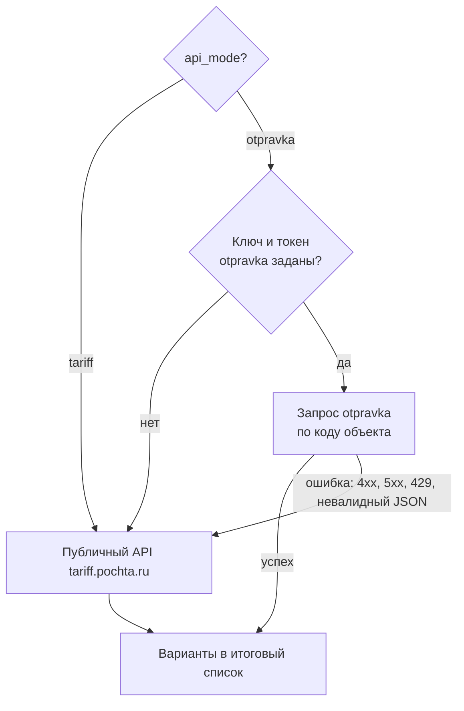
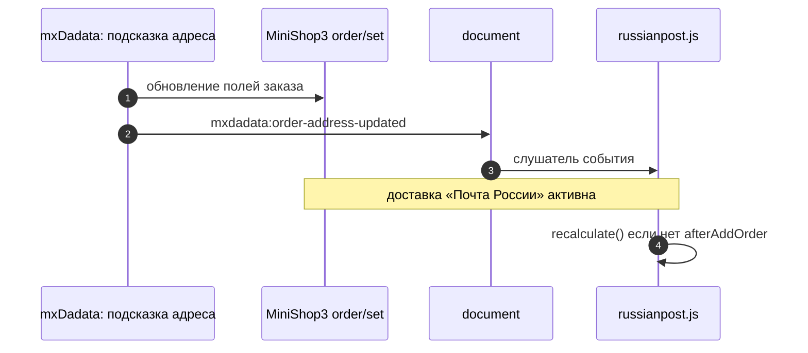

# Интеграция и кастомизация

Расширенные сценарии: режимы API, события в браузере, хуки MiniShop3 и mxDadata, отладка, кастомизация внешнего вида. Раздел **Extras → Почта России** в панели MODX описан на странице [Админка в MODX](admin-ui).

## Режимы API и fallback {#api-fallback}

| Режим (`api_mode`) | Источник тарифов | Когда использовать |
|--------------------|------------------|---------------------|
| `tariff` | `tariff.pochta.ru` | По умолчанию: без регистрации и ключей |
| `otpravka` | `otpravka.pochta.ru` | Договор с Почтой России, персональные тарифы (лимиты объёма отправлений — см. [системные настройки → API](settings#api)) |

Как получить значения для `msrussianpost_otpravka_key` и `msrussianpost_otpravka_token` в личном кабинете Отправки — в разделе [Системные настройки → Где взять ключи для API Отправки](settings#otpravka-credentials).

Логика fallback (упрощённо):

1. В режиме `otpravka`, если токен и ключ пусты, персональный запрос не выполняется — сразу полный расчёт через публичный API.
2. При заданных ключах сначала вызывается otpravka **по каждому коду** объекта. При ошибке (429, 401, 5xx, невалидный JSON) для конкретного кода этот код пропускается и **добирается** через публичный API.
3. В итоговый список методов попадают варианты из успешных ответов API. Покупатель видит максимально полный набор вариантов, пока доступен публичный API.


```mermaid
flowchart TD
  M{api_mode?}
  M -->|tariff| P[Публичный API tariff.pochta.ru]
  M -->|otpravka| K{Ключ и токен<br/>otpravka заданы?}
  K -->|нет| P
  K -->|да| O[Запрос otpravka<br/>по коду объекта]
  O -->|успех| L[Варианты в итоговый список]
  O -->|ошибка: 4xx, 5xx, 429, невалидный JSON| P
  P --> L
```

Подробнее о полях API — в официальной документации Почты России.

## Кастомные DOM-события

Скрипт `russianpost.js` после соответствующих действий генерирует на **`document`** кастомные события:

| Событие | Когда | `detail` |
|---------|--------|----------|
| `msrussianpost:calculated` | После завершения расчёта списка методов, в том числе при ошибке | `{ methods: [...] }` — тот же массив, что вернул коннектор, либо пустой |
| `msrussianpost:method-selected` | После выбора метода покупателем | `{ code }` — код выбранной услуги |

Их можно использовать для аналитики или дополнительной логики интерфейса:

```js
document.addEventListener('msrussianpost:calculated', function (e) {
  console.log('methods', e.detail);
});
```

## Плагины

1. **msRussianPost Autoload** — событие **`OnMODXInit`** (приоритет `-100`, самый ранний). Подключает файл с классом доставки, чтобы MiniShop3 мог создать `msrussianpost\Delivery\RussianPostDelivery` без отдельной записи в корневом Composer. Без этого плагина MiniShop3 может писать в лог об ошибке загрузки класса доставки, возвращать стоимость **0** и не вызывать **`msOnGetDeliveryCost`** для расчёта. В контексте `mgr` тот же плагин отдаёт `window.msRussianPostManagerLabels` и подключает `manager-order-tariff.js`.
2. **msRussianPost Delivery** — событие **`msOnGetDeliveryCost`**. Подставляет в заказ стоимость метода, выбранного в сессии виджета, для доставок с нужным классом. Не отключайте его, если нет собственной реализации расчёта стоимости для этой доставки.
3. **msRussianPost Order tariff** — события **`msOnSubmitOrder`**, **`msOnBeforeCreateOrder`**, **`msOnCreateOrder`**. Сохраняет код выбранного типа отправления в заказ. Плагин срабатывает только для доставок с классом `msrussianpost\Delivery\RussianPostDelivery` и только если код удалось определить.

### Что пишется в заказ

Плагин **Order tariff** пишет в `ms3_orders.properties` объект:

```json
{
  "msrussianpost": {
    "object_code": "23030",
    "method_label": "Заказное письмо"
  }
}
```

`object_code` берётся из сессии `select_method`; если её нет, плагин смотрит уже сохранённое свойство, а при оформлении с витрины — кэш методов по индексу (при `from_manager` кэш не используется). `method_label` подставляется по коду отдельным резолвером, его логика описана в разделе [Подпись метода](#method-label).

### Карточка заказа в менеджере

Блок с выбранным тарифом в карточке заказа MiniShop3 рисует не шаблон, а скрипт `assets/components/msrussianpost/js/manager-order-tariff.js`. Он:

- берёт `properties.msrussianpost` из заказа через действие коннектора **`get_order_tariff`** (параметр `order_num`, ответ — `order_num`, `msrussianpost.object_code`, `msrussianpost.method_label`; можно передать `order_id` вместо номера);
- параллельно вычитывает `msrussianpost` из JSON-состояния страницы: перехватывает ответы `fetch` и `XMLHttpRequest` и разбирает inline-скрипты `script[type="application/json"]`;
- вставляет блок сразу после заголовка заказа («Заказ #N»);
- выводит подпись метода, а рядом код под лексиконом **`msrussianpost_manager_selected_tariff_code`**; заголовок блока — **`msrussianpost_manager_selected_tariff`**.

Скрипт перерисовывает блок по `MutationObserver`, поэтому подгрузка карточки AJAX’ом его не ломает. Если в `properties` нет `method_label`, подпись берётся из `window.msRussianPostManagerLabels.methods`, куда Autoload-плагин положил названия кодов из настройки `msrussianpost_object_codes`. Пустой блок = в `properties` заказа нет `object_code`.

### Клиентский канал выбора

Кроме серверного `select_method` и плагина код тарифа пишет сам браузер. После каждого `selectMethod()` `russianpost.js` делает два вызова MiniShop3:

1. `ms3.orderAPI.add('msrussianpost_object_code', code)` (или `ms3.order.add`, если `orderAPI` нет) — код уходит в черновик заказа в `properties._validated`, поэтому переживает рассинхрон PHP-сессии и черновика;
2. `ms3.order.setField('delivery_cost_updated', Date.now())` — сигнал MiniShop3 пересчитать итог после смены способа доставки.

Оба вызова обёрнуты в проверки: если глобального `ms3` нет или нужного метода нет, скрипт просто пропускает шаг, ошибка не показывается. Ошибку первого вызова он пишет только в консоль при включённой отладке.

### Подпись метода {#method-label}

`msrp_resolve_method_display_name()` выбирает название по первому совпадению:

1. настройка `msrussianpost_object_labels` (`код=название` или `код:название`, строки с `#` игнорируются);
2. название из ответа API, если оно не общий заголовок вроде «Расчет тарифов»;
3. справочник `tariff.pochta.ru` (`/v2/dictionary/object/list`), результат кэшируется;
4. название из API как есть, а если его нет, строка `Object <код>`.

Для публичного API обычный путь — шаги 2 и 3: шаг 1 нужен, только если вы хотите переопределить подписи своими словами.

### Проверка установки плагинов

После обновления пакета проверьте в **Элементы → Плагины**, что **все три** плагина на месте и **опубликованы**: у **Order tariff** должны быть подписаны все три события, у **Autoload** — приоритет `-100`. Плагины ставятся как исходники: в свойствах элемента это **«Элемент кода из файла»** со статическим путём `core/components/msrussianpost/elements/plugins/<файл>.php`.

## Интеграция с хуками MiniShop3

Виджет завязан на **`ms3Hooks`**, в первую очередь на **`afterAddOrder`** при смене индекса, доставки и связанных полей.

Дополнительно **`russianpost.js`** слушает **`mxdadata:order-address-updated`** (пакет **mxDadata**, сниппет **`mxDadataAddressSuggest`**). После выбора подсказки адреса и **`order/set`** у MiniShop3 хук **`afterAddOrder`** может не вызваться. Тогда событие от mxDadata при активной доставке «Почта России» запускает **`recalculate()`**.

Порядок сниппетов на странице и настройка токена DaData — в пользовательском разделе [Подключение на сайте → Автокомплит адреса (mxDadata)](frontend#mxdadata). Имена полей формы — в документации пакета **mxDadata**.

В штатном бандле MiniShop3 виджет также учитывает **`ms3:order:delivery-change`** (в стоковом JS событие может не диспатчиться — детали в исходниках `russianpost.js` и в `developer-guide` репозитория дополнения).

Убедитесь, что на странице заказа подключён основной JS MiniShop3. Если форма кастомная и **`ms3Hooks`** недоступен, пересчёт вызывайте вручную через **`window.msRussianPost.recalculate()`** (см. [Подключение на сайте](frontend)).


```mermaid
sequenceDiagram
  autonumber
  participant MX as mxDadata: подсказка адреса
  participant MS3 as MiniShop3 order/set
  participant D as document
  participant RP as russianpost.js
  MX->>MS3: обновление полей заказа
  MX->>D: mxdadata:order-address-updated
  D->>RP: слушатель события
  Note over RP,MS3: доставка «Почта России» активна
  RP->>RP: recalculate() если нет afterAddOrder
```

## Отладка {#отладка}

Включить расширенный лог `russianpost.js` можно четырьмя способами:

1. **Параметр сниппета** `&debug=` со значением `1` / `true` / `yes`.
2. **Параметр в URL** страницы: `?msrp_debug=1`.
3. **Параметр в URL** страницы: `?ms3dw_log=1`.
4. **Глобальная переменная** в консоли или до загрузки скрипта: `window.MS3_DELIVERY_WIDGETS_TEST = true`.

Варианты 3 и 4 не требуют правки шаблона: URL можно открыть прямо в браузере, а переменную задать в inline-`script` на странице. Через сниппет и URL лог включается до инициализации виджета — так вы увидите и `init:` с разбором `deliveryIds`.

В консоли появятся сообщения с префиксом `[msRussianPost]`: список разрешённых `deliveryIds` и его источник, текущий `delivery_id`, найденный индекс, пропуски повторного расчёта по ключу `delivery_id:индекс`, а также текст ошибки, если поле доставки не найдено при непустом `deliveryIds`.

Отдельно про таймаут: запросы к коннектору (все три фронтовых действия) обрываются через 30 секунд. При таймауте, сетевой ошибке или неуспешном ответе в статус ставится лексикон `msrussianpost_error_api` — в этом случае проверьте доступность `connector.php` из браузера и состояние API Почты России в разделе [Админка в MODX](admin-ui).

::: warning Продакшен
Не оставляйте `msrp_debug`, `ms3dw_log` и `window.MS3_DELIVERY_WIDGETS_TEST` на публичных страницах надолго.
:::

## Копирование чанков

Скопируйте `tplRussianPostStatus` и `tplRussianPostMethods` в чанки с новыми именами и подключите их в шаблоне вместо стандартных: так вы не потеряете правки вёрстки при обновлении пакета (стандартные чанки при обновлении перезаписываются).

## Админка

Описание вкладок, таблиц и кнопок раздела **Extras → Почта России** — на отдельной странице [Админка в MODX](admin-ui).
