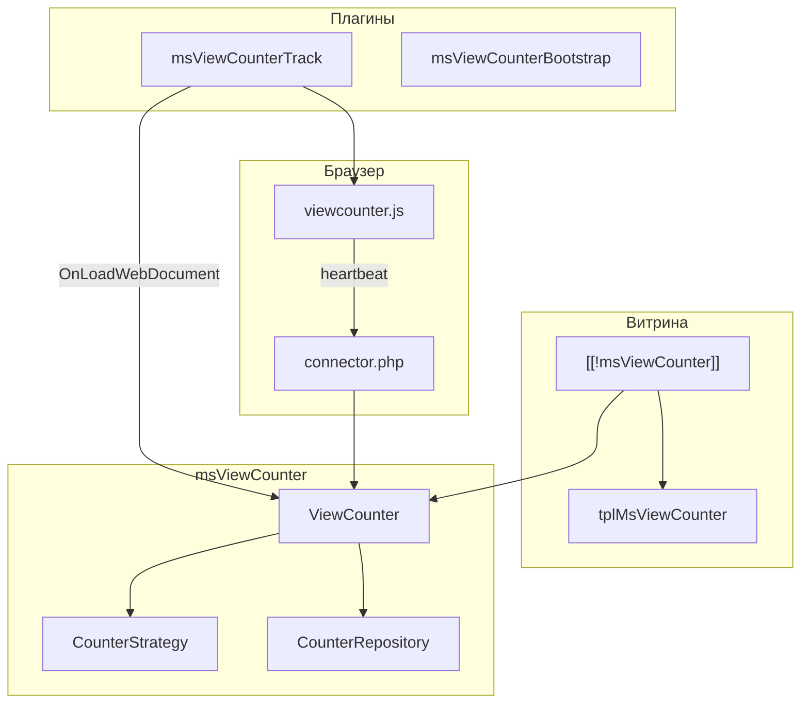

# msViewCounter

**msViewCounter** — дополнение для [MODX Revolution 3](https://modx.com/) и [MiniShop3](/components/minishop3/): на карточке товара показывает просмотры и число активных посетителей («сейчас смотрят»). Поддерживает честную статистику, маркетинговый boost и синтетический режим для новых магазинов.

С чего начать: [Быстрый старт](quick-start).

## Минимальный путь на витрине

1. Установить **MiniShop3** и **msViewCounter** через ModStore.
2. Убедиться, что плагины **`msViewCounterBootstrap`** и **`msViewCounterTrack`** включены.
3. В шаблоне **msProduct** вывести сниппет (см. [Быстрый старт](quick-start#шаг-2-вызов-на-странице-товара)).
4. При необходимости выбрать режим в настройках **`msviewcounter_mode`** — [Системные настройки](settings).
5. **Очистить кэш** и открыть страницу товара.

## Быстрые ссылки

| Нужно | Документ |
| --- | --- |
| Установить и вывести счётчик | [Быстрый старт](quick-start) |
| Все ключи `msviewcounter_*` | [Системные настройки](settings) |
| Режимы `real`, `boost`, `fake` | [Интеграция](integration#режимы-работы) |
| Стилизация через `--msvc-*` | [Интеграция — стилизация](integration#стилизация) |
| Параметры сниппета | [msViewCounter](snippets/msViewCounter) |
| Вывод в каталоге | [Каталог товаров](frontend/catalog) |
| CrawlerDetect и боты | [Интеграция — CrawlerDetect](integration#crawlerdetect) |
| Диагностика | [FAQ](faq) |

## Возможности

- **Общий счётчик** — «Этот товар просмотрели 248 раз»
- **Live-online** — «Сейчас смотрят 3 человека» с heartbeat через JS
- **Три режима** — `real` (честная статистика), `boost` (реальные данные с базой и разбросом), `fake` (синтетика без записи в БД)
- **Дедупликация** — один просмотр на товар в рамках сессии (`msviewcounter_dedup_session`)
- **Фильтр ботов** — [CrawlerDetect](https://modstore.pro/packages/other/crawlerdetect) при наличии, fallback по `User-Agent`
- **Контроль БД** — агрегат в `msviewcounter_totals`, active-сессии в `msviewcounter_active` с batch-очисткой
- **Готовый UI** — чанк `tplMsViewCounter`, CSS-карточка с переменными `--msvc-*`
- **Интеграция** — один сниппет на карточке или в строке каталога

## Системные требования

| Требование | Версия |
|------------|--------|
| MODX Revolution | 3.0+ |
| PHP | 8.2+ |
| MiniShop3 | 1.0+ |
| pdoTools | 3.0+ (рекомендуется для Fenom) |

### Зависимости

- **[MiniShop3](/components/minishop3/)** — товары класса `msProduct`, шаблон карточки

### Опционально

- **[CrawlerDetect](https://modstore.pro/packages/other/crawlerdetect)** — расширенная фильтрация ботов

## Установка

1. [Подключите репозиторий ModStore](https://modstore.pro/info/connection).
2. **Extras → Installer** → **Download Extras** — найдите **msViewCounter**, **Download**, **Install**.
3. Убедитесь, что установлен **MiniShop3**.
4. **Настройки → Очистить кэш**.

## Термины

| Термин | Описание |
|--------|----------|
| **total** | Суммарное число просмотров товара (одна строка на товар в `msviewcounter_totals`) |
| **online** | Число активных сессий на странице товара (строки в `msviewcounter_active`) |
| **heartbeat** | Периодический POST из `viewcounter.js` в connector для продления active-сессии |
| **TTL online** | Сколько секунд (`msviewcounter_online_ttl`) посетитель считается «смотрящим» |
| **boost** | Режим: реальные данные в БД, на витрине — с базой, множителем и дневным разбросом |
| **fake** | Режим: стабильные числа по ID товара и `fake_salt`, без записи в БД и без JS |

## Архитектура (кратко)

Подробнее: [Интеграция](integration), [Системные настройки](settings).
