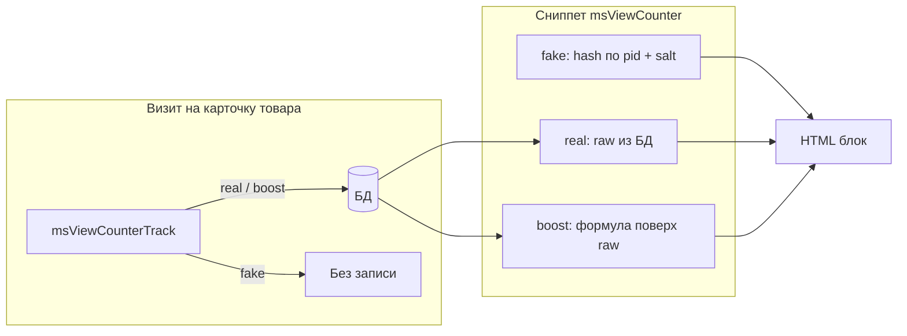

# Интеграция и режимы

## Плагины

| Плагин | Событие | Назначение |
|--------|---------|------------|
| `msViewCounterBootstrap` | `OnMODXInit` | Автозагрузка, сервис `msviewcounter` |
| `msViewCounterTrack` | `OnLoadWebDocument` | Запись просмотра на странице товара, подключение CSS/JS |

Оба плагина должны быть **включены**. Трекинг привязан к **`OnLoadWebDocument`**, а не к `OnWebPageInit`: на раннем событии ресурс может быть ещё не загружен.

## Режимы работы

Настройка: **`msviewcounter_mode`**. Режим влияет на **запись в БД**, **подключение JS** и **формулу чисел на витрине**. Сниппет и чанк одинаковы для всех режимов.

| | `real` | `boost` | `fake` |
|---|:---:|:---:|:---:|
| Запись просмотров в БД | Да | Да | Нет |
| Heartbeat / online в БД | Да | Да | Нет |
| `viewcounter.js` на карточке | Да* | Да* | Нет |
| Числа на витрине | Как в БД | Усиленные | Синтетические |
| Нужен трафик для правдоподобия | Да | Частично | Нет |

\* JS подключается, если включён `msviewcounter_show_online` и режим не `fake`.



---

### `real` — честная статистика

Режим по умолчанию. На витрине показываются **те же числа**, что хранятся в базе.

#### Запись просмотра (total)

1. Плагин **`msViewCounterTrack`** на `OnLoadWebDocument` определяет, что открыта страница товара (`msProduct`).
2. Вызывается `recordVisit(productId)`:
   - если **`block_bots`** и User-Agent похож на бота — выход;
   - если **`dedup_session`** и этот товар уже был в текущей PHP-сессии — total **не** увеличивается;
   - иначе в `msviewcounter_totals` выполняется `INSERT … ON DUPLICATE KEY UPDATE total_views + 1`.
3. ID сессии для дедупликации хранится в `$_SESSION['msviewcounter_viewed_products']`.

Один посетитель = **один total на товар за сессию** (при включённой дедупликации). Обновление страницы (F5) total не накручивает.

#### Online (active-сессии)

1. На карточке товара плагин подключает **`viewcounter.js`** и передаёт конфиг: URL connector, `productId`, `sessionId`, интервал heartbeat.
2. JS периодически (по **`heartbeat_interval`**, по умолчанию 30 с) шлёт ping в `connector.php`.
3. Connector вызывает `upsertActive`: строка `(product_id, session_id)` в **`msviewcounter_active`**, поле **`last_seen`** обновляется.
4. При выводе сниппета **`online`** = число строк по товару, у которых `last_seen` не старше **`online_ttl`** секунд (по умолчанию 120).

Устаревшие строки удаляются пачками во время heartbeat (**`cleanup_interval`**, **`cleanup_batch_limit`**).

#### Вывод на витрине

Стратегия **`RealCounterStrategy`** возвращает raw-значения из БД без преобразований:

- `total` — из `msviewcounter_totals.total_views`;
- `online` — COUNT из `msviewcounter_active` с учётом TTL.

#### Когда выбирать

- Магазин уже получает органический трафик.
- Нужны реальные цифры для аналитики и доверия без «накрутки» на выводе.
- Готовы к тому, что у новых товаров total и online будут малыми.

#### Пример поведения

| Событие | total в БД | online |
|---------|----------|--------|
| Первый визит пользователя A | 1 | 1 (после heartbeat) |
| F5 в той же сессии | 1 | 1 |
| Одновременно пользователь B на той же карточке | 2 | 2 |
| B закрыл вкладку, прошло > TTL | 2 | 1 |

---

### `boost` — реальные данные, усиленный вывод

**Запись и online работают как в `real`**: просмотры и сессии пишутся в БД, heartbeat активен. Меняется только **отображение** — стратегия **`BoostCounterStrategy`** преобразует raw-числа перед выводом.

#### Формула total

```
jitter = crc32("{productId}:{YYYYMMDD}:total") % (boost_total_jitter_max + 1)
boosted = floor(raw_total × boost_total_multiplier) + jitter
display_total = max(boost_total_base, boosted)
```

| Настройка | Роль |
|-----------|------|
| `boost_total_multiplier` | Множитель реального total (по умолчанию `1`) |
| `boost_total_jitter_max` | Добавка 0…N, **стабильная в течение календарного дня** |
| `boost_total_base` | Нижняя граница: итог не опустится ниже этого значения |

**Jitter** зависит от ID товара и **текущей даты** (`Ymd`). В один день число не меняется при refresh; **на следующий день** jitter пересчитывается — небольшое «живое» изменение без привязки к каждому запросу.

#### Формула online

```
jitter = crc32("{productId}:{YYYYMMDD}:online") % (boost_online_jitter_max + 1)
boosted = raw_online + jitter
display_online = max(boost_online_base, boosted)
```

К реальному числу active-сессий добавляется дневной разброс и применяется минимум **`boost_online_base`**.

#### Пример расчёта total

Настройки: `multiplier = 2`, `base = 100`, `jitter_max = 5`.
Raw total = 12, jitter для товара сегодня = 3:

```
boosted = floor(12 × 2) + 3 = 27
display = max(100, 27) = 100
```

Raw total = 80, jitter = 2:

```
boosted = floor(80 × 2) + 2 = 162
display = max(100, 162) = 162
```

#### Пример расчёта online

Настройки: `base = 2`, `jitter_max = 2`. Raw online = 0, jitter = 1:

```
display = max(2, 0 + 1) = 2
```

Raw online = 4, jitter = 0:

```
display = max(2, 4) = 4
```

#### Когда выбирать

- Нужна **честная запись** в БД, но на витрине не хочется показывать «3 просмотра» на новом товаре.
- Маркетинговый social proof с **контролируемым минимумом** (`boost_*_base`).
- Планируете позже переключиться на `real`, не теряя накопленную статистику.

#### Важно

- В БД остаются **реальные** raw-значения; boost не подменяет агрегат в таблице.
- При смене настроек boost отображение меняется сразу; raw в БД — нет.
- Если `show_total` или `show_online` выключены, соответствующая формула не применяется (в стратегии подставляется 0).

### `fake` — синтетика без БД

Режим для **новых магазинов**, демо-стендов и ситуаций, когда нужен блок доверия **без накопления статистики**.

#### Что не происходит

- `recordVisit` **не пишет** в `msviewcounter_totals`.
- Heartbeat **не вызывается**, **`viewcounter.js` не подключается**.
- Connector для online в этом режиме на карточке не нужен.

Метод `usesDatabase()` возвращает `false` — компонент не читает и не пишет счётчики в БД.

#### Как считаются числа

Стратегия **`FakeCounterStrategy`**. Для каждого товара и типа (`total` / `online`) значение **стабильно** и лежит в заданном диапазоне:

```
range = fake_*_max - fake_*_min + 1
offset = hash(productId, suffix, fake_salt)   // SHA-256 + детерминированное смешивание
display = fake_*_min + (offset % range)
```

| Настройка | Роль |
|-----------|------|
| `fake_total_min` / `fake_total_max` | Диапазон просмотров (по умолчанию 50–500) |
| `fake_online_min` / `fake_online_max` | Диапазон online (по умолчанию 1–8) |
| `fake_salt` | Соль: смена пересчитывает все fake-числа |

**Hash** зависит от `productId` и salt, но **не от даты** — в отличие от boost-jitter, fake-числа **не меняются каждый день** сами по себе.

#### Стабильность

| Действие | Меняются ли числа? |
|----------|-------------------|
| Refresh страницы | Нет |
| Другой товар | Да (другой `productId` → другое значение в диапазоне) |
| Смена `fake_salt` | Да (полный пересчёт) |
| Смена min/max | Да (другой диапазон) |

Соседние товары получают **разные** значения внутри диапазона, а не одно и то же число на всех карточках.

#### Пример

Настройки: `fake_total_min = 50`, `fake_total_max = 500`, salt по умолчанию.

- Товар ID 10 → например, **187** просмотров (фиксированно, пока не меняли salt/диапазон).
- Товар ID 11 → другое число, например **342**.
- Online для ID 10 → число от 1 до 8, тоже стабильное.

#### Когда выбирать

- Магазин только запущен, реальных просмотров почти нет.
- Демо / превью без «пустых» счётчиков.
- Не хотите разрастания таблиц статистики до появления трафика.

#### Переход на `real` или `boost`

После переключения режима:

- fake-числа исчезают;
- начинается (или продолжается) запись в БД с текущего момента;
- старые строки в `msviewcounter_totals` / `msviewcounter_active`, если были, **сохраняются**, но в `fake` они не использовались.

### Сравнение на одном примере

Товар ID 25. В БД после недели работы: **raw total = 34**, **raw online = 2**.

| Режим | Настройки (пример) | total на витрине | online на витрине |
|-------|-------------------|------------------|-------------------|
| `real` | по умолчанию | 34 | 2 |
| `boost` | base 100, mult 1.5, jitter 0 | max(100, 51) = **100** | max(2, 2+jitter) ≥ **2** |
| `fake` | 50–500, online 1–8 | **стабильное** из диапазона | **стабильное** из диапазона |

### Переключение режима

1. **Система → Системные настройки** → `msviewcounter_mode`.
2. **Очистить кэш** MODX.
3. Открыть карточку товара и проверить HTML:
   - `real` / `boost` + online → есть `viewcounter.js`;
   - `fake` → JS нет, числа не растут от визитов.

Подробнее про ключи boost/fake: [Системные настройки — Boost](settings#boost-msviewcounter_boost) и [Системные настройки — Fake](settings#fake-msviewcounter_fake).

## Стилизация

### Базовый CSS

Сниппет и плагин регистрируют `assets/components/msviewcounter/css/viewcounter.css`. Дефолтный блок `.msvc-counter` — компактная карточка с фоном, рамкой, тенью и status-dot у строк total/online.

### CSS-переменные

Все переменные задаются на контейнере `.msvc-counter` и влияют на карточку и строки total/online.

| Переменная | По умолчанию | Назначение |
|------------|--------------|------------|
| `--msvc-gap` | `0.5rem` | Расстояние между строками «просмотрели» и «сейчас смотрят» (CSS `gap` у grid) |
| `--msvc-margin` | `0.875rem 0` | Внешний отступ блока счётчика |
| `--msvc-padding` | `0.875rem 1rem` | Внутренние отступы карточки |
| `--msvc-font-size` | `0.9375rem` | Размер текста в блоке |
| `--msvc-line-height` | `1.45` | Межстрочный интервал |
| `--msvc-color` | `#1e293b` | Базовый цвет текста (если не переопределён у строк) |
| `--msvc-total-color` | `var(--msvc-color)` | Цвет текста строки просмотров (`.msvc-counter__total`) |
| `--msvc-online-color` | `#047857` | Цвет текста строки online (`.msvc-counter__online`) |
| `--msvc-background` | градиент | Фон карточки |
| `--msvc-border` | `1px solid …` | Рамка карточки (полное значение свойства `border`) |
| `--msvc-border-radius` | `0.875rem` | Скругление углов карточки |
| `--msvc-shadow` | box-shadow | Тень карточки |
| `--msvc-accent` | `#2563eb` | Цвет status-dot у строки total (кружок `::before`) |
| `--msvc-accent-glow` | rgba | «Ореол» вокруг dot total (`box-shadow` псевдоэлемента) |
| `--msvc-online-accent` | `#10b981` | Цвет status-dot у строки online |
| `--msvc-online-glow` | rgba | «Ореол» вокруг dot online |
| `--msvc-dot-size` | `0.5rem` | Диаметр status-dot у обеих строк |

Переопределяйте в CSS темы:

```css
.product-card .msvc-counter {
    /* Расстояние между строками total и online */
    --msvc-gap: 0.5rem;
    /* Внешний отступ блока */
    --msvc-margin: 0.875rem 0;
    /* Внутренние отступы карточки */
    --msvc-padding: 0.875rem 1rem;
    /* Типографика */
    --msvc-font-size: 0.9375rem;
    --msvc-line-height: 1.45;
    /* Цвета текста */
    --msvc-color: #1e293b;
    --msvc-total-color: var(--msvc-color);
    --msvc-online-color: #047857;
    /* Оформление карточки */
    --msvc-background: linear-gradient(135deg, #ffffff 0%, #f8fafc 100%);
    --msvc-border: 1px solid rgba(148, 163, 184, 0.28);
    --msvc-border-radius: 0.875rem;
    --msvc-shadow: 0 10px 30px rgba(15, 23, 42, 0.08);
    /* Индикаторы (status-dot) у строки total */
    --msvc-accent: #2563eb;
    --msvc-accent-glow: rgba(37, 99, 235, 0.14);
    /* Индикаторы у строки online */
    --msvc-online-accent: #10b981;
    --msvc-online-glow: rgba(16, 185, 129, 0.16);
    --msvc-dot-size: 0.5rem;
}
```

### Акцент на online

```css
.product-card .msvc-counter {
    /* Фон, рамка, скругление и тень карточки */
    --msvc-background: #fff7ed;
    --msvc-border: 1px solid #fed7aa;
    --msvc-border-radius: 1rem;
    --msvc-shadow: 0 12px 28px rgba(154, 52, 18, 0.1);
    /* Status-dot строки total */
    --msvc-accent: #f97316;
    --msvc-accent-glow: rgba(249, 115, 22, 0.16);
    /* Текст, dot и ореол строки online */
    --msvc-online-color: #dc2626;
    --msvc-online-accent: #ef4444;
    --msvc-online-glow: rgba(239, 68, 68, 0.16);
}
```

### Только текст без карточки

```css
.product-card .msvc-counter {
    --msvc-padding: 0;              /* без внутренних отступов */
    --msvc-background: transparent; /* без фона */
    --msvc-border: 0;               /* без рамки */
    --msvc-border-radius: 0;        /* без скругления */
    --msvc-shadow: none;            /* без тени */
}
```

## CrawlerDetect

Если установлен [CrawlerDetect](https://modstore.pro/packages/other/crawlerdetect), компонент использует его сервис. Иначе — встроенная проверка `User-Agent` (поисковые роботы, headless-клиенты).

При `msviewcounter_block_bots = Да` боты **не** участвуют в:

- записи просмотра (`recordVisit`);
- heartbeat active-сессии (`ping`).

В режиме `fake` запись в БД не выполняется в любом случае.

## База данных

| Таблица | Назначение |
|---------|------------|
| `msviewcounter_totals` | Агрегат просмотров: одна строка на `product_id` |
| `msviewcounter_active` | Текущие online-сессии с `last_seen` |

`msviewcounter_active` очищается во время heartbeat: интервал `cleanup_interval`, лимит `cleanup_batch_limit`. Индекс по `last_seen` ускоряет удаление устаревших строк.

При **удалении пакета** системные настройки удаляются; **таблицы статистики сохраняются**, чтобы не потерять данные магазина.

## Типовые сценарии

### Честная статистика

1. `msviewcounter_mode = real`
2. Сниппет на шаблоне товара
3. Плагин `msViewCounterTrack` включён

### Новый магазин

1. `msviewcounter_mode = fake`
2. Диапазоны `fake_total_min` / `fake_total_max`, `fake_online_min` / `fake_online_max`

### Boost для маркетинга

1. `msviewcounter_mode = boost`
2. `boost_total_base = 100`, `boost_online_base = 2`, `boost_online_jitter_max = 2`

### Счётчик в каталоге

Передайте `pid` из строки товара — см. [Каталог товаров](frontend/catalog).

## См. также

- [Страница товара](frontend/product)
- [Сниппет msViewCounter](snippets/msViewCounter)
- [Системные настройки](settings)
- [FAQ](faq)
