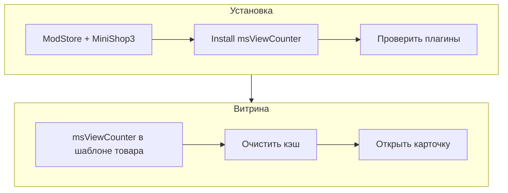

# Быстрый старт

За несколько минут можно вывести на карточке товара блок «просмотрели N раз» и «сейчас смотрят M человек».



## Требования

| Требование | Версия |
|------------|--------|
| MODX Revolution | 3.0+ |
| PHP | 8.2+ |
| MiniShop3 | установлен |
| pdoTools | 3.x (для примеров Fenom) |

## Шаг 1: Установка пакета

1. [Подключите ModStore](https://modstore.pro/info/connection).
2. **Extras → Installer → Download Extras** — **msViewCounter** → **Download** → **Install**.
3. Убедитесь, что установлен **MiniShop3**.
4. **Настройки → Очистить кэш**.

Пакет: [msViewCounter на modstore.pro](https://modstore.pro/packages/ecommerce/msviewcounter).

### После установки

| Элемент | Ожидание |
|---------|----------|
| Сниппет | `msViewCounter` |
| Чанк | `tplMsViewCounter` |
| Плагины | `msViewCounterBootstrap`, `msViewCounterTrack` — **включены** |
| Таблицы | `msviewcounter_totals`, `msviewcounter_active` |
| Событие трекинга | `msViewCounterTrack` на **`OnLoadWebDocument`** |

## Шаг 2: Вызов на странице товара

В шаблоне **msProduct** (некэшированный вызов):

::: code-group

```fenom
{'!msViewCounter' | snippet : [
    'pid' => $_modx->resource.id,
    'tpl' => 'tplMsViewCounter'
]}
```

```modx
[[!msViewCounter?
    &pid=`[[*id]]`
    &tpl=`tplMsViewCounter`
]]
```

:::

Плагин **`msViewCounterTrack`** на событии `OnLoadWebDocument` записывает просмотр текущего товара и подключает CSS/JS там, где нужно.

## Шаг 3: Системные настройки

**Настройки → Системные настройки**, фильтр **`msviewcounter`**.

Для первого запуска достаточно значений по умолчанию:

| Ключ | Значение по умолчанию | Смысл |
|------|----------------------|-------|
| `msviewcounter_mode` | `real` | Честные просмотры и online |
| `msviewcounter_show_total` | Да | Строка «просмотрели…» |
| `msviewcounter_show_online` | Да | Строка «сейчас смотрят…» |
| `msviewcounter_dedup_session` | Да | Один total на товар в сессии |
| `msviewcounter_block_bots` | Да | Не считать ботов |

Полный список: [Системные настройки](settings).

## Шаг 4: Проверка

| Действие | Ожидание |
|----------|----------|
| Открыть карточку товара | Блок `.msvc-counter` с текстами просмотров и/или online |
| Исходный код страницы | CSS `/assets/components/msviewcounter/css/viewcounter.css` |
| Режим `real` или `boost`, online включён | JS `/assets/components/msviewcounter/js/viewcounter.js` |
| Обновить страницу в той же сессии | `total` не растёт при `dedup_session=1` |
| Открыть товар в другом браузере | `online` ≥ 1 (после heartbeat) |

## Дальше

- [Страница товара](frontend/product) — условный вывод, свой чанк
- [Каталог товаров](frontend/catalog) — счётчик в строке `msProducts`
- [Интеграция](integration) — режимы `boost` и `fake`, стилизация
- [FAQ](faq) — если блок не выводится или просмотры не растут
