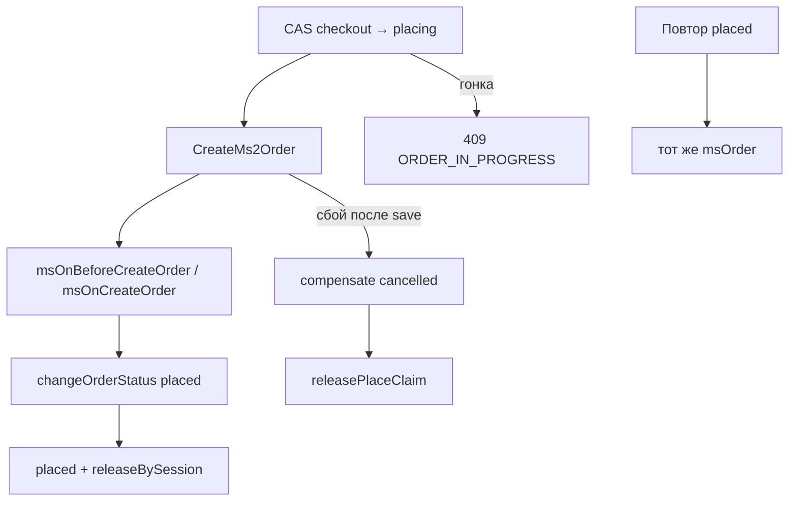

# Checkout и заказ

## Корзина (`basket/check`)

1. Пакет нормализует `items` / `products` (`offer_id` = id ресурса `msProduct`).
2. Берёт `final_price` из `msProduct::getPrice()` (рубли в каталоге).
3. В JSON ответа цены — в **копейках** (`ProductMapper::toMinor`), как `price` у delivery.
4. В успешном item `available` = `true` (bool). Число доступного количества — в `details.errors[].available` при `INSUFFICIENT_STOCK`.
5. Доступно = остаток из [stock](stock) минус активные soft-reserve.

## Сессия (`POST /api/v1/checkout`)

Ответ включает `session_id` и `order_number` (= тот же `session_id`). Soft-reserve пишется в `ms_yandexcommerce_reservations`. Повтор с тем же ключом идемпотентности не удваивает резерв ([ycp](ycp)).

## Размещение (`placed`)

1. CAS claim: `checkout` → `placing` (`SessionService::claimForPlace`). При гонке — `409 ORDER_IN_PROGRESS`.
2. Собирает товары из snapshot сессии (цены из snapshot / каталога).
3. `CreateMs2Order::execute()`:
   - xPDO: `msOrder` + `msOrderAddress` (`receiver`, …) + `msOrderProduct`
   - события `msOnBeforeCreateOrder` / `msOnCreateOrder`
   - `$miniShop2->changeOrderStatus($id, status_placed_id или ms2_status_new)`
   - при сбое после save — compensate (`status_cancelled_id` или `ms2_status_canceled`) + `releasePlaceClaim`. Маппинг статусов: [statuses](statuses).
4. **Не** вызывается `$order->submit()` и `payment->send()`.
5. Идемпотентность: повтор `placed` — заказ из таблицы сессий или `msOrder.properties.ycp_session_id`.
6. В ответе `order_number` = внешний `order_id` из тела `placed` (тот же, что `ycp_external_order_id`).

## Soft-reserve

Учёт в `ms_yandexcommerce_reservations`. Поле `remains` в каталоге пакет не декрементирует. Резерв снимается при успешном `placed` (`releaseBySession`), при `checkout/cancel` / `order/cancel` и при expire сессии.
