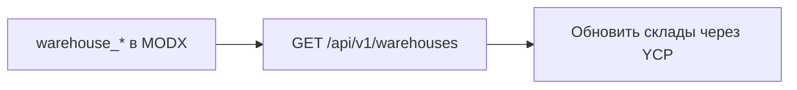

# Конфигурация

Все ключи начинаются с `msyandexcommerce_`. Area в менеджере: `yandexcommerce`.

## Включение и режим

| Ключ | Тип | По умолчанию | Эффект |
|------|-----|--------------|--------|
| `msyandexcommerce_enabled` | bool | `false` | При `false` YCP-маршруты (кроме `/health`) отвечают `503 DISABLED` |
| `msyandexcommerce_mode` | list | `sandbox` | `sandbox` \| `production`. Для YCP отдельного тестового хоста нет. Для Pay webhook переключает JWKS: `sandbox.pay.yandex.ru` / `pay.yandex.ru` |
| `msyandexcommerce_debug` | bool | `false` | В лог пишется деталь исключения (уже без секретов в sanitize) |
| `msyandexcommerce_log_level` | list | `error` | `error` \| `warning` \| `info` \| `debug` |

## Токены

| Ключ | Тип | По умолчанию | Эффект |
|------|-----|--------------|--------|
| `msyandexcommerce_api_token` | password | пусто / генерируется при install | Inbound Bearer. Сравнивается через `hash_equals` |
| `msyandexcommerce_ycp_api_token` | password | пусто | Токен из кабинета YCP. Getter `getYcpApiToken()` есть. Исходящих вызовов к API YCP в runtime нет |

Регенерация: в разделе **Yandex Commerce** кнопка **Сгенерировать API-токен** вызывает processor `settings/regenerate_token`. Новый токен возвращается в ответе процессора один раз. Скопируйте его в поле токена доступа кабинета YCP.

Токен не кладите в JS, чанки и git. В `msyandexcommerce.log` значения с ключами `*token*` / `authorization` маскируются.

## Сессия и лимиты

| Ключ | Тип | По умолчанию | Эффект |
|------|-----|--------------|--------|
| `msyandexcommerce_session_ttl` | number | `3600` | TTL checkout session (сек), минимум 60 |
| `msyandexcommerce_max_request_bytes` | number | `1048576` | Лимит тела JSON |
| `msyandexcommerce_https_required` | bool | `true` | Без HTTPS → `403 HTTPS_REQUIRED` |
| `msyandexcommerce_trust_proxy` | bool | `false` | Учитывать `X-Forwarded-Proto` / `X-Forwarded-Ssl`. Включайте только за доверенным reverse proxy |

## Склад

| Ключ | Тип | По умолчанию | Эффект |
|------|-----|--------------|--------|
| `msyandexcommerce_warehouse_id` | text | `main` | `id` склада в ответе `/warehouses` |
| `msyandexcommerce_warehouse_title` | text | пусто | Заголовок (запасной вариант: `Main warehouse`) |
| `msyandexcommerce_warehouse_address` | textarea | пусто | Адрес строкой |
| `msyandexcommerce_warehouse_phone` | text | пусто | Телефон |

Пакет отдаёт один склад из настроек MODX. Кабинет Яндекса забирает его через `GET /api/v1/warehouses`.



### Где кнопка «Обновить склады через YCP»

В MODX этой кнопки нет (ни в system settings, ни в разделе Yandex Commerce). Она только в [кабинете Яндекс Товаров](https://merchants.yandex.ru/shop?tab=checkout):

1. **Магазин** → **Кнопка «Купить»**
2. Способ подключения: **YCP протокол (API)** (не модуль 1С-Битрикс, не KIT, не ключ Маркета)
3. После URL API, токена, «Проверить подключение», компании, оплаты/доставки — раздел складов / логистики
4. Импорт складов → **Обновить склады через YCP**

Если выбран модуль Битрикс, в UI будет **Обновить склады из 1С-Битрикс**. Для этого пакета нужна кнопка YCP/API.

Кнопки может не быть, если вы ещё не дошли до шага складов, выбран другой способ подключения, или кабинет переименовал пункт. Тогда проверьте endpoint:

```bash
curl -sS "$BASE/api/v1/warehouses" \
  -H "Authorization: Bearer $TOKEN"
```

В ответе должен быть склад из настроек (`warehouse_id`, title, address, phone). Кнопка в кабинете вызывает тот же GET.

Подсказка у `msyandexcommerce_warehouse_id` в MODX говорит про кнопку Яндекса, не про кнопку в админке сайта. На прод: [production-go-live](production-go-live). Справка: [Кнопка «Купить в 1 клик»](https://yandex.ru/support/merchants/ru/buy-button).

## Доставка и оплата

| Ключ | Тип | По умолчанию | Эффект |
|------|-----|--------------|--------|
| `msyandexcommerce_delivery_courier_id` | number | `0` | `msDelivery.id` для типа `courier` |
| `msyandexcommerce_delivery_pickup_id` | number | `0` | `msDelivery.id` для типа `pickup` |
| `msyandexcommerce_payment_online_id` | number | `0` | `msPayment.id` для online/card/yandex |
| `msyandexcommerce_payment_cod_id` | number | `0` | `msPayment.id` для cod/cash/offline |
| `msyandexcommerce_pickup_points_json` | textarea | `[]` | JSON-массив собственных ПВЗ для `pickup_points` |

Если оба `delivery_*_id` равны `0`, в options попадают все активные `msDelivery`.

Если payment id не задан для выбранного метода, `placed` вернёт `422 PAYMENT_NOT_CONFIGURED`.

Сроки в `delivery/options` (календарные дни): `delivery_offset_days`, `delivery_days_min`, `delivery_days_max`. Выбор тарифа на сайте — событие `ms2ycpOnDeliveryOptions`. Подробнее: [delivery](delivery), примеры плагинов: [plugins](plugins).

## Статусы YCP → miniShop2

Ноль в настройке пакета = значение по умолчанию miniShop2. Меняет статус только `Ms2Gateway::changeOrderStatus`. Те же id пакет отдаёт обратно в `GET /order`.

| Ключ | 0 → | Эффект |
|------|-----|--------|
| `msyandexcommerce_status_placed_id` | `ms2_status_new` | После `placed` |
| `msyandexcommerce_status_paid_id` | `ms2_status_paid`, иначе не менять | `CAPTURED` в Pay webhook `/v1/webhook` |
| `msyandexcommerce_status_cancelled_id` | `ms2_status_canceled` | `cancel` и compensate |
| `msyandexcommerce_status_delivered_id` | `ms2_status_done` | `order/delivered` |

Отдельного YCP `POST /order/status` нет. Оплата: JWT вебхук Яндекс Пэй на `POST /v1/webhook` ([payment](payment)).

## Яндекс Пэй webhook

| Ключ | Тип | По умолчанию | Эффект |
|------|-----|--------------|--------|
| `msyandexcommerce_yapay_webhook_enabled` | bool | `false` | Принимать `POST /v1/webhook` |
| `msyandexcommerce_yapay_merchant_id` | text | пусто | UUID мерчанта; сверка с JWT `merchantId` |

Callback URL в ЛК Pay = base `api.php` **без** `/v1/webhook`. Подробнее: [payment](payment).

## Кнопка

| Ключ | Тип | По умолчанию | Эффект |
|------|-----|--------------|--------|
| `msyandexcommerce_button_enabled` | bool | `true` | При `false` сниппет не строит checkout URL (`403` внутри сервиса, на витрине пустая строка) |

Подробнее: [button](button).
