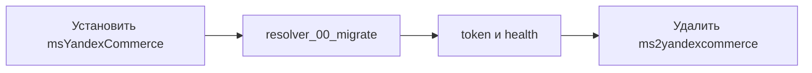

# Установка

## Требования

| Требование | Версия |
| --- | --- |
| MODX Revolution | 2.8+ |
| PHP | 7.4+ |
| miniShop2 | ≥ 2.4.0 |
| pdoTools | 2.x (для сниппета кнопки) |
| HTTPS | обязателен для публичного API в production |

## Провайдер modstore и установка пакета

Пакет зашифрован. Без провайдера установка завершится ошибкой `Package provider not found`.

1. **Система → Управление пакетами → Провайдеры** → добавьте **modstore.pro**:
   - URL: `https://modstore.pro/extras/`
   - Email и API-ключ из [личного кабинета modstore.pro](https://modstore.pro/)
2. Убедитесь, что установлены **miniShop2** и (для кнопки на витрине) **pdoTools**.
3. **Управление пакетами** → установите **msYandexCommerce** (в **Show Details** укажите провайдер **modstore.pro**).
4. **Управление → Очистить кэш**.
5. Проверьте плагин **`msyandexcommerce_bootstrap`** на событии **`OnMODXInit`**. Он должен быть **включён**. Плагин подключает автозагрузку классов. Без него API и CMP не поднимутся.

## После установки

1. Откройте меню **Yandex Commerce (YCP)** → **Обновить**. Ответ `diagnostics/check` (JSON):
   - `status`, `enabled`, `mode`, `timestamp`
   - `minishop2`, `api_token_configured`, `tables` (флаги по таблицам пакета)
   - `ready` = `enabled` && токен задан && miniShop2 доступен && все `tables` true
2. Скопируйте `api_token` в кабинет YCP (показывают один раз после регенерации).
3. Включите `msyandexcommerce_enabled` и заполните склады / delivery / payment. См. [Конфигурация](configuration).

Проверка: `GET …/assets/components/msyandexcommerce/api.php/health` → `{"status":"ok"}`.

## Обновление с ms2YandexCommerce

Signature в менеджере больше не `ms2yandexcommerce-*`. Обновление «поверх» старого пакета не сработает. Сначала поставьте новый пакет с modstore, затем удалите старый.

1. Установите **msYandexCommerce** через **Управление пакетами** (провайдер **modstore.pro**), не удаляя старый пакет. Resolver `resolver_00_migrate` перенесёт:
   - таблицы `ms2_yandexcommerce_*` → `ms_yandexcommerce_*`
   - настройки `ms2yandexcommerce_*` → `msyandexcommerce_*` (включая `api_token`)
   - сниппет и чанк (переименует)
   - плагин `ms2yandexcommerce_bootstrap` (выключит)
2. Проверьте: настройка `msyandexcommerce_api_token`, `GET …/assets/components/msyandexcommerce/api.php/health`, сниппет `msYandexCommerceButton` в шаблоне, плагин **`msyandexcommerce_bootstrap`** включён.
3. Удалите пакет `ms2yandexcommerce` из **Управление пакетами**. После rename DROP по старым именам таблиц пустой.

События `ms2ycpOnDeliveryOptions` и `ms2ycpOnPaymentNotification` не меняются. Плагины на них переподписывать не нужно.
