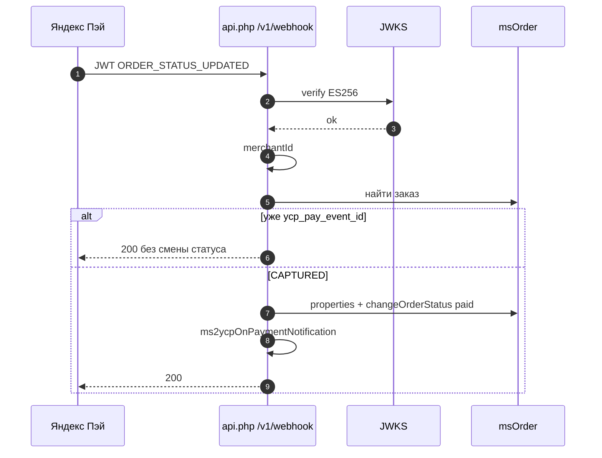

# Оплата

`payment_online_id` / `payment_cod_id` — id `msPayment`.

При `placed` в заказ пишется выбранный `payment`. Пакет **не** вызывает `msPayment->send()`. Онлайн-оплату через кассу магазина настраиваете отдельно. Яндекс Пэй в YCP приходит вебхуком на пакет (ниже).

Пакет не является форком `mspYapay`.

## Что лежит в заказе после placed

| Ключ в `msOrder.properties` | Значение |
|-----------------------------|----------|
| `ycp_session_id` | id checkout-сессии пакета |
| `ycp_external_order_id` | внешний номер из тела `placed` |

Тот же внешний номер — в `ms_yandexcommerce_sessions.external_order_id`.

## Вебхук Яндекс Пэй (`POST /v1/webhook`)

Контракт: [Yandex Pay webhook](https://pay.yandex.ru/docs/ru/custom/backend/merchant-api/webhook#oplata-zakaza).

- Тело: JWT, `Content-Type: application/octet-stream`, подпись ES256.
- JWKS: `https://pay.yandex.ru/api/jwks` (prod) или `https://sandbox.pay.yandex.ru/api/jwks` при `mode=sandbox`.
- Событие оплаты: `ORDER_STATUS_UPDATED` (`order.orderId`, `order.paymentStatus`) или `OPERATION_STATUS_UPDATED` (`operation.orderId`; `CAPTURE`+`SUCCESS` → как `CAPTURED`).

### Callback URL

В ЛК Яндекс Пэй укажите base URL **без** `/v1/webhook` (Яндекс дописывает путь):

```text
https://ваш-домен/assets/components/msyandexcommerce/api.php
```

Запрос придёт на `…/api.php/v1/webhook`.

Если у `mspYapay` уже стоит Callback URL на тот же host и он ждёт `/v1/webhook` на своём base — пути конфликтуют. Для YCP Pay используйте base именно `api.php` этого пакета.

### Настройки

| Ключ | По умолчанию | Смысл |
|------|--------------|--------|
| `msyandexcommerce_yapay_webhook_enabled` | `false` | Включить приём вебхука |
| `msyandexcommerce_yapay_merchant_id` | пусто | UUID мерчанта; сверяется с `merchantId` в payload |
| `msyandexcommerce_status_paid_id` | `0` | Статус MS2 при `CAPTURED` (0 = `ms2_status_paid` или не менять) |

Нужны также `msyandexcommerce_enabled=true` и HTTPS (как у остального API).

### Матч заказа

`order.orderId` из JWT (то же значение, что указали при оформлении заказа в Pay):

1. Сессия по `external_order_id`.
2. Если строка целиком цифры — сессия / `msOrder` по `msOrder.id`.
3. Иначе `404` + `reasonCode: ORDER_NOT_FOUND`.

До первого живого вебхука неизвестно, пришлёт YCP в Pay свой внешний id или `msOrder.id`. Двойной lookup закрывает оба варианта.



### Поведение

| `paymentStatus` | Действие |
|-----------------|----------|
| `CAPTURED` | properties + `changeOrderStatus(status_paid_id)`, если id > 0 |
| остальные (`FAILED`, `REFUNDED`, …) | только properties + событие |

В `properties` пишутся: `ycp_pay_order_id`, `ycp_pay_status`, `ycp_pay_event_time`, `ycp_pay_event`, при наличии ключа — `ycp_pay_event_id`.

Успех: HTTP `200`. Ошибки (JWT и pre-handler: HTTPS, oversized body, DISABLED): HTTP `403` + тело `{"reasonCode":"…"}` (`FORBIDDEN` / `UNAUTHORIZED` / `TOKEN_EXPIRED`). `PAYLOAD_TOO_LARGE` и `HTTPS_REQUIRED` мапятся в `reasonCode: FORBIDDEN` (HTTP 403). Формат YCP `error.code` на `/v1/webhook` не используется.

### Идемпотентность webhook

Ключ события: `eventId` / `event_id` из JWT, иначе SHA-256 от `event|eventTime|orderId|paymentStatus`. Первый раз пишется в `msOrder.properties.ycp_pay_event_id`. Повтор с тем же ключом → HTTP `200` без повторного `changeOrderStatus` и без повторного `ms2ycpOnPaymentNotification`.

`IdempotencyMiddleware` на `/v1/webhook` не действует — дедуп только через `ycp_pay_event_id`.

### Событие `ms2ycpOnPaymentNotification`

После обработки (и при CAPTURED, и при FAILED) пакет вызывает событие. При дедупе по `event_id` событие **не** вызывается.

Параметры: `payload`, `ms_order_id`, `pay_order_id`, `payment_status`, `event`, `event_id`, `status_changed`.

Плагин может дернуть Yapay или сменить статус сам. GET merchant order API в v1 пакет не вызывает.

## Конфликт id с Yapay

`mspYapay` ищет заказ по `externalId` = `msOrder.id`.

У YCP внешний номер — `properties.ycp_external_order_id`. Если нотификация уйдёт в Yapay с номером Яндекса, Yapay заказ не найдёт. Этот пакет матчит через сессию / numeric id сам.
