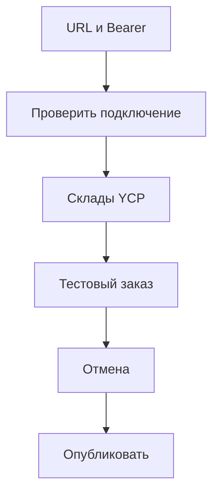

# Выход на прод

У YCP нет отдельной песочницы. Кнопка «Купить в 1 клик» в [кабинете Яндекс Товаров](https://merchants.yandex.ru/shop?tab=checkout) ходит на ваш HTTPS `api.php`. Сначала зелёный curl на боевой URL, потом тестовый заказ в кабинете.

План тестов: [testing](testing). Ключи: [configuration](configuration). Эндпоинты: [ycp](ycp).

## Порядок

```text
1. Delivery options (courier / pickup)
2. Сборка ZIP с фиксами 0.1.1+
3. Установка или обновление на проде (как на staging)
4. Диагностика в mgr MODX
5. Настройки прода + Bearer в кабинет
6. Curl / Postman на боевом api.php
7. Кабинет: проверка подключения, склады, тестовый заказ, отмена
8. Публикация кнопки только после зелёного теста
```

Шаг 7 без зелёных 1–6 не начинайте.

## Фиксы в пакете 0.1.1-beta

Перед деплоем на прод нужна версия с этими правками (см. changelog пакета):

| Фикс | Зачем |
|------|--------|
| Bearer через `getallheaders()` | На CGI/nginx `Authorization` часто не попадает в `$_SERVER`, кабинет получает ложный `401` |
| Остаток из `ms2_product_remains` | Если на сайте нет `msProductData.remains`, корзина без этой таблицы пустая |
| `createdon` по типу колонки | На части схем unix-int ломает сохранение `msOrder` / адреса |
| Draft status + bind user | Плагины MS2, которым нужен пользователь заказа |
| `Ms2OrderBagStub` | Плагины, которые ждут `msOrderHandler` на create-событиях |
| Delivery: разные `type` при одном `msDelivery` id | Кабинет ждёт `courier` и `pickup`, а не два раза `pickup` |

Доставка: [delivery](delivery). Остатки: [stock](stock).

## 1. Delivery options

Настройки в MODX, area `yandexcommerce` (не в кабинете Яндекса):

- `msyandexcommerce_delivery_courier_id` — id активного `msDelivery` для курьера
- `msyandexcommerce_delivery_pickup_id` — id активного `msDelivery` для самовывоза

Как пакет строит ответ `POST /api/v1/checkout/delivery/options`:

- Разные id → два option: `type=courier` и `type=pickup` с разными `id`
- Один id в обеих настройках → два option с одним `id`, но разными `type` (с 0.1.1). Раньше оба уходили как `pickup`
- Оба id = `0` → все активные `msDelivery` как `type=courier`

Проверка:

```bash
curl -sS -X POST "$BASE/api/v1/checkout/delivery/options" \
  -H "Authorization: Bearer $TOKEN" \
  -H "Content-Type: application/json" \
  -d "{\"items\":[{\"offer_id\":$OFFER,\"count\":1}]}"
```

В ответе должны быть типы и id, которые кабинет сможет выбрать. Если на staging дважды `id=5` с `type=pickup`, поставьте 0.1.1 и повторите запрос.

Оплата: `payment_online_id` / `payment_cod_id` ([payment](payment)). Для первой проверки удобнее `payment_method: cod`.

## 2. Получение пакета

Скачайте актуальный transport с [modstore.pro](https://modstore.pro/) (провайдер `https://modstore.pro/extras/`). В менеджере пакетов при Install укажите этот провайдер.

В ZIP / changelog должна быть 0.1.1 или новее с нужными фиксами.

## 3. Деплой на прод

Ставьте так же, как на staging:

1. **Управление пакетами** → загрузить ZIP → установить или обновить.
2. Меню **Yandex Commerce** → **Обновить**.
3. В ответе диагностики смотрите `ready`, `minishop2`, `tables`, `api_token_configured`.
4. Если токен регенерировали, сразу скопируйте его и обновите токен доступа в кабинете YCP. Старый Bearer перестанет работать.

Не правьте файлы пакета руками поверх transport: следующий update затрёт правки. Цепочка: репозиторий → build → install.

После update при необходимости очистите кэш MODX. У mgr-assets диагностики в URL есть `?v=`, чтобы браузер не держал старый JS/CSS.

## 4. Диагностика в mgr

Экран **Yandex Commerce** живёт в админке сайта (MODX). К кабинету Яндекса он не относится. Настройки вроде `msyandexcommerce_warehouse_id` = `main` тоже в system settings MODX.

После деплоя:

1. Откройте **Yandex Commerce**.
2. Дождитесь статуса (не вечный «Загрузка статуса…»).
3. Нажмите **Обновить**. Должны появиться поля готовности, не пустой экран.

Если зависает на загрузке:

- DevTools → Network: запрос к `connector.php` с `action=diagnostics/check`
- Консоль: предупреждения вроде `ms2ycp: diagnostics root…`
- Лог: `{core_path}cache/logs/msyandexcommerce.log`

В `connector.php` после проверки mgr-сессии вызывается `session_write_close()`, чтобы страница и connector не блокировали друг друга на одной PHP-сессии.

## 5. Настройки на проде

Всё в **Системные настройки** MODX, area `yandexcommerce`.

| Что | Ключ / действие | Готово |
|-----|-----------------|--------|
| Компонент включён | `msyandexcommerce_enabled` = да | ☐ |
| HTTPS за proxy | `trust_proxy` = да только за доверенным reverse proxy | ☐ |
| Склад | `warehouse_id`, `title`, `address`, `phone` | ☐ |
| Доставка | `delivery_courier_id`, `delivery_pickup_id` | ☐ |
| Оплата | `payment_online_id`, `payment_cod_id` | ☐ |
| Bearer в кабинет | совпадает с `msyandexcommerce_api_token` | ☐ |
| Товар для теста | `offer_id` = id `msProduct`, остаток > 0 (см. [stock](stock)) | ☐ |

Ещё:

- `https_required` на бою обычно `true`
- `mode` = `production` — для YCP отдельного тестового хоста нет; для Pay webhook JWKS = `pay.yandex.ru` (`sandbox` → `sandbox.pay.yandex.ru`)
- Base URL в кабинете (без `/api/v1`):

```text
https://ваш-боевой-домен/assets/components/msyandexcommerce/api.php
```

Яндекс сам дописывает пути. Подробности: [ycp](ycp).

Быстрая проверка без Bearer:

```bash
curl -sS "$BASE/health"
# {"status":"ok"}
```

### Склад: MODX и кабинет Яндекса

Кнопка **Обновить склады через YCP** только в кабинете Яндекса, не в MODX. Путь, способ YCP/API и curl: [configuration](configuration#где-кнопка-обновить-склады-через-ycp).

## 6. Проверка боевого URL

Тот же сценарий, что контур A в [testing](testing) (curl/Postman), но `BASE` указывает на боевой `api.php`.

```text
BASE=https://prod.example/assets/components/msyandexcommerce/api.php
TOKEN=<msyandexcommerce_api_token>
OFFER=<id msProduct с остатком>
```

Правила:

- Один недорогой SKU с остатком > 0
- Предпочтительно `payment_method: cod`
- Доведите до `placed`, сразу `POST …/order/cancel` (или `checkout/cancel`, если ещё не `placed`)
- Не вызывайте `order/delivered` на живых заказах без нужды
- Не гоняйте массовые циклы и не оставляйте тестовые заказы «новыми» без отмены

Postman: [msyandexcommerce-ycp.postman_collection.json](/components/msyandexcommerce/postman/msyandexcommerce-ycp.postman_collection.json). Переменные `baseUrl`, `token`, `offerId` поставьте на прод.

Минимальная последовательность:

1. `GET /health` → `{"status":"ok"}`
2. `GET /api/v1/warehouses` + Bearer → склад из настроек
3. `POST /api/v1/checkout/basket/check` с `offer_id`
4. `POST /api/v1/checkout/delivery/options` → сверьте `courier` / `pickup`
5. `POST /api/v1/checkout` → `session_id`
6. `POST /api/v1/checkout/placed` → в MS2 есть `msOrder`, в `properties` есть `ycp_*`
7. `POST /api/v1/order/cancel` → заказ отменён, soft-reserve снят (резерв также снимается при успешном `placed`)
8. Лог: `{core_path}cache/logs/msyandexcommerce.log`, префикс `[YCP][request:…]`

На этом шаге Яндекс сам ничего не шлёт. Вы ходите как его HTTP-клиент.

Пример `basket/check`:

```bash
curl -sS -X POST "$BASE/api/v1/checkout/basket/check" \
  -H "Authorization: Bearer $TOKEN" \
  -H "Content-Type: application/json" \
  -d "{\"items\":[{\"offer_id\":$OFFER,\"count\":1}]}"
```

Негативные проверки по желанию: без Bearer → `401`; неверный токен → `401`; `enabled=false` → `503 DISABLED`.

## 7. Кабинет Яндекса

Только после зелёного curl на боевом URL.

1. [Яндекс Товары → Кнопка «Купить»](https://merchants.yandex.ru/shop?tab=checkout), способ **YCP протокол (API)**.
2. URL API = боевой base (см. выше).
3. Токен доступа магазина = текущий `api_token` с прода.
4. «Проверить подключение». Смотрите ответ кабинета и лог пакета.
5. «Обновить склады через YCP» (если кнопки нет: [configuration](configuration#где-кнопка-обновить-склады-через-ycp)).
6. Фид: `offer_id` = id товара MS2. В кабинете: «Тестирование фида» → выгрузка уже проверенного фида.
7. «Товары» → один тестовый заказ. Сразу отмените в кабинете или через `order/cancel`.
8. «Опубликовать» кнопку только когда проверка и заказ в MS2 выглядят нормально. В выдаче кнопка может появиться с задержкой (до ~36 ч по справке Яндекса).



Токен, который выдаёт Яндекс (`ycp_api_token`), положите в настройку пакета, если кабинет его просит. В runtime пакета он почти не используется.

Песочницу Директа, тестовый заказ Partner API Маркета и Яндекс Пэй с YCP не путайте. Разбор: [testing](testing).

## Чего избегать

- Публиковать кнопку до зелёного curl и одного заказа в кабинете
- Ставить на прод старый ZIP без фиксов Bearer / remains / delivery type
- Включать `trust_proxy` без доверенного reverse proxy (клиент сможет подделать HTTPS)
- Искать «Обновить склады через YCP» в MODX
- Хранить остаток только в TV: пакет TV не читает ([stock](stock))

## Чеклист

- [ ] В `delivery/options` корректные `courier` / `pickup`
- [ ] Пакет 0.1.1+ с фиксами из таблицы выше установлен с modstore на проде (как на staging)
- [ ] Mgr: диагностика грузится, «Обновить» отдаёт статус
- [ ] Прод: `enabled`, `trust_proxy` (если нужен), склад, delivery / payment
- [ ] Bearer из прода вставлен в кабинет
- [ ] Есть `offer_id` с остатком в `remains` или `ms2_product_remains`
- [ ] Curl на боевом `api.php`: health → basket → delivery → checkout → placed → cancel
- [ ] Кабинет: «Проверить подключение», склады, тестовый заказ, отмена
- [ ] Публикация кнопки (осознанно)
