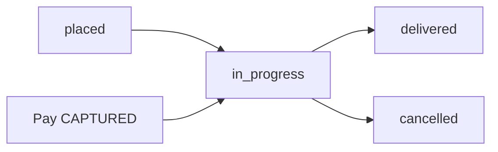

# Статусы YCP и miniShop2

Пакет не зашивает id статусов. Четыре numberfield в area `yandexcommerce`. Ноль в настройке пакета берёт значение по умолчанию miniShop2.

Меняет `msOrder.status` только `Ms2Gateway::changeOrderStatus` (`$miniShop2->changeOrderStatus`).

## Настройки

| Ключ | Ноль значит | Когда срабатывает |
|------|-------------|-------------------|
| `msyandexcommerce_status_placed_id` | `ms2_status_new` (обычно 1) | после успешного `placed` |
| `msyandexcommerce_status_paid_id` | `ms2_status_paid`, если он > 0, иначе статус не менять | `CAPTURED` в Pay webhook |
| `msyandexcommerce_status_cancelled_id` | `ms2_status_canceled` (обычно 4) | `checkout/cancel`, `order/cancel`, compensate после сбоя create |
| `msyandexcommerce_status_delivered_id` | `ms2_status_done` (обычно 2) | `POST /order/delivered` |

Если «выполнен» у вас не `ms2_status_done`, укажите свой id в `status_delivered_id`.

`paid` с нулём в пакете и нулём в `ms2_status_paid` статус не трогает. Отдельного YCP `POST /order/status` нет. Оплата приходит JWT-вебхуком Яндекс Пэй (`ORDER_STATUS_UPDATED` / `OPERATION_STATUS_UPDATED` → `CAPTURED`): [payment](payment).

`StatusMapper::toMs2StatusId()` знает строки `placed`, `paid`, `cancelled` (`canceled`), `delivered`. **HTTP inbound** этих строк не принимает. Paid на HTTP — только CAPTURED webhook. placed / cancelled / delivered — свои маршруты и `Ms2Gateway`.

## Обратный маппинг `GET /order`

Тот же набор id:

| `msOrder.status` | `delivery_statuses[].status` |
|------------------|------------------------------|
| = `status_delivered_id` | `delivered` |
| = `status_cancelled_id` | `cancelled` |
| всё остальное, включая new / paid | `in_progress` |

Paid наружу отдельным значением не отдаём.

Входящие: `placed` / cancel / delivered / Pay webhook. Наружу `GET /order`: `delivered` | `cancelled` | `in_progress`.

## Кто читает настройки

`Config::getStatus*Id()` → `StatusMapper` и `Ms2Gateway::getPlacedStatusId()` / `getCanceledStatusId()` / `getDeliveredStatusId()`.

| Кто | Что ставит |
|-----|------------|
| `CreateMs2Order` после save | placed |
| Compensate и `CancelService` | cancelled |
| `OrderStatusSyncService::delivered()` | delivered |
| `GET /order` | `StatusMapper::toYcpStatus()` |
