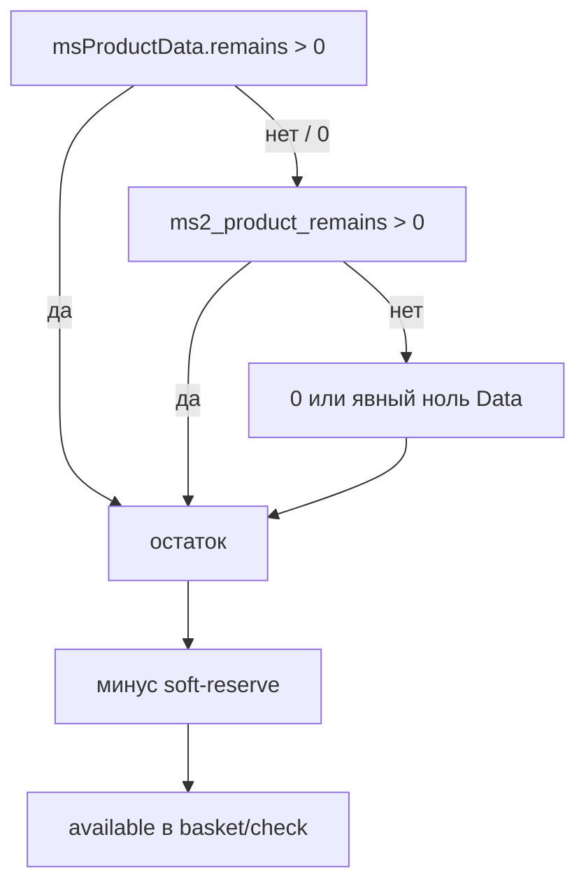

# Остатки (stock)

Цепочка в `Ms2Gateway::getStock()`:

1. Поле `remains` у `msProductData` (стандартный miniShop2): если значение **> 0**, оно авторитетно.
2. Иначе сумма `remains` из таблицы `ms2_product_remains` (дополнение msProductRemains), если сумма **> 0**.
3. Иначе явный ноль из Data (если ключ был) или `0` (нет таблицы / запрос упал).

Так `Data.remains = 0` на сайтах с msProductRemains не блокирует чтение таблицы Remains. Положительный остаток в Data всегда побеждает.

Soft-reserve живёт в `ms_yandexcommerce_reservations`. Пакет не уменьшает `remains` в каталоге. Доступно = склад минус активный резерв. Подробнее: [checkout](checkout).



## Обычный miniShop2

Остаток в карточке товара MS2 (`msProductData.remains`). Для YCP этого достаточно: в фиде и в API `offer_id` = id ресурса `msProduct`, остаток > 0.

## msProductRemains

На части сайтов склад лежит в `modx_ms2_product_remains`, а в Data `remains` = 0 или не используется. Пакет 0.1.1+ при нуле/отсутствии положительного Data читает сумму по `product_id` из этой таблицы.

Если таблицы нет, ошибка SQL глотается и stock = 0. В лог это может не попасть. Симптом: `422` / insufficient stock при живом товаре на витрине.

## TV-поле

Пакет TV не читает. Корзина и кнопка считают товар недоступным, если склад только в TV.

| Как храните склад | Что сделать |
|-------------------|-------------|
| `msProductData.remains` | Ничего: работает из коробки |
| `ms2_product_remains` | Нужен пакет с fallback Remains (0.1.1+; при `Data.remains=0` читает таблицу) |
| Только TV | Пока не поддерживается. Пишите остаток в `remains` или в таблицу Remains, либо дождитесь настройки `stock_tv` (её ещё нет) |

## Проверка

```bash
# Успех: HTTP 200, у item available === true (bool). Число остатка — только в details.errors[].available при INSUFFICIENT_STOCK
curl -sS -X POST "$BASE/api/v1/checkout/basket/check" \
  -H "Authorization: Bearer $TOKEN" \
  -H "Content-Type: application/json" \
  -d "{\"items\":[{\"offer_id\":$OFFER,\"count\":1}]}"
```

Пример успешного фрагмента ответа (цены в копейках):

```json
{
  "valid": true,
  "items": [
    {
      "offer_id": "42",
      "name": "Товар",
      "count": 1,
      "price": 199900,
      "final_price": 179900,
      "regular_price": 199900,
      "currency": "RUB",
      "available": true
    }
  ],
  "total": 179900,
  "currency": "RUB"
}
```

Цены в ответе (`price`, `final_price`, `total`) — в копейках. В менеджере MS2 сравните остаток каталога с тем, что уходит в ошибку `INSUFFICIENT_STOCK`. Если на витрине «есть», а check падает, смотрите TV / Remains / поле Data.

См. также [troubleshooting](troubleshooting) (`BASKET_CHECK_FAILED`) и [faq](faq).
