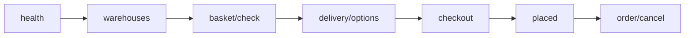

# План тестирования YCP

Справка Яндекса сверена 16 сентября 2026.

У YCP нет отдельного sandbox-хоста, тестовых логинов и OpenAPI. Проверка идёт в боевом кабинете [Яндекс Товаров](https://merchants.yandex.ru/shop?tab=checkout).

Настройка `msyandexcommerce_mode` (`sandbox` / `production`) для YCP отдельный тестовый хост не поднимает. Для Pay webhook переключает JWKS: `sandbox.pay.yandex.ru` / `pay.yandex.ru`.

## Что есть в справке Яндекса

| Что | Где | Зачем |
|-----|-----|-------|
| Кабинет YCP | [Яндекс Товары → Кнопка «Купить»](https://merchants.yandex.ru/shop?tab=checkout) | URL API, токен доступа магазина, токен API YCP |
| «Проверить подключение» | Настройки модуля / URL для API | Яндекс сам бьёт в ваш HTTPS endpoint |
| «Тестирование фида» → «Выгрузить фид из Яндекс Товаров» | Кабинет YCP | Один уже проверенный фид. Хватает для тестового заказа |
| Тестовый заказ | Кабинет YCP → «Товары» | Оформление без публикации кнопки в Поиске |
| «Опубликовать» | После успешного теста | Кнопка в выдаче и Алисе, до 36 часов |

На [merchants.yandex.ru/ycp](https://merchants.yandex.ru/ycp) для собственных CMS написано: интеграция по API в бете. Отдельного тестового контура там тоже нет.

`offer_id` в фиде = id товара на сайте. В miniShop2 это id ресурса `msProduct`. Чтобы ограничить кнопку частью ассортимента, в фиде: `<param name="is_checkout_enabled">true|false</param>` ([offers](https://yandex.ru/support/merchants/ru/offers)).

После «Опубликовать» кнопка может не показаться всем: продукт в бете, выдача ограничена.

## Что с YCP путают

| Сервис | Что там | Почему не наш контур |
|--------|---------|----------------------|
| [Песочница Директа](https://yandex.ru/dev/direct/doc/ru/concepts/sandbox) | `api-sandbox.direct.yandex.com` | Рекламный API, не checkout |
| [Тестовый заказ Маркета](https://yandex.ru/dev/market/partner-api/doc/ru/concepts/sandbox) | кабинет → API и модули → Тестовый заказ, в запросах `fake=true` | Partner API FBS Маркета. Пакет его не реализует |
| [Яндекс Пэй Merchant API](https://pay.yandex.ru/docs/ru/custom/backend/merchant-api-hidden/order-create) | `/v1/order/create`, резерв 30 мин | Merchant `order/create` пакет не реализует. JWT webhook Пэй (`POST /v1/webhook`) — да, см. [payment](payment). Маппинг `msPayment` при `placed` отдельно |
| Сайты на [Яндекс KIT](https://kit.yandex.ru/) | YCP из коробки | Не CMS miniShop2 |

Фид Маркета / Яндекс Товаров нужен для витрины и `offer_id`. Checkout бьёт в ваш `api.php`, не в Partner API Маркета.

## Два контура

```text
A. Вы = клиент Яндекса (staging + curl/Postman)
B. Кабинет YCP (путь из справки)
```

Если сразу идти в B без A, сюрпризы вылезут на живом заказе. A без B не ловит поля, которые Яндекс реально шлёт.

Staging: отдельный HTTPS-домен, отдельный магазин в кабинете, 1–2 дешёвых SKU, постоплата или тестовый `msPayment`. Заказ сразу отменяйте.

## A. Контракт магазина (без кабинета)

В YCP Яндекс ходит как HTTP-клиент. На staging эту роль берёте вы.

Подготовка:

1. Пакет установлен. В менеджере «Yandex Commerce (YCP)» → «Обновить»: в JSON смотрите `ready`, `enabled`, `mode`, `minishop2`, `tables`, `api_token_configured`, `timestamp`.
2. `msyandexcommerce_enabled` = да.
3. Склад, `delivery_*_id`, `payment_*_id` заполнены ([configuration](configuration)).
4. HTTPS. За reverse proxy включите `trust_proxy`, иначе `403 HTTPS_REQUIRED`.
5. Bearer из `msyandexcommerce_api_token` (после регенерации токен показывают один раз).
6. `offer_id` = id опубликованного `msProduct` с `remains` > 0.

Переменные:

```text
BASE=https://staging.example/assets/components/msyandexcommerce/api.php
TOKEN=<msyandexcommerce_api_token>
OFFER=<id msProduct>
```

### Последовательность

`/health` без Bearer. Остальное с заголовками:

```http
Authorization: Bearer $TOKEN
Content-Type: application/json
```



1. `GET $BASE/health` → `{"status":"ok"}`.
2. `GET $BASE/api/v1/warehouses` → склад из настроек MODX. Ту же ручку дергает кнопка **Обновить склады через YCP** в кабинете Яндекса (в MODX её нет).
3. `POST $BASE/api/v1/checkout/basket/check`

```json
{"items":[{"offer_id":OFFER,"count":1}]}
```

Пакет также читает алиасы `id` / `product_id` и `quantity`.

1. `POST $BASE/api/v1/checkout/delivery/options` с теми же `items`.
2. `GET $BASE/api/v1/checkout/delivery/pickup_points`.
3. `POST $BASE/api/v1/checkout` с `items`, `customer`, `address`, `delivery`. В ответе `session_id`, `order_number` (= `session_id`) и статус `checkout`.
4. Повтор `checkout` с тем же ключом идемпотентности (`Idempotency-Key` / `session_id`) не должен удвоить soft-reserve.
5. `POST $BASE/api/v1/checkout/placed`

```json
{
  "session_id": "<из шага 6>",
  "order_id": "ya-test-1",
  "payment_method": "cod"
}
```

В miniShop2 появляется `msOrder`. В `properties` лежат `ycp_session_id` и `ycp_external_order_id`. В ответе `order_number` = `order_id` из тела. Повтор `placed` с тем же `session_id` возвращает тот же заказ.

1. `GET $BASE/api/v1/order?session_id=...` или `order_id=ya-test-1`.
2. `POST $BASE/api/v1/order/cancel` (до `placed` можно `checkout/cancel`).
3. По желанию: новый цикл до `placed`, затем `POST $BASE/api/v1/order/delivered`.

Лог: `{core_path}cache/logs/msyandexcommerce.log`, префикс `[YCP][request:…]`.

Негативные проверки:

- без Bearer → `401`
- неверный токен → `401`
- `enabled=false` → `503 DISABLED`
- HTTP без TLS при `https_required` → `403`
- несуществующий `offer_id` → ошибка корзины

Пример шага 3:

```bash
curl -sS -X POST "$BASE/api/v1/checkout/basket/check" \
  -H "Authorization: Bearer $TOKEN" \
  -H "Content-Type: application/json" \
  -d "{\"items\":[{\"offer_id\":$OFFER,\"count\":1}]}"
```

Коллекция Postman: [msyandexcommerce-ycp.postman_collection.json](/components/msyandexcommerce/postman/msyandexcommerce-ycp.postman_collection.json). Import → задайте `baseUrl`, `token`, `offerId`. После «Checkout» `sessionId` пишется сам.

Если кабинет YCP принимает только боевой домен, коллекцией бейте в тот же prod URL. Берите копеечный SKU, `payment_method: cod`, после `placed` сразу `order/cancel`. Яндекс при этом сам ничего не шлёт.

## B. Путь в кабинете

Пока контур A не зелёный, URL в кабинете держите на staging.

1. [Яндекс Товары](https://merchants.yandex.ru/shop?tab=checkout) → «Магазин» → «Кнопка „Купить“» → способ «YCP протокол (API)».
2. Токен API YCP из кабинета положите в `msyandexcommerce_ycp_api_token`. Исходящих вызовов к API YCP в runtime нет. Getter есть, поле нужно кабинету.
3. Сгенерируйте access token магазина (диагностика / «Сгенерировать API-токен») и вставьте в кабинет как токен доступа.
4. «URL для API» без суффикса `/api/v1`:

```text
https://staging.example/assets/components/msyandexcommerce/api.php
```

Яндекс сам дописывает `/api/v1/...`. См. [ycp](ycp).

1. «Проверить подключение». Смотрите лог пакета и ответ кабинета. При ошибке справка предлагает писать в поддержку Яндекса с текстом ошибки и данными подключения.
2. Компания, домен, оплата, доставка, склады. Склады: в кабинете Яндекса **Обновить склады через YCP** (способ подключения YCP/API, не Битрикс). Где искать и что делать, если кнопки нет: [configuration](configuration#где-кнопка-обновить-склады-через-ycp).
3. Фид в «Товары» → «Источники данных» должен пройти проверку. В кабинете YCP: «Тестирование фида» → «Выгрузить фид из Яндекс Товаров». Должен подтянуться один валидный фид.
4. «Товары» → тестовый заказ: корзина, резерв, оплата/доставка, заказ в miniShop2. Сразу отмените в кабинете или через `order/cancel`.
5. «Опубликовать» только после зелёного теста. URL на прод не переключайте, пока staging-заказ не создал корректный `msOrder`.

Для первого прогона в кабинете проще выбрать только постоплату. Онлайн (Яндекс Pay + касса) подключайте отдельно.

## Прод: проверка боевого URL

Когда B на staging зелёный: тот же пакет на проде, настройки, curl на боевой `api.php`, затем кабинет. Кнопку не публикуйте, пока проверка не прошла.

Порядок выхода: [production-go-live](production-go-live).

## Чеклист

- [ ] `/health` = ok
- [ ] Bearer + warehouses
- [ ] basket/check по реальному `offer_id`
- [ ] delivery/options
- [ ] checkout → `session_id`, резерв не двоится
- [ ] placed → `msOrder`, повтор placed идемпотентен
- [ ] cancel / delivered
- [ ] Кабинет: URL + токен, «Проверить подключение»
- [ ] «Обновить склады через YCP»
- [ ] Фид выгружен в «Тестирование фида», `offer_id` = id MS2
- [ ] Тестовый заказ в «Товары», данные в MS2 сходятся
- [ ] Заказ отменён
- [ ] Публикация кнопки (осознанно, до 36 ч)

## Ссылки

- [Кабинет](https://merchants.yandex.ru/shop?tab=checkout)
- [Загрузка фида](https://yandex.ru/support/merchants/ru/connect/feed-load)
- [Тестовые заказы Маркета (не YCP)](https://yandex.ru/dev/market/partner-api/doc/ru/concepts/sandbox)
- Официальные страницы YCP: [ycp](ycp)
