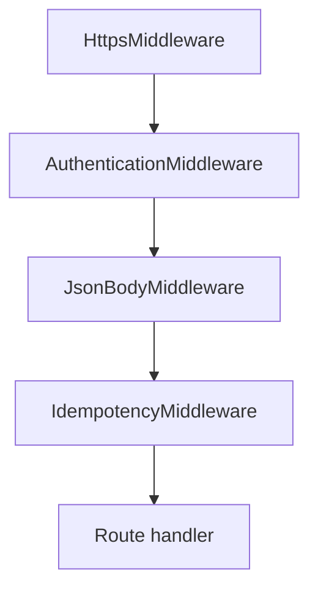
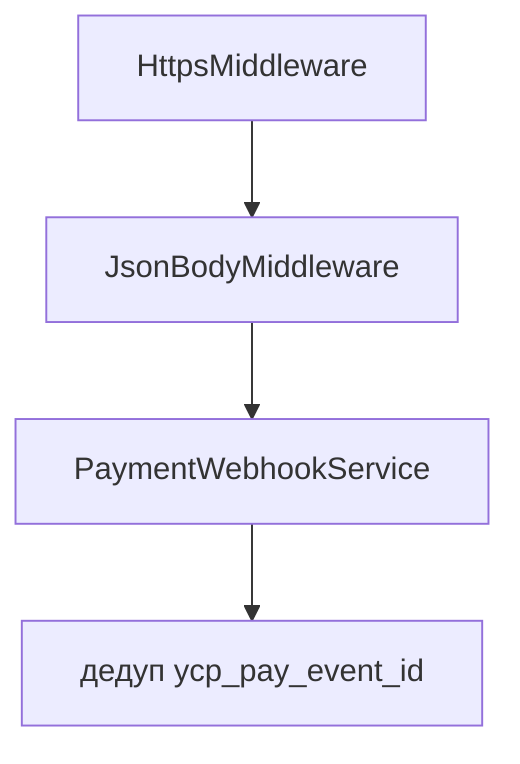
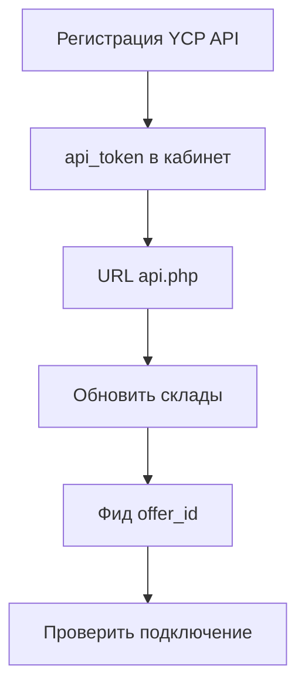

# YCP API

Входная точка магазина:

```text
https://ваш-домен/assets/components/msyandexcommerce/api.php
```

В кабинете YCP в поле **URL для API** указывают этот base URL **без** суффикса `/api/v1`. Яндекс сам дописывает пути.

Маршрутизация идёт через `PATH_INFO` или путь после `api.php`. Примеры рабочих URL:

```text
GET  https://shop.example/assets/components/msyandexcommerce/api.php/health
GET  https://shop.example/assets/components/msyandexcommerce/api.php/api/v1/warehouses
POST https://shop.example/assets/components/msyandexcommerce/api.php/api/v1/checkout/basket/check
```

Rewrite на `api.php` укорачивает base. Не обязателен, если PATH_INFO доходит до PHP.

## Авторизация

Заголовок:

```http
Authorization: Bearer <msyandexcommerce_api_token>
Content-Type: application/json
```

Сравнение токена: `hash_equals`. Пустой токен в настройках → HTTP `503`, `error.code` = `UNAUTHORIZED` («API token is not configured»). Нет/неверный Bearer → HTTP `401`, тот же `UNAUTHORIZED`.

`/health` авторизацию и проверку HTTPS не требует.

## Эндпоинты

Контракт путей — из community-интеграций YCP (Webasyst / Woo). Справка Яндекса описывает операции, полного OpenAPI нет. После **Проверить подключение** сверяйте поля ответа с логом и при необходимости подправьте mapper.

| Method | Path | Handler | Назначение |
|--------|------|---------|------------|
| GET | `/health` | DiagnosticsService | `{"status":"ok"}` |
| GET | `/api/v1/warehouses` | Config::warehousesResponse | Список складов |
| POST | `/api/v1/checkout/basket/check` | CartService | Цены (копейки) и остатки |
| POST | `/api/v1/checkout/delivery/options` | DeliveryService | Тарифы, `date_from` / `date_to`, событие `ms2ycpOnDeliveryOptions` |
| GET | `/api/v1/checkout/delivery/pickup_points` | Config::pickupPointsResponse | Свои ПВЗ |
| POST | `/api/v1/checkout` | CheckoutService | Сессия + soft-reserve |
| POST | `/api/v1/checkout/placed` | OrderService | Создание заказа MS2 |
| POST | `/api/v1/checkout/cancel` | CancelService | Отмена сессии |
| GET | `/api/v1/order` | OrderStatusSyncService | Статус YCP-заказа (`delivered` / `cancelled` / `in_progress` по `status_*_id`) |
| POST | `/api/v1/order/cancel` | CancelService | Отмена заказа |
| POST | `/api/v1/order/delivered` | OrderStatusSyncService | Доставлен |
| POST | `/v1/webhook` | PaymentWebhookService | JWT Яндекс Пэй (без Bearer; `yapay_webhook_enabled`) |

## Middleware (порядок)

1. `HttpsMiddleware`
2. `AuthenticationMiddleware`
3. `JsonBodyMiddleware` (лимит `max_request_bytes`)
4. `IdempotencyMiddleware` для `POST /api/v1/checkout`, `placed`, `checkout/cancel`, `order/cancel`, `order/delivered`

Ключ идемпотентности (по приоритету): заголовок `Idempotency-Key`, иначе поля тела `idempotency_key` или `session_id`. Пустой ключ — middleware пропускает запрос без записи. Ответы хранятся в `ms_yandexcommerce_requests`.

`POST /v1/webhook` в этот список **не** входит. Дедуп Pay — по `ycp_pay_event_id` в заказе ([payment](payment)).

Маршруты YCP (кроме Pay webhook):



`POST /v1/webhook`:



## Ошибки

Формат YCP (все маршруты кроме Pay webhook):

```json
{
  "error": {
    "code": "UNAUTHORIZED",
    "message": "Missing Bearer token",
    "details": {}
  }
}
```

Частые коды: `UNAUTHORIZED`, `DISABLED`, `HTTPS_REQUIRED`, `NOT_FOUND`, `SESSION_REQUIRED`, `SESSION_NOT_FOUND`, `INVALID_SESSION_STATE`, `EMPTY_CART`, `INVALID_CART`, `PRODUCT_NOT_FOUND`, `INSUFFICIENT_STOCK`, `NO_DELIVERY`, `ORDER_IN_PROGRESS`, `BUTTON_DISABLED`, `PAYLOAD_TOO_LARGE`, `INVALID_JSON`, `PAYMENT_NOT_CONFIGURED`, `BASKET_CHECK_FAILED`, `ORDER_CREATE_FAILED`, `MS2_UNAVAILABLE`, `DB_ERROR`, `FORBIDDEN`, `TOKEN_EXPIRED`.

HTTP-код совпадает с `YcpException` (400–503). Неизвестные исключения → `500 INTERNAL_ERROR` без stack trace.

`POST /v1/webhook` (Яндекс Пэй): тело ошибок `{"reasonCode":"…"}` (в т.ч. HTTPS и oversized body → `FORBIDDEN`). См. [payment](payment).

## Кабинет Яндекс Товаров

1. Зарегистрируйте магазин, способ подключения **YCP протокол (API)**.
2. Вставьте access token магазина (`api_token`) в кабинет.
3. При необходимости сохраните выданный Яндексом API-токен в `ycp_api_token`.
4. Укажите URL API (base на `api.php`).
5. Настройте оплату/доставку в кабинете в соответствии с mapping в MODX.
6. Импортируйте склады кнопкой **Обновить склады через YCP** в кабинете Яндекса (не в MODX). Путь и почему кнопки может не быть: [configuration](configuration#где-кнопка-обновить-склады-через-ycp).
7. Выгрузите фид. `offer_id` = id товара miniShop2.
8. **Проверить подключение**, затем тестовый заказ в разделе Товары. Полный план: [testing](testing).



Официальные инструкции:

- [Введение в YCP](https://yandex.ru/support/merchants-ru-ycp/ru/)
- [Кнопка «Купить в 1 клик»](https://yandex.ru/support/merchants/ru/buy-button)
- [Кнопка на сайте](https://yandex.ru/support/merchants/ru/buy-button-site)

## Логи

Файл: `{core_path}cache/logs/msyandexcommerce.log`.

Префикс строки: `[YCP][request:<id>]`. Request id берётся из заголовка `X-Request-Id` или генерируется.
