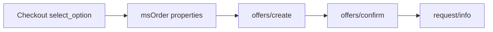

# Заявки и менеджер

## Жизненный цикл

1. На чекауте выбор сохраняется в `properties.msyandexdelivery`.
2. В менеджере на вкладке заказа вы вызываете **Create** → Platform `offers/create`.
3. **Confirm** → `offers/confirm` с `offer_id`.
4. **Refresh status** → `request/info` (и при необходимости `actual_info` / `history` через сервис).

Push-уведомлений (webhook) **нет**. Other-day API их не даёт. Статус обновляйте опросом.

Данные заявки хранятся в таблице **`msyandex_requests`** (модель `msydRequest`) и в properties заказа.

## Вкладка заказа MiniShop3

Плагин `msYandexDelivery Manager order tab` на `msOnManagerCustomCssJs` (страница заказа) регистрирует вкладку через `MS3OrderTabsRegistry`. Нужен **VueTools**.

На вкладке: статус, offer/request id, цена, tracking, кнопки Create / Confirm / Refresh.

## CMP

Меню **msYandexDelivery** открывает CMP: тест соединения, тест расчёта, просмотр и очистка журнала HTTP. Пункт **Системные настройки** ведёт в namespace `msyandexdelivery`.

## Connector

Единая точка: `assets/components/msyandexdelivery/connector.php`.

| action | Контекст | Назначение |
| --- | --- | --- |
| `calculate` | web | Расчёт стоимости |
| `select_option` | web | Сохранить выбор (нужен `ms3_token`) |
| `list_pickup_points` | web | Список ПВЗ |
| `test_connection` | mgr | Проверка доступа к API |
| `test_calculate` | mgr | Тестовый расчёт |
| `get_log` / `clear_log` | mgr | Журнал запросов |
| `get_order_summary` | mgr | Сводка по заказу |
| `create_request` | mgr | Создать offer |
| `confirm_request` | mgr | Подтвердить offer |
| `refresh_status` | mgr | Обновить статус |

`cancel_request` перечислен среди mgr-actions, но в `switch` коннектора **не реализован** (ответ `unknown_action`). Метод отмены в `YandexPlatformClient` есть; UI пока не подключён.

## Platform API (клиент)

Базовый host: `msyandexdelivery_base_url`. Пути клиента:

| Метод | Path |
| --- | --- |
| POST | `/api/b2b/platform/pricing-calculator` |
| POST | `/api/b2b/platform/offers/create` |
| POST | `/api/b2b/platform/offers/confirm` |
| GET | `/api/b2b/platform/request/info` |
| GET | `/api/b2b/platform/request/actual_info` |
| GET | `/api/b2b/platform/request/history` |
| POST | `/api/b2b/platform/request/cancel` |
| POST | `/api/b2b/platform/location/detect` |
| POST | `/api/b2b/platform/pickup-points/list` |

Сервис: `MsYandexDelivery\Service\YandexDeliveryService`. HTTP: `MsYandexDelivery\Api\YandexPlatformClient`.

## Плагины

| Плагин | События |
| --- | --- |
| msYandexDelivery Autoload | `OnMODXInit` (priority -100) |
| msYandexDelivery Delivery | `msOnGetDeliveryCost` |
| msYandexDelivery Order persist | `msOnSubmitOrder`, `msOnBeforeCreateOrder`, `msOnCreateOrder` |
| msYandexDelivery Manager order tab | `msOnManagerCustomCssJs` |
