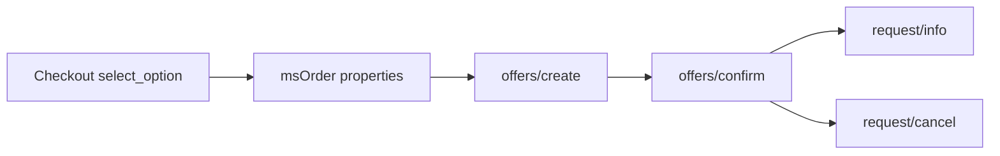

# Заявки и менеджер

## Жизненный цикл



1. На чекауте выбор сохраняется в `properties.msyandexdelivery`.
2. В менеджере на вкладке заказа вы вызываете **Create** → Platform `offers/create`.
3. **Confirm** → `offers/confirm` с `offer_id`.
4. **Refresh status** → `request/info`.
5. **Отменить** → `request/cancel` (пока заявка ещё не у курьера).

Push-уведомлений (webhook) **нет**. Other-day API их не даёт. Статус обновляйте опросом вручную или пакетно.

Данные заявки хранятся в таблице **`msyandex_requests`** (модель `msydRequest`) и в properties заказа.

## Вкладка заказа MiniShop3


Плагин `msYandexDelivery Manager order tab` на `msOnManagerCustomCssJs` (страница заказа) регистрирует вкладку через `MS3OrderTabsRegistry`. Нужен **VueTools**.

На вкладке: статус, offer/request id, цена, tracking, кнопки Create / Confirm / Refresh / Cancel.

Кнопка **Отменить** доступна после подтверждения заявки и до передачи посылки курьеру. Недоступна для завершённых заявок (доставлена, отменена, возвращена, ошибка), заказа в пункте выдачи, возврата и статуса «Едет к получателю». После успешной отмены на вкладке будет «Отменена».

## Опрос статусов

Пакетный опрос подтягивает актуальные статусы из Яндекс Доставки для активных заявок. Завершённые (доставлена, отменена, возвращена, ошибка) пропускаются. В первую очередь обновляются заявки, которые давно не синхронизировались.

После каждого изменения статус сохраняется в карточке заказа MiniShop3. Чтобы автоматически менять статус заказа или слать уведомления, подключите плагин на событие смены статуса (см. ниже).

### Scheduler

Файл задачи: `core/components/msyandexdelivery/elements/tasks/sync_statuses.php`

1. Установите [Scheduler](https://modx.com/extras/package/scheduler) или аналог.
2. Создайте File task на этот путь.
3. Интервал 15–30 минут.
4. В свойствах задачи можно задать `limit`. Иначе берётся `msyandexdelivery_sync_poll_limit`.

### Cron без Scheduler

Задайте длинный `msyandexdelivery_sync_secret` и вызовите коннектор:

```bash
curl -sS 'https://example.com/assets/components/msyandexdelivery/connector.php?action=sync_statuses&secret=YOUR_SECRET'
```

Работает и через POST. Без секрета и без сессии менеджера ответ `unauthorized`. Если вы уже вошли в менеджер, `action=sync_statuses` можно без секрета.

### Плагин на смену статуса

```php
<?php
/** @var modX $modx */
switch ($modx->event->name) {
    case 'msYandexDeliveryOnStatusChange':
        $orderId = (int) ($modx->event->params['order_id'] ?? 0);
        $normalized = (string) ($modx->event->params['normalized_status'] ?? '');
        // например сменить статус MS3 при delivered
        break;
}
```

Подпишите плагин на событие. MODX создаст имя при первом `invokeEvent`, либо добавьте `msYandexDeliveryOnStatusChange` в Events пакета.

## Connector

Единая точка: `assets/components/msyandexdelivery/connector.php`.

| action | Контекст | Назначение |
| --- | --- | --- |
| `calculate` | web | Расчёт стоимости |
| `select_option` | web | Сохранить выбор (нужен `ms3_token`) |
| `list_pickup_points` | web / mgr | Список ПВЗ |
| `get_order_summary` | mgr | Сводка по заказу |
| `create_request` | mgr | Создать offer |
| `confirm_request` | mgr | Подтвердить offer |
| `refresh_status` | mgr | Обновить статус |
| `cancel_request` | mgr | Отменить заявку |
| `sync_statuses` | mgr или secret | Пакетный опрос активных заявок |

## Platform API (клиент)

Базовый host: `msyandexdelivery_base_url`. Пути клиента:

| Метод | Path |
| --- | --- |
| POST | `/api/b2b/platform/pricing-calculator` |
| POST | `/api/b2b/platform/offers/create` |
| POST | `/api/b2b/platform/offers/confirm` |
| GET | `/api/b2b/platform/request/info` |
| GET | `/api/b2b/platform/request/actual_info` |
| GET | `/api/b2b/platform/request/history` |
| POST | `/api/b2b/platform/request/cancel` |
| POST | `/api/b2b/platform/location/detect` |
| POST | `/api/b2b/platform/pickup-points/list` |

Сервис: `MsYandexDelivery\Service\YandexDeliveryService`. HTTP: `MsYandexDelivery\Api\YandexPlatformClient`.

## Плагины

| Плагин | События |
| --- | --- |
| msYandexDelivery Autoload | `OnMODXInit` (priority -100) |
| msYandexDelivery Delivery | `msOnGetDeliveryCost` |
| msYandexDelivery Order persist | `msOnSubmitOrder`, `msOnBeforeCreateOrder`, `msOnCreateOrder` |
| msYandexDelivery Manager order tab | `msOnManagerCustomCssJs` |
