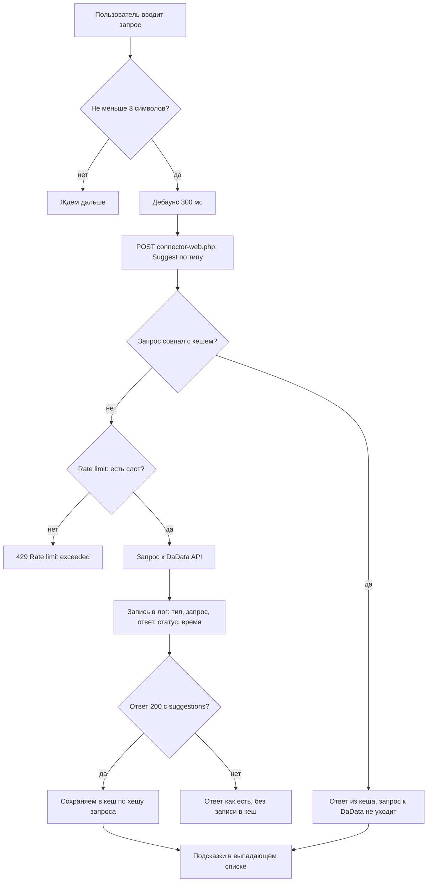

# Подключение на сайте

Сниппеты выводятся в **чанке формы заказа** (например `tpl.msOrder`) или эквиваленте. Вызов должен быть **некэшированным**, иначе скрипты не попадут на страницу.

Поставляемый чанк **`tpl.mxdadata.msOrder`** написан только на **Fenom** (`{if …}`, `{'!Snip' | snippet}`). Синтаксиса `[[…]]` в нём нет, эквивалент на MODX-синтаксисе придётся писать самому.

::: warning
Все три сниппета только регистрируют скрипты и **возвращают пустую строку**. Серверной подстановки подсказок нет: без JavaScript подсказок не будет. Нормализацию адреса на сервере делает отдельный плагин на `msOnBeforeCreateOrder` / `msOnSubmitOrder`, см. [Интеграция](/components/mxdadata/integration).
:::

## Коннектор витрины

**URL:** `assets/components/mxdadata/connector-web.php` (в сниппетах подставляется абсолютный URL от `[[++assets_url]]`).

Переопределение: параметр сниппета **`connectorUrl`**.



Разрешённые действия (см. исходник коннектора), в том числе: `Suggest/Address`, `Suggest/Party`, `Suggest/Name`, `Suggest/Email`, `Suggest/Bank`, `Party/FindById`, `Geolocate/Address`, `Tools/Version`.

Публичный POST без сессии менеджера. В ответах заголовок **`Access-Control-Allow-Origin: *`** (см. `connector-web.php`).

Формы ответа:

| Тело | Когда |
|------|-------|
| `{success: true, message: "", data: …}` | действие выполнено. У `Suggest/*` в `data` лежит `suggestions` со списком, при попадании в серверный кэш добавляется `data.from_cache = true` |
| `{success: false, message: "…", errors: …}` | действие отклонено: запрос короче 3 символов, пустой token, превышен лимит |
| `{success: false, message: "Service disabled"}` | `mxdadata_enabled` = «Нет». Проверка стоит до разбора `action` |
| `{success: false, message: "Invalid or missing action"}` или `Processor not found` | `action` не в списке разрешённых либо нет класса процессора |
| `{success: false, message: "Processor error"}` | исключение в процессоре. Текст исключения не возвращается |

Тексты ошибок берутся из лексикона `mxdadata:default`, а веб-коннектор его грузит, поэтому тексты DaData видны в публичном JSON.

## Имена полей формы MiniShop3 {#имена-полей-формы-minishop3}

`name` в форме должны совпадать с ожиданиями сниппетов и модели **msOrder.Address** (и полей Party для ИНН).

### Адрес (модель Address)

`mxDadataAddressSuggest` пишет восемь значений: `index`, `region`, `city`, `street`, `building`, `room`, `text_address`, `fias_id`. Каждое значение идёт в **два** поля: сначала в поле с «голым» `name` (например `city`), потом в поле с тем же именем с префиксом **`address_`** (`address_city`). Через `order/set` заполняются оба варианта, при заполнении напрямую в DOM «голое» имя не достаёт для `fias_id` и `address_text_address`.

| `name` (форма) | Поле модели | Описание | Заполнение |
|----------------|------------|----------|------------|
| `text_address` | `text_address` | Адрес одной строкой. Единственное «голое» имя адреса, которое mxDadata пишет всегда | Да |
| `index` | `index` | Почтовый индекс | Да |
| `region` | `region` | Регион | Да |
| `city` | `city` | Город | Да |
| `street` | `street` | Улица | Да |
| `building` | `building` | Дом | Да |
| `room` | `room` | Квартира / офис | Да |
| `fias_id` | `fias_id` | Код ФИАС | Да, но только через `order/set` |
| `address_text_address` | `text_address` | То же значение под именем MS3 | Да, но только через `order/set` |
| `address_index` | `index` | Почтовый индекс с префиксом | Да |
| `address_region` | `region` | Регион с префиксом | Да |
| `address_city` | `city` | Город с префиксом | Да |
| `address_street` | `street` | Улица с префиксом | Да |
| `address_building` | `building` | Дом с префиксом | Да |
| `address_room` | `room` | Квартира / офис с префиксом | Да |
| `address_fias_id` | `fias_id` | Код ФИАС, обычно скрытое поле | Да |
| `address` | `text_address` | Входит в дефолтный `input` как поле **ввода** подсказки. В списке результата его нет, mxDadata его не заполняет | Нет |
| `address_first_name`, `address_last_name`, `address_phone`, `address_email` | `first_name`, `last_name`, `phone`, `email` | Поля формы MS3. mxDadata их не заполняет, писателей в пакете нет | Нет |

::: warning Поле `name="address"`
После выбора подсказки `[name="address"]` показывает адрес, потому что это **само поле ввода** подсказки, а не результат автозаполнения. Поля результата (`text_address`, `address_*`) сниппет не трогает. Если нужен видимый адрес в отдельном поле, дайте ему `name="text_address"` или `name="address_text_address"`.
:::

### Реквизиты юрлица (Party, ИНН)

`mxDadataPartySuggest` пишет `company_name`, `kpp`, `ogrn`, `legal_address` в «голые» имена и в те же имена с префиксом `address_`.

| `name` (форма) | Описание | Заполнение |
|----------------|----------|------------|
| `address_inn` | ИНН, поле ввода подсказки | Да (ввод) |
| `inn` | ИНН, альтернативное имя ввода | Да (ввод) |
| `address_company_name` | Наименование организации | Да |
| `company_name` | То же без префикса | Да |
| `address_kpp` | КПП | Да |
| `kpp` | То же без префикса | Да |
| `address_ogrn` | ОГРН (в ответе бывает `ogrnip`) | Да |
| `ogrn` | То же без префикса | Да |
| `address_legal_address` | Юридический адрес | Да |
| `legal_address` | То же без префикса | Да |

Наименование берётся из ответа DaData по цепочке `full_with_opf` → `short_with_opf` → `full` → `short` → `name` → `value`, ОГРН берётся из `ogrn` с запасным `ogrnip`. Подробнее: [Админка → Юрлица](/components/mxdadata/admin-ui#юрлица-party).

## Запись в черновик заказа MS3 {#запись-в-черновик-заказа-ms3}

После выбора подсказки `mxDadataAddressSuggest` отправляет адрес в черновик заказа **одним** запросом. Параллельных `order/add` сниппет не делает.

- адрес: `window.ms3Config.actionUrl` с параметром `route=/api/v1/order/set`
- тело: `{ "fields": { "index": …, "region": …, "city": …, "street": …, "building": …, "room": …, "text_address": …, "fias_id": … } }`. Пустые значения в тело не попадают
- заголовки: `Content-Type: application/json`, `Accept: application/json`, `X-Requested-With: XMLHttpRequest`, куки уходят (`credentials: same-origin`)

::: warning
Сниппет читает **`window.ms3Config.actionUrl`**. Без инициализированного на странице MS3 адрес в заказ не уйдёт.
:::

Из успешного ответа берётся `data.order`. По нему скрипт расставляет значения в поля формы: сначала пробует `address_<имя>`, потом `<имя>`, и пишет в оба поля. Попутно снимается ошибка валидации MS3: у поля убирается `is-invalid`, родительскому `div` добавляется `was-validated`, текст внутри `.invalid-feedback` очищается.

Если `ms3Config.actionUrl` недоступен или запрос не прошёл, скрипт идёт вторым путём и заполняет поля напрямую в DOM. Тогда пишутся `index`, `region`, `city`, `street`, `building`, `room`, `text_address` и `address_fias_id`, `address_city`, `address_region`, `address_index`, `address_street`, `address_building`, `address_room`. Значения `fias_id` и `address_text_address` при этом остаются пустыми.

В обоих режимах на `document` уходит событие `mxdadata:order-address-updated`.

## Где ищутся поля {#где-ищутся-поля}

Значения ищутся не во всём документе, а внутри корня, найденного от поля подсказки (`closest`):

| Корень | Когда берётся |
|---|---|
| `[data-ms3-form="order"]` | форма заказа MS3 |
| `form.ms3_order_form` | та же форма в другой разметке |
| `.ms3_order_form` | то же |
| `#mxdadata-test-order` | своя секция для проверки сниппетов |
| `document` | ничего не нашлось, поля ищутся во всей странице |

## Порядок с msRussianPost {#порядок-с-msrussianpost}

Чтобы [доставка Почтой России](/components/msrussianpost/) пересчиталась после выбора подсказки:

1. Поля адреса и **подсказки mxDadata** (`mxDadataAddressSuggest` и при необходимости Party) — **выше** по разметке
2. Затем **msrpLexiconScript** → **msRussianPost** → чанки виджета Почты

Порядок подключения относится к пакету msRussianPost, mxDadata его не проверяет. Известно только, что `russianpost.js` слушает событие `mxdadata:order-address-updated` и пересчитывает тарифы при выбранной доставке Почтой России. Хук `ms3Hooks.afterAddOrder` в ряде сценариев после `order/set` не вызывается, поэтому событие важно.

## Демо чанка {#демо-чанка}

Чанк **`tpl.mxdadata.msOrder`** в пакете содержит блок **«Демо mxDadata»** в `<details>` (внизу):

- поля Party (`#mxdadata-demo-inn` и реквизиты с `name="inn"`, `company_name`, `kpp`, `ogrn`, `legal_address`)
- контейнер **`#mxdadata-demo-universal`** для `mxDadataForm` (конфиг **`chunk.mxdadata.demoFormSug`** через `suggestionsChunk`)
- поле подсказки адреса `#mxdadata-order-address` (однострочное, **без** `name`, плюс скрытое `name="address_fias_id"`)

В конце чанка вызываются `mxDadataAddressSuggest`, `mxDadataPartySuggest` (`innInput` на демо-ИНН) и `mxDadataForm`.

**Показ демо** в штатном чанке — **только если корзина не пуста** (ветка в шаблоне на непустую корзину). На экране «пустая корзина» демо **намеренно** не выводится: не подключаются скрипты и запросы к DaData.

### Поле адреса в демо не подключается {#поле-адреса-в-демо-не-подключается}

Известное ограничение поставляемого чанка. Причина такая:

- вызов в конце чанка идёт без параметра `input`: `{'!mxDadataAddressSuggest' | snippet}`
- в чанке у поля `#mxdadata-order-address` **нет** атрибута `name`, и значения `input=` в чанке нет
- значение `input` по умолчанию берётся из свойства сниппета в транспорте: `[name="address"], #address, [name="address_text_address"]`. Ни одного из этих селекторов в чанке тоже нет
- `querySelectorAll` находит 0 элементов, подсказка не инициализируется. Запасной PHP-список с `#mxdadata-order-address` не спасает: в MODX 3 свойство сниппета перекрывает PHP-фолбэк

Обходной путь: передать `input` явно в своём чанке.

::: code-group

```fenom
{'!mxDadataAddressSuggest' | snippet : ['input' => '#mxdadata-order-address']}
```

```modx
[[!mxDadataAddressSuggest?
    &input=`#mxdadata-order-address`
]]
```

:::

Чтобы исправить именно поставляемый `tpl.mxdadata.msOrder`, замените его вызов в конце чанка:

```fenom
{'!mxDadataAddressSuggest' | snippet : ['input' => '#mxdadata-order-address']}
```

Подсказка заработает, но адрес останется только в самом поле ввода: `#mxdadata-order-address` без `name` не уходит в заказ, а заполнение остальных полей зависит от `ms3Config.actionUrl` (см. [Запись в черновик заказа MS3](#запись-в-черновик-заказа-ms3)). Если нужен адрес в заказе, добавьте рядом скрытое `name="text_address"` или впишите значение через `order/set` на своей странице.

### Проверка всех трёх сниппетов без товаров в корзине

Когда блок из `tpl.mxdadata.msOrder` не подходит (корзина пуста или нужна своя разметка):

1. Создайте отдельный ресурс с произвольным шаблоном. Отдельного демо-шаблона в транспорте **нет**.
2. Оберните разметку в контейнер **`#mxdadata-test-order`**: этот `id` сниппет адреса принимает как корень поиска полей.
3. Вызовите **`mxDadataAddressSuggest`** с `input` на поле адреса и **`mxDadataPartySuggest`** с `innInput` на поле ИНН.
4. Для **`mxDadataForm`** задайте **`suggestionsChunk`** = **`chunk.mxdadata.demoFormSugTest`** и **переименуйте** `id` полей под ключи этого чанка: все семь ключей с префиксом `mxdadata_test_`.

Ключи `chunk.mxdadata.demoFormSugTest`:

| Ключ | Тип | Поля |
|------|-----|-------|
| `mxdadata_test_demo_email` | EMAIL | — |
| `mxdadata_test_demo_addr_line` | ADDRESS | — |
| `mxdadata_test_demo_party_u` | PARTY, `restrict_value` | — |
| `mxdadata_test_demo_bank` | BANK | — |
| `mxdadata_test_demo_fullname` | NAME, `count: 8` | — |
| `mxdadata_test_demo_geobtn` | GEOLOCATE | `latInput: mxdadata_test_demo_lat`, `lonInput: mxdadata_test_demo_lon`, `fillTarget: mxdadata_test_demo_geo_address`, `radius_meters: 50`, `count: 5` |
| `mxdadata_test_demo_version` | VERSION_INFO | — |

Ключ из JSON ищется сначала как `id`, потом как `name` **внутри** контейнера `selector`. Несовпадение имён означает, что подсказка не заработает. Ключи, начинающиеся с `_`, скрипт пропускает: так удобно временно отключать поле, не убирая его из JSON.

Без валидного JSON подсказки `mxDadataForm` не инициализируются.

## Синхронизация radio-групп заказа

Поставляемый чанк ставит на форму `data-mxdadata-sync-payment` и `data-mxdadata-sync-delivery`. Если чанк не выставил `1`, инлайн-скрипт в конце чанка при `DOMContentLoaded` отмечает выбранным первый radio в группе и отправляет ему `change`. MS3 копит заказ на сервере по событию `change`, поэтому без этого `payment_id` / `delivery_id` в сессии не появятся. Своё значение `ms3Config` этим не мешает.

## Стили

Общие стили подсказок: `assets/components/mxdadata/css/web/suggest.css` (подключается хелпером вместе со сниппетами, один раз за запрос).

| Класс | Кто ставит | Правило в `suggest.css` |
|---|---|---|
| `.mxdadata-suggest-wrapper` | обёртка поля ввода (`address-suggest.js`, `dadata-form.js`) | есть |
| `.mxdadata-suggest` | контейнер (`address-suggest.js`, `dadata-form.js`) | нет |
| `.mxdadata-suggest__dropdown` | список подсказок | есть |
| `.mxdadata-suggest__item` | пункт списка | есть, плюс `:hover` |
| `.mxdadata-party-wrapper` | обёртка поля ИНН (`party-suggest.js`) | есть |
| `.mxdadata-party-suggest` | контейнер (`party-suggest.js`) | нет |
| `.mxdadata-party-suggest__dropdown` | список подсказок | есть |
| `.mxdadata-party-suggest__item` | пункт списка | есть, плюс `:hover` |

Два класса без правил — точки расширения, свои стили вешайте на них. JS и CSS отдаются с `?v=<время изменения файла>`.

## Ручная инициализация

Сниппет — только обёртка над функциями в `window`. Если скрипт подключён вручную, инициализацию можно вызвать самому:

```js
window.mxDadataAddressSuggest.init(inputElement, {
    connectorUrl: 'https://site.ru/assets/components/mxdadata/connector-web.php',
    onSelect: function (mapped) { /* mapped.city, mapped.address и т.д. */ },
});
```

```js
window.mxDadataPartySuggest.init(innElement, {
    connectorUrl: 'https://site.ru/assets/components/mxdadata/connector-web.php',
    onSelect: function (mapped) { /* mapped.company_name, mapped.kpp, mapped.ogrn */ },
});
```

```js
window.mxDadataForm.init('#dadata-form', { email: { type: 'EMAIL' } }, connectorUrl);
```

Повторный вызов сниппета на той же странице безопасен: скрипт помечает поле атрибутом `data-mxdadata-init` (адрес) или `data-mxdadata-party-init` (ИНН) и второй раз его не трогает.

## Fenom

При **auto_escape** выводите сниппеты как **сырой HTML** (`|raw` / `{raw …}`), чтобы не экранировались `<script>`.

Примеры синтаксиса MODX и Fenom: [сниппеты](snippets/index) и [mxDadataForm](snippets/mxDadataForm).
