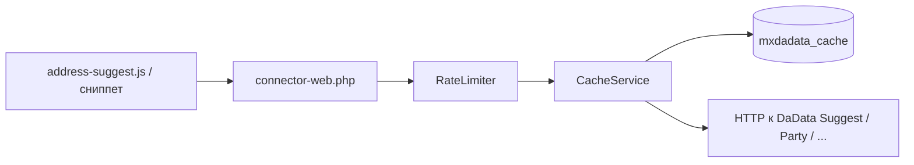
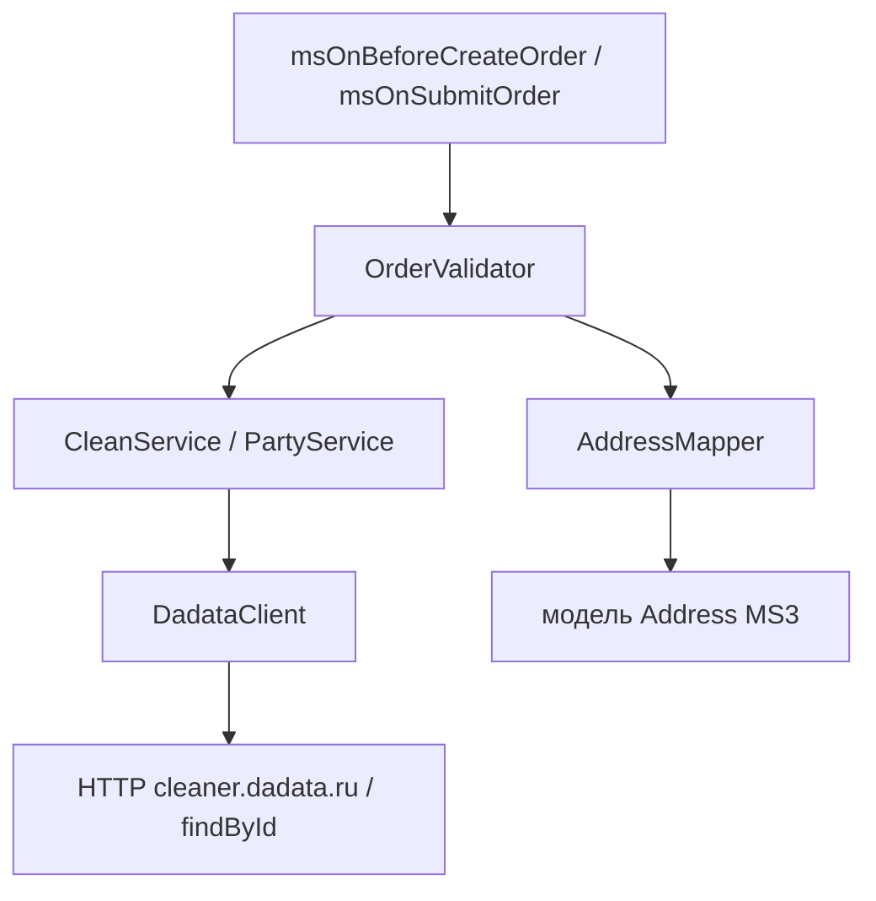
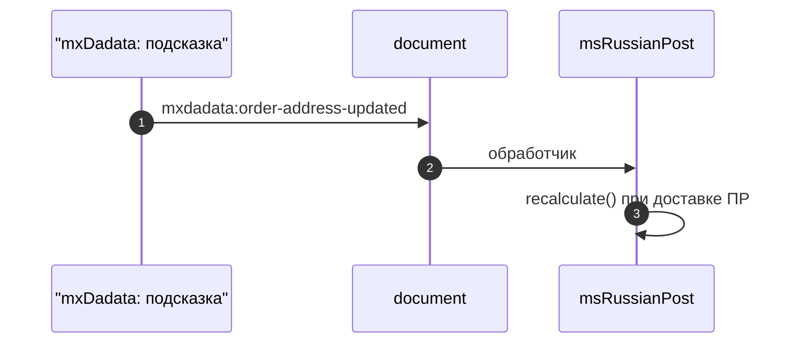

# Интеграция и сценарии

Поведение плагина, валидация заказа, кэш, лимиты и отладка. Плейсхолдеры и сценарии сопровождения — [Для разработчиков](developer).

## Схемы потоков данных

Подсказки с **витрины** (без валидации Clean на стороне заказа — только Suggest/Party-эндпоинты, разрешённые в `connector-web.php`):

**Оформление заказа** (сервер: Clean, нормализация адреса, проверка FIAS/индекса при включённых опциях):

Кратко текстом, если диаграммы не отображаются: **витрина** — запросы из JS/сниппета в `connector-web.php`, затем ограничение частоты, кэш в `mxdadata_cache`, при промахе — HTTP к Suggest/Party. **Заказ** — плагин на `msOnBeforeCreateOrder` / `msOnSubmitOrder` вызывает `OrderValidator` и сервисы Clean/Party, а при успехе `AddressMapper` обновляет поля адреса.

## Плагин mxDadata

| Событие | Назначение |
|---------|------------|
| **OnWebPageInit** | Плейсхолдеры веб-контекста (коннектор, флаги отладки) для шаблонов |
| **msOnBeforeCreateOrder** | Валидация и нормализация до создания заказа |
| **msOnSubmitOrder** | Та же цепочка на отправку заказа |

Если **`mxdadata_enabled`** = «Нет» или в настройках **нет** пары Token/Secret, обработка заказа по API DaData **не выполняется** (плагин выходит досрочно).

## Валидация и нормализация

Класс **`OrderValidator`** использует **Clean** (телефон, email, адрес) и при необходимости **Party**, карту полей **`AddressMapper`**.

- При **`mxdadata_block_order_on_error`** = «Да» и ошибках валидации в **output** события передаётся сообщение — заказ не создаётся
- Сообщения для обязательного FIAS / индекса — из лексикона (`mxdadata_fias_required`, `mxdadata_index_required` и т.д.)
- Успешная нормализация **обновляет** объект `Address` заказа перед сохранением

## Кэш и rate limit

- Ответы кэшируются в **`mxdadata_cache`** с TTL **`mxdadata_cache_ttl`**
- **RateLimiter** ограничивает частоту по **`mxdadata_throttle_rpm`**

## Логи

Записи в **`mxdadata_log`**. Просмотр и ротация — в [админке](admin-ui). Уровень: **`mxdadata_log_level`**.

## Отладка на витрине {#отладка-на-витрине}

1. Системная настройка **`mxdadata_debug_mode`** = «Да»
2. Параметр в URL: **`?mxdadata_debug=1`**
3. В консоли: `localStorage.setItem('mxdadata_web_debug', '1')` (снять — `removeItem`)

Включён расширенный вывод в консоль при инициализации `address-suggest.js` / `party-suggest.js` / `dadata-form.js`.

## Событие для других скриптов

После обновления адреса по подсказке (и связанного `order/set`) диспатчится **`mxdadata:order-address-updated`** на `document`. Его обрабатывает, в частности, [msRussianPost](/components/msrussianpost/) для пересчёта тарифов.

## Универсальная форма mxDadataForm {#универсальная-форма-mxdadataform}

Сниппет **`mxDadataForm`** читает JSON: ключи — `id` или `name` полей **внутри** контейнера `selector`. Типы полей (`type`):

| Тип | Назначение |
|-----|------------|
| **ADDRESS** | Подсказка адреса. В `subject` задают соответствие полям ответа DaData. Поддерживаются `bounds`, `from_bound`, `to_bound`, `locations`, `restrict_value`, `params`, `count`, связь **`master`** с «главным» полем |
| **NAME**, **EMAIL**, **BANK**, **PARTY** | Подсказки по имени, почте, банку, организации (через `connector-web.php`) |
| **GEOLOCATE** | В конфиге элемент — **кнопка**. В объекте: `latInput`, `lonInput` (id/name полей широты/долготы), `fillTarget` (куда подставить выбранный адрес), опционально `radius_meters`, `count`. По ответу геолокации: **первый** найденный адрес сразу подставляется в `fillTarget`. Если вариантов несколько, список остаётся для ручного выбора. |
| **VERSION_INFO** | Элемент с `id` (например `div`/`pre`) — в него выводится ответ `Tools/Version` (версия API DaData) |

Допустимые **`action`** в `connector-web.php` для веб-части: `Suggest/Address`, `Suggest/Party`, `Suggest/Name`, `Suggest/Email`, `Suggest/Bank`, `Party/FindById`, `Geolocate/Address`, `Tools/Version` (см. коннектор в пакете). Сложные схемы с вложенным `subject` и несколькими полями удобно задавать через **`suggestionsChunk`** с чанком, содержащим только JSON.

Если **`suggestionsChunk`** задан, сниппет сначала читает JSON из чанка MODX (`$modx->getChunk()`). Когда в БД чанк пустой или в теле невалидный JSON, используется **файл** в пакете: `core/components/mxdadata/elements/chunks/<имя_чанка>.tpl` (тот же путь, что и у статического чанка в репозитории). Это помогает, когда конфиг в репозитории есть, а запись в БД ещё не перенесена.

## Связанные компоненты

- [MiniShop3 — оформление заказа](/components/minishop3/frontend/order)
- [msRussianPost — подключение на сайте](/components/msrussianpost/frontend#mxdadata)
