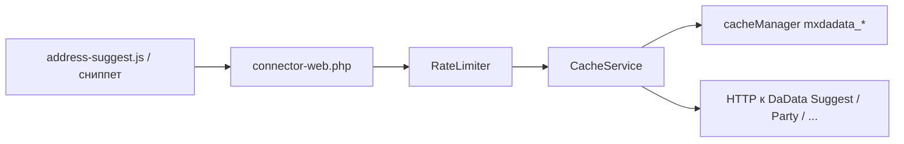
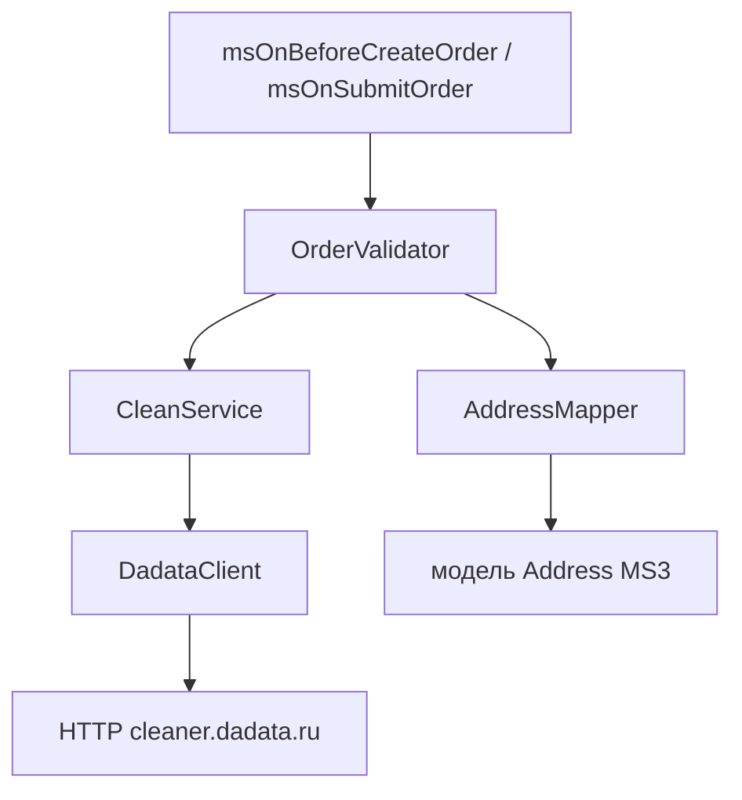
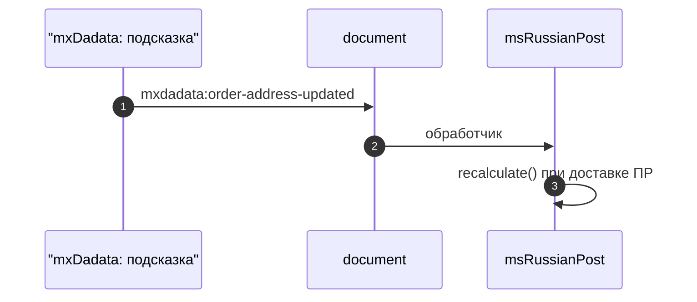

# Интеграция и сценарии

Плагин валидирует заказ, кэширует ответы DaData и ограничивает частоту запросов. Плейсхолдеры и сценарии сопровождения: [Для разработчиков](developer).

## Схемы потоков данных

Подсказки с **витрины** (Suggest/Party через `connector-web.php`, без Clean на этом пути):

```mermaid
flowchart LR
  A[address-suggest.js / сниппет] --> B[connector-web.php]
  B --> C[RateLimiter]
  C --> D[CacheService]
  D --> E[cacheManager mxdadata_*]
  D --> F[HTTP к DaData Suggest / Party / ...]
```

**Оформление заказа** (сервер: Clean, нормализация адреса, проверка FIAS/индекса при включённых опциях):

```mermaid
flowchart TD
  P[msOnBeforeCreateOrder / msOnSubmitOrder] --> V[OrderValidator]
  V --> S[CleanService]
  S --> DC[DadataClient]
  DC --> API[HTTP cleaner.dadata.ru]
  V --> AM[AddressMapper]
  AM --> AD[модель Address MS3]
```

**Party** при создании заказа **не** вызывается. Party идёт с витрины (`Party/FindById`) и со вкладки **Юрлица**.

## Плагин mxDadata

| Событие | Назначение |
|---------|------------|
| **OnWebPageInit** | Плейсхолдеры веб-контекста (коннектор, флаги отладки) для шаблонов |
| **msOnBeforeCreateOrder** | Валидация и нормализация до создания заказа |
| **msOnSubmitOrder** | Та же цепочка на отправку заказа |

Если **`mxdadata_enabled`** = «Нет» или **пустой Token**, обработка заказа по API DaData **не выполняется** (плагин выходит досрочно). **Secret** для входа в плагин не проверяется: без Secret Clean/Party на сервере вернут ошибку уже внутри валидации.

## Валидация и нормализация

Класс **`OrderValidator`** вызывает **Clean** (телефон, email, адрес) и **`AddressMapper`**. Зависимость **PartyService** в конструкторе есть, методы Party из валидатора **не** вызываются.

- При **`mxdadata_block_order_on_error`** = «Да» и ошибках валидации в **output** события передаётся сообщение. Заказ не создаётся.
- Сообщения для обязательного FIAS / индекса: из лексикона (`mxdadata_fias_required`, `mxdadata_index_required` и т.д.)
- Успешная нормализация **обновляет** объект `Address` заказа (без записи **`lat`/`lon`** в Address плагином)

### Кэш Clean и валидация заказа

При попадании в кэш **`CleanService`** отдаёт обёртку `{from_cache, data, status}` **без** массива **`body[0]`**, которого ждёт **`OrderValidator`**. Повторная нормализация того же телефона, email или адреса может ломаться ([issue #4](https://github.com/Ibochkarev/mxDadata/issues/4)). Для проверки временно уменьшите TTL или очистите кэш MODX с Dashboard (см. [Админка → Подключение](admin-ui)).

## Кэш и ограничение частоты

- Ответы кэшируются в **`cacheManager`**, ключи с префиксом **`mxdadata_`**, TTL **`mxdadata_cache_ttl`**
- Таблица **`mxdadata_cache`** в установке создаётся, рантайм её не использует ([issue #3](https://github.com/Ibochkarev/mxDadata/issues/3))
- **`RateLimiter`** ограничивает частоту по **`mxdadata_throttle_rpm`**

## Логи

Записи в **`mxdadata_log`**: каждый Suggest/Clean/Party через **`LoggerService::log()`** попадает в таблицу. **`mxdadata_log_level`** на INSERT **не** влияет ([issue #5](https://github.com/Ibochkarev/mxDadata/issues/5)). Просмотр и ротация: [админка](admin-ui).

## Отладка на витрине {#отладка-на-витрине}

1. Системная настройка **`mxdadata_debug_mode`** = «Да»
2. Параметр в URL: **`?mxdadata_debug=1`**
3. В консоли: `localStorage.setItem('mxdadata_web_debug', '1')` (снять — `removeItem`)

Включён расширенный вывод в консоль при инициализации `address-suggest.js` / `party-suggest.js` / `dadata-form.js`. Ошибки процессоров на **`connector-web.php`** в JSON без деталей исключения.

## Событие для других скриптов

После обновления адреса по подсказке (и связанного `order/set`) на `document` отправляется **`mxdadata:order-address-updated`**. Его обрабатывает, в частности, [msRussianPost](/components/msrussianpost/) для пересчёта тарифов.

```mermaid
sequenceDiagram
  autonumber
  participant M as "mxDadata: подсказка"
  participant D as document
  participant R as msRussianPost
  M->>D: mxdadata:order-address-updated
  D->>R: обработчик
  R->>R: recalculate() при доставке ПР
```

## Универсальная форма mxDadataForm {#универсальная-форма-mxdadataform}

Сниппет **`mxDadataForm`** читает JSON: ключи — `id` или `name` полей **внутри** контейнера `selector`. Типы полей (`type`):

| Тип | Назначение |
|-----|------------|
| **ADDRESS** | Подсказка адреса. В `subject` задают соответствие полям ответа DaData. Поддерживаются `bounds`, `from_bound`, `to_bound`, `locations`, `restrict_value`, `params`, `count`, связь **`master`** с «главным» полем |
| **NAME**, **EMAIL**, **BANK**, **PARTY** | Подсказки по имени, почте, банку, организации (через `connector-web.php`) |
| **GEOLOCATE** | Элемент в конфиге: **кнопка**. Поля: `latInput`, `lonInput` (id/name широты и долготы), `fillTarget` (куда подставить адрес). Опционально: `radius_meters`, `count` |
| **VERSION_INFO** | Элемент с `id` (например `div`/`pre`) — в него выводится ответ `Tools/Version` (версия API DaData) |

По ответу геолокации **первый** найденный адрес сразу подставляется в `fillTarget`. Если список пуст или у первого варианта **`qc_geo === '4'`**, скрипт повторяет запрос. Повтор идёт с **`radius_meters` не меньше 500**, если в конфиге радиус меньше или не задан. Если вариантов несколько, список остаётся для ручного выбора.

Допустимые **`action`** в `connector-web.php` для веб-части: `Suggest/Address`, `Suggest/Party`, `Suggest/Name`, `Suggest/Email`, `Suggest/Bank`, `Party/FindById`, `Geolocate/Address`, `Tools/Version` (см. коннектор в пакете). Сложные схемы с вложенным `subject` и несколькими полями удобно задавать через **`suggestionsChunk`** с чанком, содержащим только JSON.

Если **`suggestionsChunk`** задан, сниппет сначала читает JSON из чанка MODX (`$modx->getChunk()`). Когда в БД чанк пустой или в теле невалидный JSON, берётся **файл** в пакете: `core/components/mxdadata/elements/chunks/<имя_чанка>.tpl`. Путь тот же, что у статического чанка в репозитории. Это помогает, когда конфиг в репозитории есть, а запись в БД ещё не перенесена.

## Связанные компоненты

- [MiniShop3 — оформление заказа](/components/minishop3/frontend/order)
- [msRussianPost — подключение на сайте](/components/msrussianpost/frontend#mxdadata)
