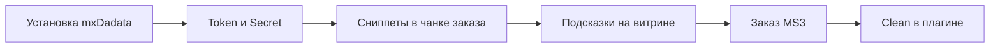

# Быстрый старт

Как подключить подсказки DaData к оформлению заказа MiniShop3.



## Требования

| Требование | Версия |
|------------|--------|
| MODX Revolution | 3.0.3+ |
| PHP | 8.2+ |
| Расширения PHP | `curl`, `mbstring`, `openssl` |
| MiniShop3 | пакет `minishop3` ≥ 1.0.0 |
| Учётная запись [DaData](https://dadata.ru/) | Token и Secret из кабинета |
| VueTools | ≥ 1.1.1, в `requires` транспорта для Vue-админки. Сниппеты на сайте без него |

## Шаг 1: Установка пакета

1. **Extras → Installer → Управлять репозиториями** — убедитесь, что подключён **modstore.pro**. Транспорт зашифрован, без провайдера установка падает с `Package provider not found`.
2. **Extras → Installer** — найдите **mxDadata** (ModStore) или установите собранный транспорт
3. Убедитесь, что установлен **MiniShop3**
4. **Настройки → Очистить кэш**

После установки создаются:

- **18** системных настроек (фильтр **Настройки → Системные настройки**: `mxdadata`)
- пункт меню **Extras → mxDadata**
- сниппеты **`mxDadataAddressSuggest`**, **`mxDadataPartySuggest`**, **`mxDadataForm`**
- плагин **mxDadata** на события **`OnWebPageInit`**, **`msOnBeforeCreateOrder`**, **`msOnSubmitOrder`**
- чанки оформления (в т.ч. `tpl.mxdadata.msOrder` с демо-блоком — см. [Подключение на сайте](frontend#демо-чанка))

**Проверка админки:** откройте **Extras → mxDadata** (нужно право **`mxdadata_view`**). Без **VueTools** installer/resolver предупреждает. Сниппеты на сайте работают независимо.

## Шаг 2: Ключи DaData

1. [dadata.ru](https://dadata.ru/) — регистрация / вход
2. [Профиль → информация](https://dadata.ru/profile/#info) — **API Key** (Token) и **Secret**
3. В MODX: **Настройки → Системные настройки** (`mxdadata`) или **Extras → mxDadata → Настройки** — **`mxdadata_api_token`**, **`mxdadata_api_secret`**
4. **Extras → mxDadata → Обзор → Подключение → Тест соединения** — при успехе подтверждение в интерфейсе

Token используется для Suggest. Secret — для **Clean** (нормализация) и **Party** (юрлица), в том числе в плагине заказа.

Подробнее: [Системные настройки](settings).

## Шаг 3: Включение компонента

Проверьте **`mxdadata_enabled`** = «Да» в системных настройках `mxdadata`. При «Нет» плагин валидации и логика заказа не выполняются.

## Шаг 4: Сниппеты в чанке заказа

Подключайте **некэшированные** вызовы (`[[!…]]` или Fenom `!snippet`).

**Минимум для адреса:**

::: code-group

```fenom
{'!mxDadataAddressSuggest' | snippet}
```

```modx
[[!mxDadataAddressSuggest]]
```

:::

**Адрес + юрлицо по ИНН:**

::: code-group

```fenom
{'!mxDadataAddressSuggest' | snippet}
{'!mxDadataPartySuggest' | snippet}
```

```modx
[[!mxDadataAddressSuggest]]
[[!mxDadataPartySuggest]]
```

:::

**Порядок с [msRussianPost](/components/msrussianpost/):** сначала поля адреса и **mxDadata** (подсказки), затем виджет Почты России. См. [Подключение на сайте](frontend#порядок-с-msrussianpost).

## Шаг 5: Настройки MiniShop3 (по желанию)

**Настройки → Системные настройки** (`mxdadata`, область miniShop3):

- строгая валидация телефона/email
- обязательный FIAS / индекс
- JSON **маппинга** полей DaData → поля адреса MS3

См. [Системные настройки → MiniShop3](settings#minishop3).

## Шаг 6: Проверка

1. Откройте страницу оформления заказа. Начните вводить адрес в поле, к которому привязан сниппет. По умолчанию это поля с `name="address"`, `address_text_address` и др.
2. Должны появиться подсказки DaData. После выбора заполняются город, индекс, FIAS (если настроено в форме).
3. Оформите тестовый заказ. При включённой валидации неверный телефон или email может заблокировать создание заказа. См. [Интеграция](integration).

**Отладка в браузере:** `?mxdadata_debug=1` в URL или **`mxdadata_debug_mode`** = «Да» в настройках. В консоли появятся расширенные логи. См. [Интеграция](integration#отладка-на-витрине).

## Что дальше

- [Системные настройки](settings) — кэш, лимит запросов, логи
- [Сниппеты](snippets/index) — параметры `input`, `innInput`, `suggestions`
- [Админка в MODX](admin-ui) — журнал, кэш, тест Party
- [Интеграция](integration) — плагин, валидация, связь с доставками
- [Для разработчиков](developer) — плейсхолдеры, API DaData
- [FAQ](faq) — частые вопросы, 429, логи
