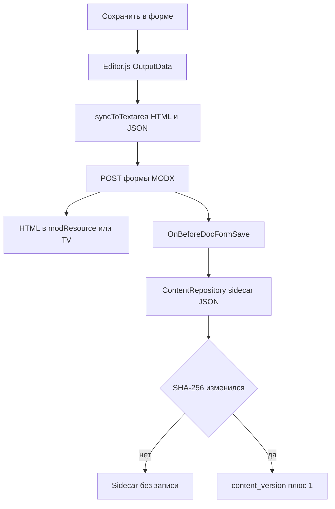
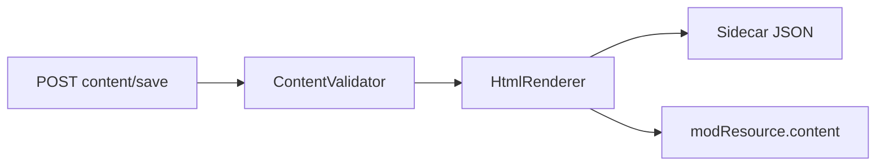

# Потоки (технические)

Схемы сохранения и загрузки контента. Для редакторов: [Руководство редактора](/components/mxeditorjs/user-guide).

## Модель данных

mxEditorJs использует **Canonical JSON + HTML snapshot**:

- **JSON** (Editor.js OutputData): источник истины в sidecar-таблицах
- **HTML**: снимок для сайта в `modResource.content` или textarea TV

```mermaid
flowchart LR
  ED[Editor.js в менеджере] --> JSON[(mxeditorjs_content / mxeditorjs_tv_content)]
  ED --> HTML[modResource.content / TV textarea]
  HTML --> SITE[Шаблон [[*content]]]
```

## Загрузка формы ресурса

1. Плагин на `OnDocFormPrerender` подключает CSS/JS и заполняет `window.mxEditorJsConfig`
2. `MODx.loadRTE` инициализирует Editor.js на `#ta` (основной контент) и на `textarea.modx-richtext` кроме `#ta` (TV)
3. `content/get` читает JSON из sidecar
4. Если JSON пуст и это основной контент: предложение миграции HTML (`content/migrate`, `dry_run`)

## Сохранение через форму MODX (основной путь)

Форма пишет HTML в ресурс или TV, JSON в sidecar. Connector `content/save` не вызывается.



1. Клиент (`syncToTextarea`, задержка 500 ms):
   - HTML → textarea (клиентский `renderPreviewHtml`)
   - JSON → скрытые поля `mxeditorjs_json` / `mxeditorjs_tv_{id}_json`
2. `hookBeforeSubmit` сбрасывает актуальный JSON в скрытые поля
3. Form POST → MODX сохраняет HTML в ресурс/TV
4. `OnBeforeDocFormSave` → `ContentRepository` / `TvContentRepository.save(JSON)`
5. Если SHA-256 JSON не изменился, sidecar не перезаписывается. Иначе растёт `content_version`. Пустой `blocks: []` обновляет sidecar (очистка редактора стирает JSON).

На этом пути серверный `HtmlRenderer` **не вызывается**. HTML в textarea собирает клиент.

## Сохранение через connector



`POST content/save` + `content_json`:

1. `ContentValidator`
2. `HtmlRenderer` → HTML
3. Запись sidecar
4. Для основного контента: обновление `modResource.content`

Используйте для AJAX или своих интеграций. TV через connector не обновляют `modResource.content`.

## Миграция HTML → Editor.js

1. Окно при открытии ресурса без sidecar, но с HTML
2. `content/migrate?dry_run=1`: предпросмотр блоков
3. Подтверждение → `HtmlMigrator.convert()` → sidecar + `HtmlRenderer` → `modResource.content`
4. Параметры `force`, `confirmed`: перезапись существующего sidecar

Поддерживаются: `p`, `h1`–`h6`, `ul`/`ol`, `blockquote`, `img`, `table`, `pre`/`code`, `hr`. Не мигрируются: embed, gallery, attaches, checklist.

## Медиа

| Действие | Connector | Настройки |
| --- | --- | --- |
| Загрузка изображения / галереи | `media/upload` | `image_mediasource`, `image_upload_path` |
| Загрузка вложения | `media/uploadFile` | `file_mediasource`, `file_upload_path` |
| Обзор папок | `media/browse` | `type=image` или `type=file` |

## Удаление ресурса

`OnResourceDelete` удаляет записи в `mxeditorjs_content` и связанные строки `mxeditorjs_tv_content`.

## Плагин и события

| Событие | Назначение |
| --- | --- |
| `OnRichTextEditorRegister` | Регистрация mxEditorJs в списке RTE |
| `OnTVInputRenderList` | Путь к `elements/tv/input/` (обработчик `migxmxeditorjs`), если `mxeditorjs.enabled` |
| `OnDocFormPrerender` | Конфиг, ассеты, инициализация |
| `OnBeforeDocFormSave` | Сохранение JSON в sidecar |
| `OnResourceDelete` | Очистка sidecar |
