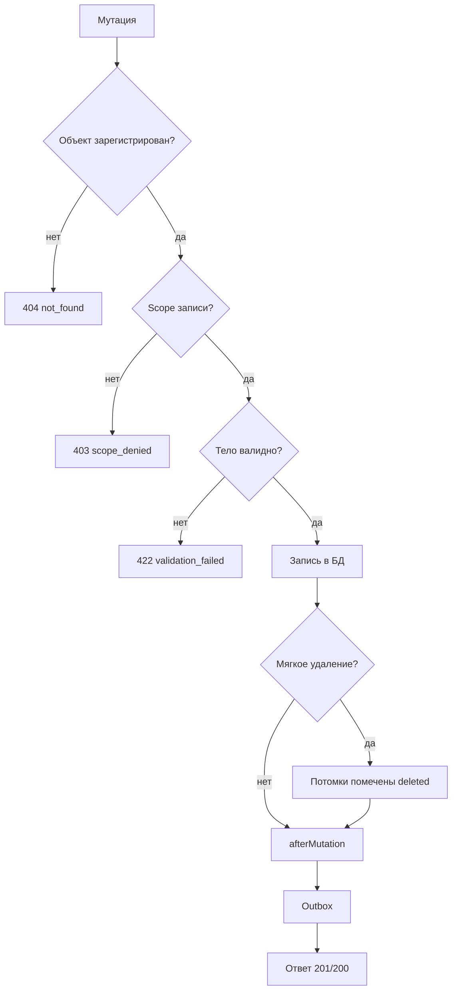

# Мутации

`POST`, `PUT`, `PATCH`, `DELETE` на resources и objects требуют учётные данные и scopes записи.

| Метод | Path | Scope | Успех |
| --- | --- | --- | --- |
| POST | `/resources`, `/objects/{name}` | `{name}.create` | `201` |
| PUT, PATCH | `/resources/{id}`, `/objects/{name}/{id}` | `{name}.update` | `200` |
| DELETE | `/resources/{id}`, `/objects/{name}/{id}` | `{name}.delete` | `200` |

Общий путь мутации от проверок до ответа:



## Тело

`Content-Type: application/json` (для `POST`/`PUT`/`PATCH`). Размер ограничен `mxheadless_max_body_bytes` (1 MB).

```bash
curl -s -X POST https://example.com/api/v1/resources \
  -H 'Authorization: Bearer mxh_...' \
  -H 'Content-Type: application/json' \
  -H 'Idempotency-Key: create-about-001' \
  -d '{"pagetitle":"About","template":1,"published":1}'
```

Пустое тело на `PUT` / `PATCH` допустимо только для `PATCH`. Сессионные мутации требуют заголовок `X-CSRF-Token`.

## PUT и PATCH

`PATCH` присылает дельту: меняются только переданные поля, остальные остаются как были.

`PUT` проверяется как полная замена. Все поля из списка `required` определения объекта должны присутствовать в теле, иначе `422 validation_failed`. Для `resources` это `pagetitle`.

Один и тот же запрос с разным методом даёт разный результат:

```http
PATCH /api/v1/resources/12 HTTP/1.1
Content-Type: application/json

{"menuindex":3}
```

Ответ `200`: меняется только `menuindex`.

```http
PUT /api/v1/resources/12 HTTP/1.1
Content-Type: application/json

{"menuindex":3}
```

Тот же запрос на `PUT` даёт `422`:

```json
{
  "type": "https://mxheadless.dev/problems/validation",
  "title": "Unprocessable Entity",
  "status": 422,
  "detail": "Missing required fields",
  "instance": "/api/v1/resources/12",
  "code": "validation_failed",
  "errors": {
    "pagetitle": ["This field is required."]
  }
}
```

Поля из `required` нельзя и очищать: `null`, пустая строка, массив или boolean дают `422`.

## Почему приходит 422

Валидация тела идёт после проверки прав и до записи в базу. Проверки одинаковы для `resources` и для extras-объектов, но часть правил имеет смысл только у ресурсов.

| Проверка | Условие | Код ответа |
| --- | --- | --- |
| Поля из `required` | Не передан (на `PUT`), `null`, пустая строка, массив или boolean | 422 |
| Поле из `immutable` | Любая явная запись: `id`, `createdon`, `createdby`, `editedon`, `editedby`, `deletedon` | 422 |
| Поле из `hiddenFields` | Любая запись: например `properties` у `resources` | 422 |
| Поле не из `fields` | Неизвестное имя в теле | 422 |
| Поле из `protectedFields` | Нет field-level права: `fields.{field}` у ключа, `mxheadless_fields_{field}` у сессии | 422 |
| Значение не scalar | Массив или объект вместо строки, числа, boolean | 422 |
| Тип поля | `template`, `parent`, `content_type`, `menuindex` должны быть целым числом | 422 |
| Тип boolean | `published`, `deleted`, `hidemenu`, `isfolder` и другие: `0`, `1`, `true`, `false` | 422 |
| Тело не JSON | `POST`/`PUT`/`PATCH` без разбираемого JSON-объекта | 422 |
| `Idempotency-Key` | Длиннее 128 символов или вне `A-Za-z0-9._:-` | 422 |

Дополнительно для ресурсов:

| Проверка | Условие | Код ответа |
| --- | --- | --- |
| Уникальность `alias` | Такой `alias` уже есть среди живых ресурсов с тем же `parent` и тем же `context_key` | 422 |
| `alias` длиннее 255 символов | Значение отклоняется, а не обрезается | 422 |
| Цикл по `parent` | Новый `parent` указывает на самого ресурса или на его потомка | 422 |
| Существование `parent` | Ресурса с таким id нет | 422 |
| Состояние `parent` | Ресурс-родитель помечен `deleted` | 422 |
| `class_key` | Класса нет или он не наследует `modResource` | 422 |
| `template` | `0` или id существующего `modTemplate`, иначе 422 | 422 |
| `content_type` | Положительный id существующего `modContentType`, иначе 422 | 422 |
| `context_key` | Не из `mxheadless_allowed_contexts`, не существует или не загружается в текущем запросе | 422 |

Целочисленные строки приводятся к числу (`"3"` → `3`), значения boolean-полей принимаются как `0`, `1`, `true`, `false`. Остальные значения отклоняются.

Ошибка всегда приходит в `errors` с именем поля:

```json
{
  "type": "https://mxheadless.dev/problems/validation",
  "title": "Unprocessable Entity",
  "status": 422,
  "detail": "Invalid field value",
  "instance": "/api/v1/resources",
  "code": "validation_failed",
  "errors": {
    "alias": ["Alias already exists for this parent and context"]
  }
}
```

Уникальность `alias` — самая частая причина `422` на практике: в MODX это стандартное ограничение на пару `alias` + `parent` + `context_key`, и проверка повторяет его на уровне API.

Полный набор проверяемых полей: [Schema](schema).

## Idempotency

При `mxheadless_idempotency_enabled=true` (по умолчанию) на **POST** можно передать:

```text
Idempotency-Key: <unique-string>
```

Ключ: 1–128 символов `A-Za-z0-9._:-`. Ответ на первый запрос несёт `Idempotency-Key` в заголовке. Повтор с тем же ключом и тем же телом возвращает сохранённый ответ с заголовком `Idempotency-Replayed: true`. Другое тело или параллельный запрос с тем же ключом → `409` `idempotency_conflict`.

Ключ включает метод, путь и тело, поэтому один и тот же ключ на разных путях не конфликтует. TTL: `mxheadless_idempotency_ttl` (86400 с).

## Мягкое удаление

`DELETE` на resources мягкий: помечает `deleted` ресурс и заодно всех его потомков. Окончательное удаление одной строки: `?force=1`.

Восстановление: `PATCH` с `{"deleted":0}`. Параметр `include_deleted=1` в этой операции не читается, но `update()` ищет строку и среди soft-deleted, поэтому `PATCH` восстанавливает ресурс и без него.

::: warning Удаление ресурса каскадное

`DELETE /resources/{id}` без `force` собирает всех потомков по дереву `Children` рекурсивно и помечает их `deleted`, `deletedby`, `deletedon` в одной операции (`ObjectService::softDeleteResourceTree`). Ответ содержит только id удалённого ресурса, но из выборки исчезает вся ветка целиком, включая опубликованные страницы вложенных разделов.

Как избежать:

- `?force=1` удаляет строку ресурса окончательно и потомков не трогает. Дети остаются с `parent`, указывающим на несуществующий id.
- Перед удалением папки переведите нужных потомков на другого родителя: `PATCH /resources/{id}` с `{"parent":0}` или `{"parent":<id>}`. Дети не попадут в дерево удаляемой ветки.
- Обходной путь для extras-объектов: каскад есть только у `modResource`. Для остальных объектов `DELETE` трогает одну запись.

Восстановление `PATCH {"deleted":0}` возвращает в выдачу только сам ресурс, потомков нужно восстанавливать отдельно.

:::

```bash
curl -s -X DELETE 'https://example.com/api/v1/resources/12?force=1' \
  -H 'Authorization: Bearer mxh_...'
```

Ответ мягкого удаления:

```json
{
  "data": { "id": "12", "deleted": true, "permanent": false },
  "meta": {}
}
```

У любого объекта без поля `deleted` в определении `permanent` всегда `true`.

## Webhooks

После успешной мутации core ставит события в outbox (`resources.created` и т.д.). Доставка идёт через CLI worker. См. [Webhooks](/components/mxheadless/operations/webhooks).

## См. также

- [Schema](schema)
- [Авторизация](/components/mxheadless/authorization)
- [Ошибки](errors)
