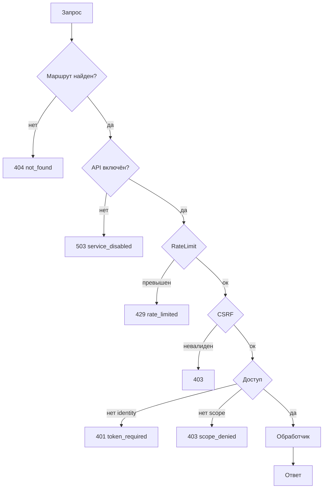

# Обзор API

Базовый URL: `{prefix}/v1`, по умолчанию `/api/v1`.

Живой каталог на установленном сайте: `GET /meta/endpoints` и Swagger UI `/docs`. Ниже маршруты **core** из `RoutesRegistrar` и `CoreEndpointBootstrap` (версия пакета 1.0.43). Extras добавляют свои через `registerEndpoint`.

Запрос проходит стек middleware до обработчика:



В стеке также работают BodyLimit (`413`), ContentNegotiation (`406`), CORS, RequestId, AuditLog и Error — на схеме они не показаны.

## Envelope успеха

```json
{
  "data": {},
  "meta": {
    "total": 100,
    "count": 20,
    "limit": 20,
    "offset": 0,
    "has_more": true
  },
  "links": {
    "self": "/api/v1/resources?limit=20&offset=0",
    "next": "/api/v1/resources?limit=20&offset=20"
  }
}
```

При ошибке ответ в формате [RFC 9457](errors), без обёртки `data`/`meta`.

## Meta и auth

| Method | Path | Public | Scope | Назначение |
| --- | --- | --- | --- | --- |
| GET | `/` | да | - | Discovery: версия, возможности |
| GET | `/health` | да | - | Health БД: `data.status` (`ok` / `degraded`), `data.database`, `data.timestamp`. Доступен при kill switch |
| GET | `/schema` | да | - | Схема зарегистрированных объектов |
| GET | `/docs` | да | - | Swagger UI (`mxheadless_swagger_enabled`) |
| GET | `/meta/endpoints` | да | - | Живой каталог эндпоинтов |
| GET | `/meta/openapi` | да | - | OpenAPI в envelope |
| GET | `/meta/openapi.json` | да | - | Сырой OpenAPI 3.0 JSON |
| POST | `/auth/token` | да\* | - | OAuth token. Работает только при `mxheadless_oauth_enabled` |

\*Маршрут публичный, но endpoint выключен настройкой, пока OAuth выключен.

## Resources и pages

| Method | Path | Public | Scope |
| --- | --- | --- | --- |
| GET | `/resources` | да | `resources.read` |
| GET | `/resources/{id}` | да | `resources.read` |
| POST | `/resources` | нет | `resources.create` |
| PUT, PATCH | `/resources/{id}` | нет | `resources.update` |
| DELETE | `/resources/{id}` | нет | `resources.delete` |
| GET | `/pages/{uri}` | да | `resources.read` |

Публичный GET для anonymous. API key / OAuth на публичном GET всё равно должны иметь указанный scope.

## Contexts

| Method | Path | Public | Scope |
| --- | --- | --- | --- |
| GET | `/contexts` | нет | `contexts.read` |
| GET | `/contexts/{key}` | нет | `contexts.read` |
| GET | `/contexts/{key}/settings` | нет | `contexts.read` |

`{key}`: ключ контекста (`web`, `mgr`, …). Settings по списку.

## Elements (read-only)

| Method | Path | Public | Scope |
| --- | --- | --- | --- |
| GET | `/chunks` | нет | `chunks.read` |
| GET | `/chunks/{id}` | нет | `chunks.read` |
| GET | `/templates` | нет | `templates.read` |
| GET | `/templates/{id}` | нет | `templates.read` |
| GET | `/snippets` | нет | `snippets.read` |
| GET | `/snippets/{id}` | нет | `snippets.read` |
| GET | `/tvs` | нет | `tvs.read` |
| GET | `/tvs/{id}` | нет | `tvs.read` |
| GET | `/categories` | нет | `categories.read` |
| GET | `/categories/{id}` | нет | `categories.read` |
| GET | `/content_types` | нет | `content_types.read` |
| GET | `/content_types/{id}` | нет | `content_types.read` |

## Универсальные объекты

Только для имён из `ObjectRegistry` (core + extras). Незарегистрированное `{name}` даёт `404`.

| Method | Path | Public | Scope |
| --- | --- | --- | --- |
| GET | `/objects/{name}` | нет | `{name}.read` |
| GET | `/objects/{name}/{id}` | нет | `{name}.read` |
| POST | `/objects/{name}` | нет | `{name}.create` |
| PUT, PATCH | `/objects/{name}/{id}` | нет | `{name}.update` |
| DELETE | `/objects/{name}/{id}` | нет | `{name}.delete` |

Пример: object `products` → scopes `products.read`, `products.create`, …

Полный список scopes: [Авторизация](/components/mxheadless/authorization).

## Kill switch

При `mxheadless_enabled=false` работают только `GET /` и `GET /health`. Остальное → `503` `service_disabled`.

## Заголовки

Заголовок запроса:

| Заголовок | Роль |
| --- | --- |
| `Authorization` / `X-API-Key` | Учётные данные |
| `X-Context` | Контекст MODX |
| `X-CSRF-Token` | Мутации по сессии |
| `Idempotency-Key` | Идемпотентный POST |
| `X-Request-ID` | Корреляция |

`X-Request-ID` принимается только в формате 8–64 символа из `A-Za-z0-9`, `-`, `_`, `.`. Значение вне формата игнорируется, сервер подставляет случайный hex-идентификатор.

Ответы rate limit: `X-RateLimit-Limit`, `X-RateLimit-Remaining`, `X-RateLimit-Reset`. На `429` добавляется `Retry-After` с числом секунд до окна.

Заголовок ответа при CORS: `Vary: Origin`. Состав `Access-Control-Expose-Headers` задаёт `mxheadless_cors_expose_headers`.

Заголовок `Accept` проверяется на всех маршрутах: без `application/json` и без `*/*` ответ `406`. Исключение одно, `text/html` проходит только на `/api/v1/docs`, чтобы Swagger UI открывался из браузера.

## Дальше по группам

- [Discovery](discovery)
- [Schema](schema)
- [Swagger и OpenAPI](swagger)
- [Resources и Pages](resources)
- [Preview](preview)
- [HTTP-кэш](http-caching)
- [Elements и Contexts](elements)
- [Objects](objects)
- [Запросы](querying)
- [Мутации](mutations)
- [Scopes](/components/mxheadless/authorization)
