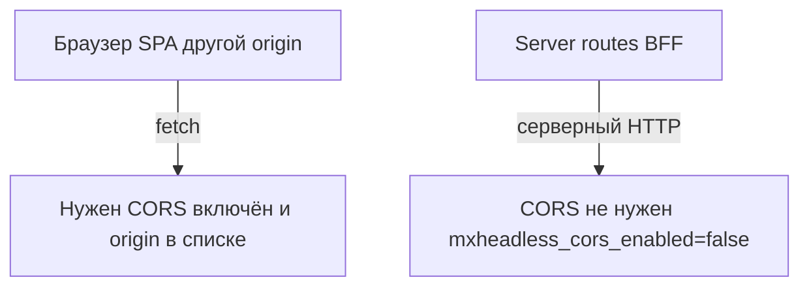

# CORS

CORS нужен, когда **браузер** с другого origin ходит в API напрямую: Nuxt SPA, client components в Next. Серверные вызовы (`$fetch` в server routes, RSC, Route Handlers) CORS не требуют.

## Настройки

| Ключ | По умолчанию | Заметки |
| --- | --- | --- |
| `mxheadless_cors_enabled` | `false` | Главный переключатель |
| `mxheadless_cors_allowed_origins` | пусто | Точные origin через запятую или `*` |
| `mxheadless_cors_allowed_methods` | `GET,POST,PUT,PATCH,DELETE,OPTIONS` | |
| `mxheadless_cors_allowed_headers` | `Authorization,Content-Type,X-Request-ID,X-CSRF-Token,X-Context,X-API-Key,Idempotency-Key` | |
| `mxheadless_cors_expose_headers` | `ETag,X-Request-ID,X-RateLimit-Limit,X-RateLimit-Remaining,X-RateLimit-Reset,Idempotency-Replayed,X-CSRF-Token` | Доступны из JS |
| `mxheadless_cors_allow_credentials` | `false` | Не сочетать с `*` в origins |

## Что значит значение по умолчанию

`mxheadless_cors_enabled=false` выключает CORS. API не отдаёт заголовки `Access-Control-*`.

Это не «разрешить всем». При выключенном CORS запрос из браузера с другого origin падает на клиенте. Страницы того же origin и серверные вызовы работают как раньше.

Если включить `mxheadless_cors_enabled=true`, срабатывает список разрешённых origin. Заголовки появляются только когда `Origin` совпал с `mxheadless_cors_allowed_origins`, либо в списке ровно `*`. Даже при `*` в ответ подставляется origin запроса, а не безусловный `*` с credentials.

## Когда заголовков не будет

Middleware Cors стоит в цепочке после Error и до маршрутизации, аутентификации и авторизации. Поэтому `Access-Control-*` не появляется в таких случаях:

| Ситуация | Результат |
| --- | --- |
| Запрос без заголовка `Origin` (curl, серверные вызовы) | Заголовков нет |
| `Origin` не совпал со списком | Заголовков нет, запрос при этом обрабатывается |
| `mxheadless_cors_allowed_origins` пуст | Разрешённых origin нет, включая `*` |
| `mxheadless_cors_enabled=false` | Заголовков нет ни при каком `Origin` |
| Ответ `401`, `403`, `409`, `429`, `500`, `503` | Заголовков нет: ошибку собирает Error, который стоит выше Cors |

Последний пункт стоит учесть в SPA: при отказе по rate limit или CSRF браузер покажет generic CORS-ошибку, а не problem+json. Смотрите [журнал запросов](../operations/audit-log) или заголовок `X-Request-ID`.

## Локальный Nuxt или Next SPA

Фронт на `localhost:3000`, MODX на другом хосте или порту:

```text
mxheadless_cors_enabled = true
mxheadless_cors_allowed_origins = http://localhost:3000
mxheadless_cors_allow_credentials = false
```

Если в браузере нужны session-cookie MODX, ставьте `mxheadless_cors_allow_credentials = true` и указывайте точный origin (не `*`).

В инструментах браузера preflight `OPTIONS` должен вернуть `204` и `Access-Control-Allow-Origin: http://localhost:3000`.

## Production SPA на другом домене

```text
mxheadless_cors_enabled = true
mxheadless_cors_allowed_origins = https://app.example.com
```

Staging добавляйте явно:

```text
mxheadless_cors_allowed_origins = https://app.example.com,https://staging.example.com
```

Discovery (`GET /api/v1`) отдаёт `data.cors.enabled` и `data.cors.allowed_origins`. Сверьте с origin SPA, прежде чем искать ошибку в `fetch`.

## Обойтись без CORS

Если Nuxt или Next ходит в MODX только из server routes, оставьте `mxheadless_cors_enabled=false`. Браузер до MODX не доходит, CORS не нужен.



## Preflight и проверка curl

Запрос `OPTIONS` Cors обрабатывает сам и отвечает `204` до маршрутизации: существование пути и аутентификация не проверяются. Preflight возвращает `204` даже при выключенном CORS, но без `Access-Control-*`.

При совпавшем origin в ответ уходят заголовки из настроек плюс два жёстко заданных, настроек для них нет:

| Заголовок | Значение |
| --- | --- |
| `Access-Control-Max-Age` | `86400` |
| `Vary` | `Origin` |

`Vary: Origin` нужен кэшам и CDN: без него ответ с CORS-заголовками может отдаться чужому origin. Настройкой это не меняется.

`Access-Control-Allow-Credentials: true` добавляется только при `mxheadless_cors_allow_credentials=true`.

Имитация preflight:

```bash
curl -i -X OPTIONS 'https://modx.example.com/api/v1/health' \
  -H 'Origin: https://app.example.com' \
  -H 'Access-Control-Request-Method: GET'
```

CORS включён и origin в списке: `204` и `Access-Control-Allow-Origin: https://app.example.com`. CORS выключен или origin чужой: этих заголовков не будет.

В `Access-Control-Expose-Headers` есть `ETag` для повторной проверки из `fetch`.

## MiniShop3

`ms3_cors_allowed_origins` не имеет отношения к mxHeadless: пакета с таким ключом нет, ни один `mxheadless_*`-ключ его не заменяет. Настройка принадлежит MiniShop3, и если на сайте крутится его Web API, продублируйте origin SPA там. См. [MiniShop3](/components/mxheadless/extensions/minishop3).
