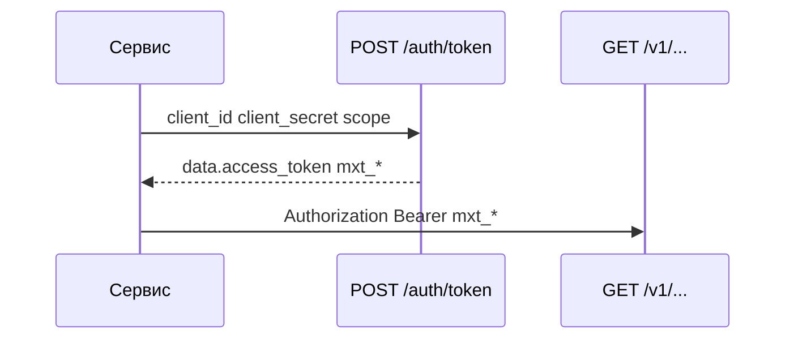

# OAuth

Bearer-токены `mxt_*` с коротким TTL. По умолчанию выключено.

## Включение

| Ключ | По умолчанию | Назначение |
| --- | --- | --- |
| `mxheadless_oauth_enabled` | `false` | `POST /api/v1/auth/token` |
| `mxheadless_oauth_token_ttl` | `3600` | TTL access token (секунды) |
| `mxheadless_oauth_password_grant_enabled` | `false` | Grant `password` |

## Клиент

```bash
php core/components/mxheadless/bin/oauth-client-create.php \
  --client-id=next-preview \
  --name='Next preview' \
  --scopes=resources.read,preview \
  --grants=client_credentials
```

Secret показывают один раз. Таблицы: `mxheadless_oauth_clients`, `mxheadless_oauth_tokens` (hash).

## Выпуск токена



```bash
curl -s -X POST https://example.com/api/v1/auth/token \
  -H 'Content-Type: application/json' \
  -d '{
    "grant_type": "client_credentials",
    "client_id": "next-preview",
    "client_secret": "YOUR_CLIENT_SECRET",
    "scope": "resources.read"
  }'
```

Ответ в envelope: `data.access_token` (`mxt_...`), `data.token_type`, `data.expires_in`, `data.scope`. Дальше:

```bash
TOKEN=$(curl -s -X POST https://example.com/api/v1/auth/token \
  -H 'Content-Type: application/json' \
  -d '{"grant_type":"client_credentials","client_id":"...","client_secret":"...","scope":"resources.read"}' \
  | jq -r .data.access_token)

curl -s https://example.com/api/v1/resources \
  -H "Authorization: Bearer $TOKEN"
```

Поддерживаются `application/json` и `application/x-www-form-urlencoded`. Для client credentials допускается HTTP Basic с `client_id`/`client_secret`.

## Grants

| Grant | Когда |
| --- | --- |
| `client_credentials` | Сервер к серверу (по умолчанию) |
| `password` | Только если `mxheadless_oauth_password_grant_enabled=true` |

Ошибка OAuth: `400` `invalid_grant`.

## Key или token

| Credential | Когда |
| --- | --- |
| `mxh_*` | CI, долгие фоновые задачи, без обновления токена |
| `mxt_*` | TTL, ротация без повторной выкладки секрета в каждом сервисе |

Оба типа проходят одну проверку scopes. CSRF не нужен.
