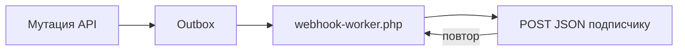

# Webhooks

События ставит в outbox мутация через API mxHeadless: create, update и delete в `ObjectService`. Доставка идёт через CLI worker.



Правки из админки MODX событий не порождают: плагин пакета висит только на `OnHandleRequest`, слушателей `OnResourceSave` или `OnManagerEvent` в пакете нет.

## События core

`resources.created`, `resources.updated`, `resources.deleted` и аналоги `{name}.{action}` для generic objects.

## Подписка

```bash
php core/components/mxheadless/bin/webhook-subscribe.php \
  --name=isr \
  --url=https://frontend.example/api/revalidate \
  --events=resources.created,resources.updated,resources.deleted \
  --secret=YOUR_HMAC_SECRET
```

Без `--events=` скрипт подставляет три события ресурсов: `resources.created`, `resources.updated`, `resources.deleted`. Пустой `--events=` даёт `*`. Флаг `--inactive` создаёт подписку с `active: 0`, доставок по ней не будет.

Сравнение событий строгое: совпадает точное имя или литерал `*`. Префиксные шаблоны (`resources.*`) не поддержаны, подписка с ними молча не получит событий.

Без `--secret` скрипт генерирует случайный секрет и печатает его в stdout.

Таблицы: `mxheadless_webhook_subscriptions`, `mxheadless_webhook_deliveries`.

## Worker

```bash
php core/components/mxheadless/bin/webhook-worker.php --limit=50
```

`--limit` по умолчанию из `mxheadless_webhook_worker_limit`. Вешайте на cron каждую минуту.

## Доставка

POST JSON на URL подписчика:

| Заголовок | Значение |
| --- | --- |
| `Content-Type` | `application/json` |
| `User-Agent` | `MxHeadless-Webhook/1.0` |
| `X-MxHeadless-Event` | тип события |
| `X-MxHeadless-Delivery-Id` | id доставки |
| `X-MxHeadless-Signature` | `t=<unix>,v1=<hex>` при secret |

`v1` это HMAC-SHA256 от строки `"{t}.{тело}"` секретом подписки. Подписчик должен разобрать оба поля заголовка и принять расхождение по времени до 300 секунд. Формата `sha256=<hex>` пакет не производит.

Повторы: пауза между попытками `min(3600, 30 * 2^(attempts - 1))` секунд, не больше `mxheadless_webhook_max_attempts` (5), затем статус `failed` с текстом ошибки в `last_error`.

## SSRF

По умолчанию блокируются localhost, private IP, `.local`/`.test`. Для разработки: `mxheadless_webhook_allow_private_urls=true` (ослабляет и проверку TLS).

## Payload (v1)

```json
{
  "id": "3f2a1c9e5b7d4e8fa0c16d2b9e4f7301",
  "type": "resources.updated",
  "created_at": "2026-10-05T09:14:22+00:00",
  "data": {
    "object": "resources",
    "action": "updated",
    "id": "12",
    "context": "web",
    "uri": "about",
    "parent": 2
  },
  "meta": {
    "revalidate": [
      "mxheadless:resources",
      "mxheadless:context:web",
      "mxheadless:resources:12",
      "mxheadless:uri:about",
      "mxheadless:resources:2"
    ]
  }
}
```

`data.id` приходит строкой. `parent` попадает в payload только при `parent > 0` и отсутствует в событии `created`.

## Проверка на dev

В пакете есть приёмник `assets/components/mxheadless/webhook-catcher.php`. Он отвечает `{"ok": true}` и пишет заголовки и тело в `sys_get_temp_dir()/mxheadless-webhooks/latest.json`.

```bash
php core/components/mxheadless/bin/webhook-subscribe.php \
  --name=local \
  --url=https://127.0.0.1:8443/assets/components/mxheadless/webhook-catcher.php \
  --secret=dev-secret
```

Для локального адреса нужен `mxheadless_webhook_allow_private_urls=true`.

Cron и systemd для worker: [Workers](workers). Теги `meta.revalidate` для Next.js и Nuxt: [ISR revalidation](isr-revalidation).
