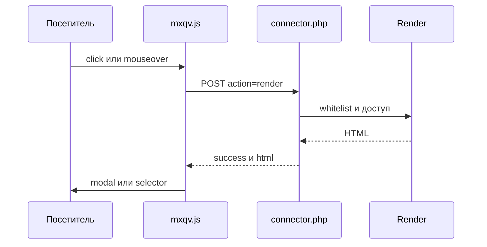

# Архитектура mxQuickView

## Обзор компонентов

- **Сниппет инициализации** `mxQuickView.initialize` — CSS/JS, `window.mxqvConfig`, режимы модалки `native`/`bootstrap`/`fancybox`.
- **Frontend JS** `assets/components/mxquickview/js/mxqv.min.js` — делегирование событий, AJAX к connector, отрисовка modal/selector, loop-навигация, хелперы ms3Variants.
- **Коннектор** `assets/components/mxquickview/connector.php` — HTTP-точка входа для action `render`.
- **Класс рендера** `core/components/mxquickview/src/Processors/Render.php` — белый список, доступ к ресурсу, отрисовка `chunk|snippet|template`. Это обычный статический класс, а не MODX-процессор: пакет не регистрирует ни одного процессора и не добавляет пункт в меню «Компоненты», вызов идёт напрямую из коннектора.
- **Базовый чанк товара** `core/components/mxquickview/elements/chunks/mxqv_product.tpl` — карточка quick view с формой корзины и блоком вариантов.

## Поток данных

1. Пользователь кликает или наводит на элемент с `data-mxqv-*`.
2. `mxqv.js` формирует POST в `connector.php` (`mode`, `data_action`, `element`, `id`, `context`, `output`, `modal_library`).
3. Коннектор проверяет HTTP-метод и `action=render`, затем вызывает `Render::run(...)`.
4. Класс рендера:
   - проверяет `id`, `element`, `data_action`;
   - загружает ресурс (`deleted=0`), сверяет контекст и проверяет право просмотра;
   - сверяет элемент с белым списком;
   - собирает HTML через `getChunk`, `runSnippet` или `$resource->process()` (для `template`).
5. Коннектор возвращает JSON `{success, html|message}`.
6. JS вставляет HTML в выбранную модалку (`native`/`bootstrap`/`fancybox`) или в контейнер `selector`.

## Как определяется объект быстрого просмотра

Ресурс для отрисовки берётся из `data-mxqv-id` триггера: клиент не выбирает объект на сервере, он только передаёт ID. Дальше сервер ищет ресурс по `id` с `deleted=0`, при переданном `context` сверяет его с `context_key` ресурса, переключает контекст и проверяет право просмотра. Если ресурс не найден, приходит `Resource not found`, если права нет — `Access denied`.

Дополнительно MODX-поля `id` и `resource` выставляются в плейсхолдеры, поэтому чанк может использовать `[[+id]]` без явной передачи.

## Плейсхолдеры рендера

В отрисовку передаются:

- поля ресурса (`$resource->toArray()`);
- `content`, `assets_url`;
- `mxqv_content_html` (копия `content`), `mxqv_intro_html` (обёртка `introtext` в `
`, если introtext не пуст). В чанке `mxqv_resource` по умолчанию не используются.
- при MiniShop3: если класс `msProduct` загружен и для ID есть товар, поля `msProductData` сливаются поверх полей ресурса;
- при ms3Variants: `has_variants`, `variants_html`, `variants_json`. Варианты в список подставляет сниппет `msProductVariants`, JSON собирается по моделям `ProductVariant` / `VariantOption` с `active=1`, сортировкой по `position`. Для ресурса без товара MiniShop3 все три значения пустые: `has_variants=false`, `variants_html=''`, `variants_json='[]'`.

Состав плейсхолдеров чанков поставки `mxqv_product` и `mxqv_resource` — в разделе [Плейсхолдеры чанков поставки](/components/mxquickview/api#pleysholdery-chankov-postavki).

## Разбор ответа

Порядок обработки готового HTML:

1. Fenom через pdoTools: `parseFenom($html, $props)`, при неудаче `getChunk('@INLINE ' . $html, $props)`, при неудаче сниппет `pdoParser` с `tpl => '@INLINE ' . $html` и `fastMode => 0`.
2. Все три шага внутри `try/catch`. Без pdoTools (или если все шаги вернули пустую строку) остаётся исходный HTML, поэтому чанки на Fenom покажут сырые `{$…}`.
3. `processElementTags` прогоняет по ответу MODX-теги `[[*…]]`, `[[+…]]`, `[[~…]]` с `maxIterations = 10`, чтобы теги из контента ресурса отработали внутри модалки.

## Безопасность

- Коннектор обрабатывает только `POST` и только `action=render`.
- CSRF-токен в `connector.php` не проверяется: запрос принимается по одному лишь методу и значению `action`. Защита опирается на белые списки и на права на ресурс, см. [Права доступа](/components/mxquickview/permissions).
- Проверяется наличие ресурса (`id`, `deleted=0`) и право просмотра (политика `view` или `load`, или permission `view`).
- Для `chunk` и `snippet` белый список обязателен.
- Для `template` белый список обязателен. Пустой `mxquickview_allowed_template` блокирует отрисовку шаблона.
- Ни плагинов, ни собственных прав панели управления, ни MODX-процессоров пакет не регистрирует.

## Хранилище данных

Своих таблиц БД для quick view нет: используются ресурсы MODX и (опционально) модели MiniShop3/ms3Variants.

## Файлы и роли

| Файл | Роль |
| --- | --- |
| `assets/components/mxquickview/connector.php` | Входная точка AJAX |
| `core/components/mxquickview/src/Processors/Render.php` | Логика отрисовки, вызывается коннектором напрямую |
| `core/components/mxquickview/elements/snippets/mxqv_initialize.php` | Подключение фронта и разметки модалки |
| `assets/components/mxquickview/js/mxqv.min.js` | Поведение на клиенте (минифицирован) |
| `assets/components/mxquickview/css/mxqv.min.css` | Стили модалки и карточки (минифицирован) |
