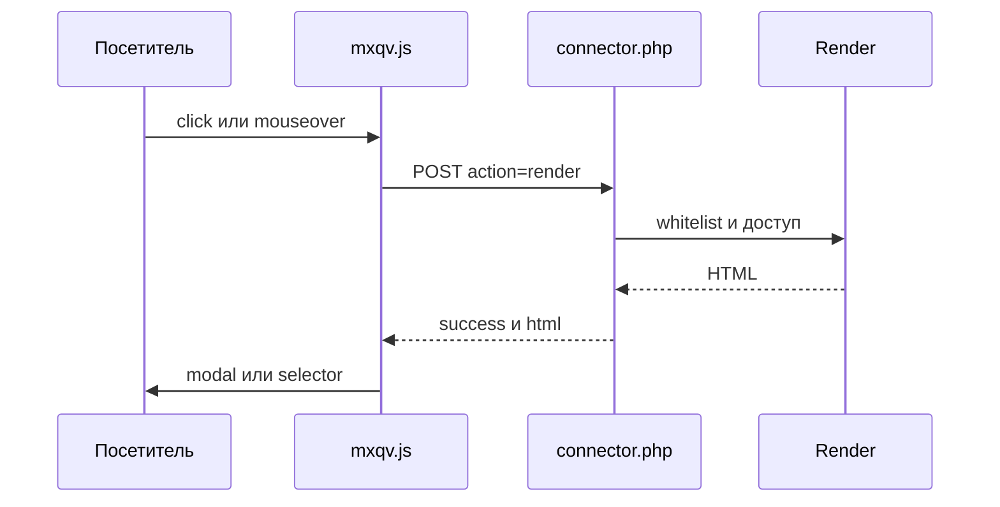

# Архитектура mxQuickView

## Обзор компонентов

- **Сниппет инициализации** `mxQuickView.initialize` — CSS/JS, `window.mxqvConfig`, режимы модалки `native`/`bootstrap`/`fancybox`.
- **Frontend JS** `assets/components/mxquickview/js/mxqv.min.js` — делегирование событий, AJAX к connector, отрисовка modal/selector, loop-навигация, хелперы ms3Variants.
- **Коннектор** `assets/components/mxquickview/connector.php` — HTTP-точка входа для action `render`.
- **Процессор** `core/components/mxquickview/src/Processors/Render.php` — белый список, доступ к ресурсу, отрисовка `chunk|snippet|template`.
- **Базовый чанк товара** `core/components/mxquickview/elements/chunks/mxqv_product.tpl` — карточка quick view с формой корзины и блоком вариантов.

## Поток данных

1. Пользователь кликает или наводит на элемент с `data-mxqv-*`.
2. `mxqv.js` формирует POST в `connector.php` (`mode`, `data_action`, `element`, `id`, `context`, `output`, `modal_library`).
3. Коннектор проверяет HTTP-метод и `action=render`, затем вызывает `Render::run(...)`.
4. Процессор:
   - проверяет `id`, `element`, `data_action`;
   - загружает ресурс и проверяет право просмотра;
   - сверяет элемент с белым списком;
   - собирает HTML через `getChunk`, `runSnippet` или `$resource->process()` (для `template`).
5. Коннектор возвращает JSON `{success, html|message}`.
6. JS вставляет HTML в выбранную модалку (`native`/`bootstrap`/`fancybox`) или в контейнер `selector`.

## Плейсхолдеры рендера

В отрисовку передаются:

- поля ресурса (`$resource->toArray()`);
- `content`, `assets_url`;
- `mxqv_content_html` (копия `content`), `mxqv_intro_html` (обёртка `introtext` в `
`, если introtext не пуст). В чанке `mxqv_resource` по умолчанию не используются.
- при MiniShop3: поля `msProductData`;
- при ms3Variants: `has_variants`, `variants_html`, `variants_json`.
- Чанки поставки и HTML после `process()` проходят Fenom через pdoTools (`parseFenom` / `@INLINE`), если pdoTools установлен.

## Безопасность

- Коннектор обрабатывает только `POST`.
- Проверяется наличие ресурса (`id`, `deleted=0`) и право просмотра (политика `view` или `load`, или permission `view`).
- Для `chunk` и `snippet` белый список обязателен.
- Для `template` белый список обязателен. Пустой `mxquickview_allowed_template` блокирует отрисовку шаблона.

## Хранилище данных

Своих таблиц БД для quick view нет: используются ресурсы MODX и (опционально) модели MiniShop3/ms3Variants.

## Файлы и роли

| Файл | Роль |
| --- | --- |
| `assets/components/mxquickview/connector.php` | Входная точка AJAX |
| `core/components/mxquickview/src/Processors/Render.php` | Логика отрисовки |
| `core/components/mxquickview/elements/snippets/mxqv_initialize.php` | Подключение фронта и разметки модалки |
| `assets/components/mxquickview/js/mxqv.min.js` | Поведение на клиенте (минифицирован) |
| `assets/components/mxquickview/css/mxqv.min.css` | Стили модалки и карточки (минифицирован) |
