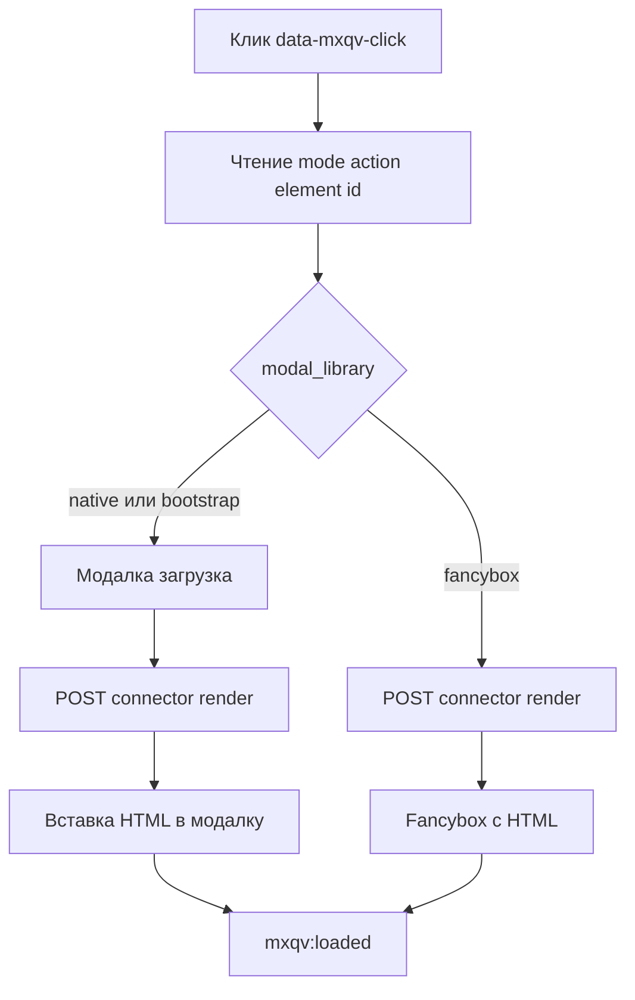

# Потоки

## 1. Отрисовка в модалке по клику

1. Клик по элементу с `data-mxqv-click`.
2. JS читает `mode`, `data_action`, `element`, `id`, `title`.
3. Для `native`/`bootstrap` модалка открывается сразу (состояние загрузки), затем уходит POST в `connector.php` (`action=render`, включая `modal_library`).
4. Для `fancybox` сначала POST, затем Fancybox открывается уже с полученным HTML.
5. При успехе HTML вставляется в контейнер выбранного режима:
   - `native` → `#mxqv-modal-body .qv-modal__content-area`;
   - `bootstrap` → `#mxqv-bootstrap-modal-body .qv-modal__content-area`;
   - `fancybox` → текущий слайд Fancybox.
6. После вставки публикуется `mxqv:loaded`.

## 2. Отрисовка по наведению (mouseover)

1. Наведение на элемент с `data-mxqv-mouseover`.
2. Запускается таймер `mouseoverDelay` из `window.mxqvConfig`.
3. Если курсор не ушёл до конца таймера, выполняется тот же запрос `render`.
4. Если курсор ушёл раньше, таймер отменяется.

## 3. Режим `selector` (без встроенной модалки)

1. На триггере задано `data-mxqv-mode="selector"` и `data-mxqv-output`.
2. JS вставляет индикатор загрузки в целевой контейнер.
3. После ответа заменяет контейнер на `html` или сообщение об ошибке.

## 4. Навигация prev/next в списке

1. Триггер находится внутри контейнера `data-mxqv-parent data-mxqv-loop="true"`.
2. JS собирает список триггеров внутри контейнера.
3. Кнопки `[data-mxqv-nav="prev|next"]` и клавиши ←/→ меняют текущий индекс (только `modalLibrary` `native` или `bootstrap`).
4. На границах списка кнопки скрываются. Для Fancybox `updateNavButtons` не выполняется, prev/next недоступны.
5. **Escape** закрывает модалку только в режиме `native` (не bootstrap/fancybox).

## 5. Добавление в корзину из quick view

1. В разметке форма MiniShop3 (`data-ms3-form`, `ms3_action=cart/add`).
2. После вставки HTML вызываются `ms3.cartUI.init`/`reinit`, `ms3.quantityUI.reinit`/`init`, `ms3.productCardUI.reinit()` (если API MiniShop3 на странице).
3. Публикуется `ms3:cart:updated` с `detail: { source: 'mxqv' }`.
4. Добавление в корзину без перезагрузки работает, если MiniShop3 на странице уже инициализирован.

## 6. ms3Variants внутри quick view

1. Процессор для `msProduct` подставляет `has_variants`, `variants_html` и `variants_json` (если ms3Variants установлен).
2. В чанке `variants_json` попадает в `data-mxqv-variants-json` через `:htmlent`.
3. JS ищет `.qv-product[data-mxqv-variants]` и обрабатывает только флаг `true|1|yes|on`.
4. JS слушает `click` по `[data-variant-id]` и `change` на `select/input` в `.qv-product__variants`.
5. При выборе варианта обновляет цену, старую цену и изображение.
6. Обработчик вариантов (`initVariantsInContent`) вызывается при вставке в **modal** (`setContent`), не в ветке `mode=selector` ([issue #2](https://github.com/Ibochkarev/mxQuickView/issues/2)).

## 7. Поток ошибок

1. При ошибке проверки коннектор возвращает `{success:false, message, html:''}`.
2. В режиме `modal` сообщение показывается в содержимом модалки.
3. В режиме `selector` сообщение вставляется в целевой контейнер.
