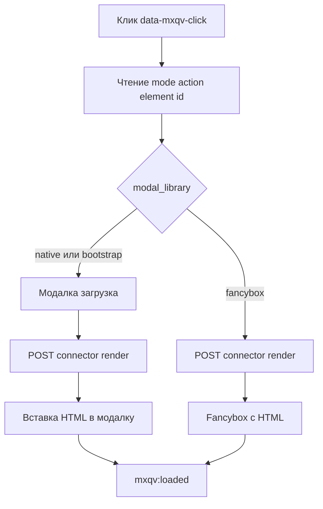
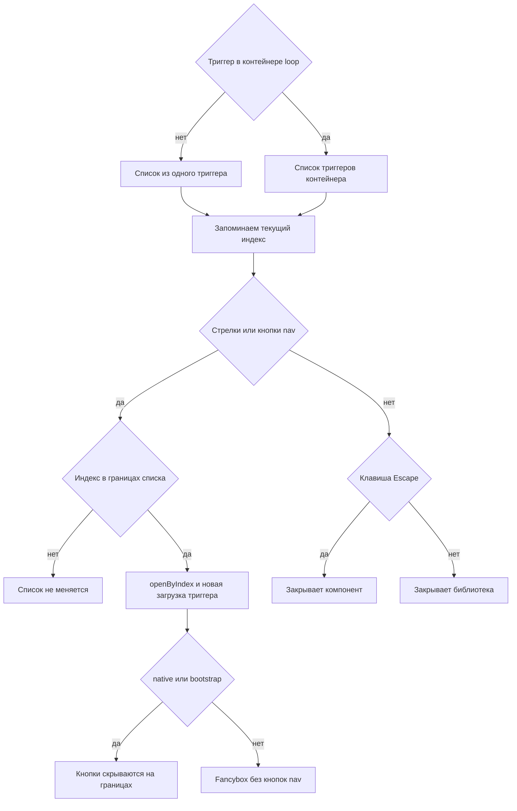

# Потоки

## 1. Отрисовка в модалке по клику

Для `native`/`bootstrap` модалка открывается сразу (состояние загрузки), затем уходит POST в `connector.php` (`action=render`, включая `modal_library`).

Для `fancybox` сначала POST, затем Fancybox открывается уже с полученным HTML.

Библиотека проверяется дважды, при инициализации и при каждом открытии. Если API запрошенной библиотеки недоступен, компонент молча откатывается на `native` и пишет предупреждение в консоль: `Bootstrap mode requested, but bootstrap.Modal is unavailable. Fallback to native.`

При успехе HTML вставляется в контейнер выбранного режима:

- `native` → `#mxqv-modal-body .qv-modal__content-area`
- `bootstrap` → `#mxqv-bootstrap-modal-body .qv-modal__content-area`
- `fancybox` → текущий слайд Fancybox

После вставки публикуется `mxqv:loaded`.

## 2. Отрисовка по наведению (mouseover)

1. Наведение на элемент с `data-mxqv-mouseover`.
2. Запускается таймер `mouseoverDelay` из `window.mxqvConfig`.
3. Если курсор не ушёл до конца таймера, выполняется тот же запрос `render`. Список loop не собирается: prev/next и ←/→ с `data-mxqv-mouseover` не работают.
4. Если курсор ушёл раньше, таймер отменяется.

## 3. Режим `selector` (без встроенной модалки)

1. На триггере задано `data-mxqv-mode="selector"` и `data-mxqv-output`.
2. JS вставляет индикатор загрузки в целевой контейнер.
3. После ответа заменяет контейнер на `html` или сообщение об ошибке.

## 4. Навигация prev/next в списке

1. Триггер находится внутри контейнера `data-mxqv-parent data-mxqv-loop="true"`.
2. JS собирает список триггеров внутри контейнера.
3. Клавиши ←/→ меняют текущий индекс в любом режиме: проверяется только факт открытой модалки и границы списка.
4. Кнопки `[data-mxqv-nav="prev|next"]` рисует только разметка `native` и `bootstrap`, в `fancybox` их нет и `updateNavButtons()` не выполняется. На границах списка кнопки скрываются.
5. **Escape** обрабатывается компонентом только в `native`. В `bootstrap` и `fancybox` окно закрывает сама библиотека.

## 5. Добавление в корзину из quick view

1. В разметке форма MiniShop3 (`data-ms3-form`, `ms3_action=cart/add`).
2. После вставки HTML вызываются `ms3.cartUI.init`/`reinit`, `ms3.quantityUI.reinit`/`init`, `ms3.productCardUI.reinit()` (если API MiniShop3 на странице).
3. Публикуется `ms3:cart:updated` с `detail: { source: 'mxqv' }`.
4. Добавление в корзину без перезагрузки работает, если MiniShop3 на странице уже инициализирован.

## 6. ms3Variants внутри quick view

1. Класс рендера `Render` для ресурса, у которого есть запись `msProduct`, подставляет `has_variants`, `variants_html` и `variants_json` (если установлен ms3Variants).
2. В чанке `variants_json` попадает в `data-mxqv-variants-json`. В поставляемом чанке `mxqv_product` это Fenom-фильтр `{$variants_json|escape:'html'}`. Свой MODX-чанк экранирует тот же плейсхолдер фильтром `:htmlent`, например `[[+variants_json:htmlent]]`.
3. JS ищет `.qv-product[data-mxqv-variants]` и обрабатывает только флаг `true|1|yes|on`.
4. JS слушает `click` по `[data-variant-id]` и `change` на `select/input` в `.qv-product__variants`.
5. При выборе варианта обновляет цену, старую цену и изображение.
6. Обработчик вариантов (`initVariantsInContent`) вызывается при вставке в **modal** и в `mode=selector`.

## 7. Поток ошибок

1. При ошибке проверки коннектор возвращает `{success:false, message, html:''}`.
2. В режиме `modal` сообщение показывается в содержимом модалки.
3. В режиме `selector` сообщение вставляется в целевой контейнер.
