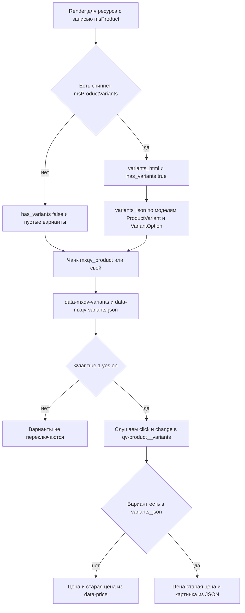

# Интеграция на сайт

## 1. Подключение ресурсов (обязательно)

Подключите `mxQuickView.initialize` один раз в шаблоне.

::: code-group

```modx
[[!mxQuickView.initialize]]
```

```fenom
{'!mxQuickView.initialize'|snippet}
```

:::

### Пример с параметрами

::: code-group

```modx
[[!mxQuickView.initialize?
  &modalSize=`modal-xl`
  &mouseoverDelay=`350`
]]
```

```fenom
{'!mxQuickView.initialize'|snippet:[
  'modalSize' => 'modal-xl',
  'mouseoverDelay' => 350
]}
```

:::

Базовый URL ресурсов и `connector.php`: по умолчанию `[[++assets_url]]components/mxquickview/`. Переопределение — необязательный `getOption` `mxquickview.assets_url` (в transport нет).

Чанки поставки (`mxqv_product`, `mxqv_resource`) используют **Fenom**. Установите pdoTools 3.x: процессор разбирает Fenom при отрисовке chunk/template. Без pdoTools в ответе останутся сырые `{$…}`.

### Выбор библиотеки модалки

`modalLibrary`: `native` (по умолчанию), `bootstrap` или `fancybox`.

`fancybox` вызывает `window.Fancybox.show()`. Если API Fancybox нет, JS переключает режим на `native` (разметка `#mxqv-modal` всегда в HTML). То же без `bootstrap.Modal` или без `#mxqv-bootstrap-modal`. Проверка выполняется на старте и повторяется при каждом открытии.

В поставке лежат собственные файлы библиотек:

- Fancybox 6.1.13: `assets/components/mxquickview/vendor/fancybox/fancybox.css`, `fancybox.umd.js`
- Bootstrap 5.3.2: `assets/components/mxquickview/vendor/bootstrap/bootstrap.min.css`, `bootstrap.min.js`

Рядом с ними лежат `LICENSE` и `THIRD_PARTY.txt`.

Как выбирается файл: путь из параметра сниппета или из системной настройки приводится к URL (теги `[[++assets_url]]` разворачиваются) и подключается как есть, без проверки существования. Поиск в `assets/components/mxquickview/vendor/...` и CDN работают только при пустом значении, то есть если параметр и настройка оставлены пустыми:

- Fancybox: сначала `vendor/fancybox/`, затем CDN `@fancyapps/ui` без закреплённой версии.
- Bootstrap: сначала `vendor/bootstrap/`, затем CDN Bootstrap 5.3.2.

::: warning
CDN-Bootstrap подключается файлом `bootstrap.min.js`, он не содержит Popper. Выпадающие списки и всплывающие подсказки Bootstrap в этой ветке не заработают, Popper нужно подключить отдельно. В поставленном `bootstrap.min.js` Popper есть.
:::

Пути можно задать явно:

::: code-group

```modx
[[!mxQuickView.initialize?
  &modalLibrary=`fancybox`
  &fancyboxCss=`/assets/components/mxquickview/vendor/fancybox/fancybox.css`
  &fancyboxJs=`/assets/components/mxquickview/vendor/fancybox/fancybox.umd.js`
]]
```

```fenom
{'!mxQuickView.initialize'|snippet:[
  'modalLibrary' => 'fancybox',
  'fancyboxCss' => '/assets/components/mxquickview/vendor/fancybox/fancybox.css',
  'fancyboxJs' => '/assets/components/mxquickview/vendor/fancybox/fancybox.umd.js'
]}
```

:::

Для Bootstrap передайте `modalLibrary=bootstrap`.

## 2. Быстрый просмотр любого ресурса (новости, статьи, страницы)

Чанк `mxqv_resource` подходит для любых ресурсов (pagetitle, introtext, content). Добавьте его в `mxquickview_allowed_chunk`.

::: code-group

```modx
<button type="button"
  data-mxqv-click
  data-mxqv-mode="modal"
  data-mxqv-action="chunk"
  data-mxqv-element="mxqv_resource"
  data-mxqv-id="[[+id]]"
  data-mxqv-title="[[+pagetitle]]">
  Быстрый просмотр
</button>
```

```fenom
<button type="button"
  data-mxqv-click
  data-mxqv-mode="modal"
  data-mxqv-action="chunk"
  data-mxqv-element="mxqv_resource"
  data-mxqv-id="{$id}"
  data-mxqv-title="{$pagetitle}">
  Быстрый просмотр
</button>
```

:::

## 3. Кнопка mxQuickView в карточке товара (modal + chunk)

::: code-group

```modx
<button type="button"
  data-mxqv-click
  data-mxqv-mode="modal"
  data-mxqv-action="chunk"
  data-mxqv-element="mxqv_product"
  data-mxqv-id="[[+id]]"
  data-mxqv-title="[[+pagetitle]]">
  Быстрый просмотр
</button>
```

```fenom
<button type="button"
  data-mxqv-click
  data-mxqv-mode="modal"
  data-mxqv-action="chunk"
  data-mxqv-element="mxqv_product"
  data-mxqv-id="{$id}"
  data-mxqv-title="{$pagetitle}">
  Быстрый просмотр
</button>
```

:::

## 4. Клик + `modal` + `snippet` (пример с `msCart` и широкой модалкой)

::: code-group

```modx
[[!mxQuickView.initialize?
  &modalSize=`modal-xl`
]]

<button type="button"
  data-mxqv-click
  data-mxqv-mode="modal"
  data-mxqv-action="snippet"
  data-mxqv-element="msCart"
  data-mxqv-id="[[+id]]"
  data-mxqv-title="[[+pagetitle]]">
  Быстрый просмотр корзины
</button>
```

```fenom
{'!mxQuickView.initialize'|snippet:[
  'modalSize' => 'modal-xl'
]}

<button type="button"
  data-mxqv-click
  data-mxqv-mode="modal"
  data-mxqv-action="snippet"
  data-mxqv-element="msCart"
  data-mxqv-id="{$id}"
  data-mxqv-title="{$pagetitle}">
  Быстрый просмотр корзины
</button>
```

:::

`msCart` должен быть в `mxquickview_allowed_snippet`.

Компактная миникорзина в quick view собирается как `msCart` + `tpl.msMiniCart` (по docs.modx.pro). `data-mxqv-element="msMiniCart"` работает как alias.

## 5. Отрисовка по наведению (mouseover)

::: code-group

```modx
<a href="#"
  data-mxqv-mouseover
  data-mxqv-mode="modal"
  data-mxqv-action="chunk"
  data-mxqv-element="mxqv_product"
  data-mxqv-id="[[+id]]"
  data-mxqv-title="[[+pagetitle]]">Наведите</a>
```

```fenom
<a href="#"
  data-mxqv-mouseover
  data-mxqv-mode="modal"
  data-mxqv-action="chunk"
  data-mxqv-element="mxqv_product"
  data-mxqv-id="{$id}"
  data-mxqv-title="{$pagetitle}">Наведите</a>
```

:::

Задержка: параметр `mouseoverDelay` перекрывает `mxquickview_mouseover_delay`. Пустая строка свойства читает настройку (по умолчанию 300 мс).

## 6. Режим `selector` (свой контейнер)

::: code-group

```modx
<button type="button"
  data-mxqv-click
  data-mxqv-mode="selector"
  data-mxqv-action="chunk"
  data-mxqv-element="mxqv_product"
  data-mxqv-id="[[+id]]"
  data-mxqv-output=".quickview-output">
  Загрузить в блок
</button>

<div class="quickview-output"></div>
```

```fenom
<button type="button"
  data-mxqv-click
  data-mxqv-mode="selector"
  data-mxqv-action="chunk"
  data-mxqv-element="mxqv_product"
  data-mxqv-id="{$id}"
  data-mxqv-output=".quickview-output">
  Загрузить в блок
</button>

<div class="quickview-output"></div>
```

:::

## 7. Комбинированный сценарий: `mouseover` + `selector`

::: code-group

```modx
<a href="#"
  data-mxqv-mouseover
  data-mxqv-mode="selector"
  data-mxqv-action="chunk"
  data-mxqv-element="mxqv_product"
  data-mxqv-id="[[+id]]"
  data-mxqv-output=".quickview-output">
  Наведите для загрузки
</a>

<div class="quickview-output"></div>
```

```fenom
<a href="#"
  data-mxqv-mouseover
  data-mxqv-mode="selector"
  data-mxqv-action="chunk"
  data-mxqv-element="mxqv_product"
  data-mxqv-id="{$id}"
  data-mxqv-output=".quickview-output">
  Наведите для загрузки
</a>

<div class="quickview-output"></div>
```

:::

### Вариант с Bootstrap 5 modal через `selector`

::: code-group

```modx
<button type="button"
  data-bs-toggle="modal"
  data-bs-target="#qvBootstrapModal"
  data-mxqv-click
  data-mxqv-mode="selector"
  data-mxqv-action="chunk"
  data-mxqv-element="mxqv_product"
  data-mxqv-id="[[+id]]"
  data-mxqv-output="#qvBootstrapModal .modal-body">
  Быстрый просмотр
</button>

<div class="modal fade" id="qvBootstrapModal" tabindex="-1" aria-hidden="true">
  <div class="modal-dialog modal-lg">
    <div class="modal-content">
      <div class="modal-header">
        <h5 class="modal-title">Быстрый просмотр</h5>
        <button type="button" class="btn-close" data-bs-dismiss="modal" aria-label="Close"></button>
      </div>
      <div class="modal-body"></div>
    </div>
  </div>
</div>
```

```fenom
<button type="button"
  data-bs-toggle="modal"
  data-bs-target="#qvBootstrapModal"
  data-mxqv-click
  data-mxqv-mode="selector"
  data-mxqv-action="chunk"
  data-mxqv-element="mxqv_product"
  data-mxqv-id="{$id}"
  data-mxqv-output="#qvBootstrapModal .modal-body">
  Быстрый просмотр
</button>

<div class="modal fade" id="qvBootstrapModal" tabindex="-1" aria-hidden="true">
  <div class="modal-dialog modal-lg">
    <div class="modal-content">
      <div class="modal-header">
        <h5 class="modal-title">Быстрый просмотр</h5>
        <button type="button" class="btn-close" data-bs-dismiss="modal" aria-label="Close"></button>
      </div>
      <div class="modal-body"></div>
    </div>
  </div>
</div>
```

:::

## 8. Навигация prev/next в списке товаров

Кнопки `data-mxqv-nav="prev"` и `data-mxqv-nav="next"` есть только в разметке `native` и `bootstrap`. У Fancybox их нет, навигация остаётся на клавишах ← / →, которые работают во всех режимах.

Клавиши ← / → переключают товар в пределах родителя с `data-mxqv-loop="true"`. Escape закрывает модалку только в режиме `native`.

::: code-group

```modx
<div data-mxqv-parent data-mxqv-loop="true">
  <button type="button"
    data-mxqv-click
    data-mxqv-mode="modal"
    data-mxqv-action="chunk"
    data-mxqv-element="mxqv_product"
    data-mxqv-id="[[+id]]"
    data-mxqv-title="[[+pagetitle]]">
    Быстрый просмотр
  </button>
</div>
```

```fenom
<div data-mxqv-parent data-mxqv-loop="true">
  <button type="button"
    data-mxqv-click
    data-mxqv-mode="modal"
    data-mxqv-action="chunk"
    data-mxqv-element="mxqv_product"
    data-mxqv-id="{$id}"
    data-mxqv-title="{$pagetitle}">
    Быстрый просмотр
  </button>
</div>
```

:::

У каждого триггера внутри должны быть свои `data-mxqv-action`, `data-mxqv-element`, `data-mxqv-id`.

## 9. Интеграция с MiniShop3 и ms3Variants

- В чанке quick view — форма `ms3-add-to-cart` (`data-ms3-form`, `ms3_action=cart/add`).
- После вставки HTML: `ms3.cartUI.init`/`reinit`, `ms3.quantityUI.reinit`/`init`, `ms3.productCardUI.reinit()` и событие `ms3:cart:updated` (`source: 'mxqv'`), если MiniShop3 на странице.
- При установленном ms3Variants доступны `[[+variants_html]]`, `[[+variants_json]]`, `[[+has_variants]]`.

### Что делает mxQuickView на сервере

Данные о вариантах идут от `Render` через плейсхолдеры в чанк и дальше в разметку, откуда их забирает `initVariantsInContent`:



1. Для `msProduct` вызывается `msProductVariants` с параметрами `productId`, `product_id`, `id`.
2. В чанк передаётся `[[+has_variants]]` как строка `true|false`.
3. В чанк передаётся `[[+variants_html]]` как HTML выбора варианта от `msProductVariants`.
4. В чанк передаётся `[[+variants_json]]` как JSON массива вариантов (`id`, `price`, `old_price`, `sku`, `count`, `file_id`, `options`).

### Что должно быть в quick view-чанке

::: code-group

```modx
<div class="qv-product"
  data-ms3-product-id="[[+id]]"
  data-mxqv-variants="[[+has_variants]]"
  data-mxqv-variants-json="[[+variants_json:htmlent]]">
  <form method="post" class="ms3_form ms3-add-to-cart" data-ms3-form data-cart-state="add">
    <input type="hidden" name="id" value="[[+id]]">
    <input type="hidden" name="count" value="1">
    <input type="hidden" name="options" value="[]">
    <input type="hidden" name="ms3_action" value="cart/add">
    <div class="qv-product__variants">[[+variants_html]]</div>
    <button type="submit">В корзину</button>
  </form>
</div>
```

```fenom
<div class="qv-product"
  data-ms3-product-id="{$id}"
  data-mxqv-variants="{$has_variants}"
  data-mxqv-variants-json="{$variants_json|escape:'html'}">
  <form method="post" class="ms3_form ms3-add-to-cart" data-ms3-form data-cart-state="add">
    <input type="hidden" name="id" value="{$id}">
    <input type="hidden" name="count" value="1">
    <input type="hidden" name="options" value="[]">
    <input type="hidden" name="ms3_action" value="cart/add">
    <div class="qv-product__variants">{$variants_html}</div>
    <button type="submit">В корзину</button>
  </form>
</div>
```

:::

### Что делает frontend-логика mxQuickView

Переключение вариантов (`initVariantsInContent`) вызывается и в **modal**, и в `mode=selector`.

1. Ищет `.qv-product[data-mxqv-variants]` и проверяет флаг (`true|1|yes|on`).
2. Парсит `data-mxqv-variants-json`.
3. Слушает выбор варианта в `.qv-product__variants`.
4. По клику берёт id из `data-variant-id` на самом элементе или на его `option`.
5. По `change` берёт id из `data-variant-id` у `select`/`input`, из `value` выбранного `option` или из `value` самого поля, если в `name` есть подстрока `variant` (так работает разметка ms3Variants).
6. При смене варианта обновляет цену (`[data-mxqv-price]`), old price (`.qv-product__price-old`) и изображение (`.qv-product__thumb`, если есть `data-thumb` или `data-image`).

Если варианта нет в `data-mxqv-variants-json`, цена и старая цена берутся из атрибутов самого элемента: `data-price` и `data-old-price`.

### MiniShop3 и ms3Variants

- mxQuickView не читает параметры `usePackages`, `includeThumbs`, `msProducts`, `pdoPage`: это API MiniShop3 и pdoTools. Варианты в список подставляет сниппет `msProductVariants`, который mxQuickView вызывает с параметрами `productId`, `product_id` и `id`.
- [ms3Variants](/components/ms3variants/)
- [MiniShop3: вкладки товара и `usePackages`](/components/minishop3/development/product-tabs-integration)

## 10. Почему блок не работает

1. Не подключён `mxQuickView.initialize`.
2. Элемента нет в белом списке (`allowed_chunk`, `allowed_snippet`, `allowed_template`).
3. Нет или неверный `data-mxqv-id`.
4. В режиме `selector` нет целевого контейнера `data-mxqv-output`.
5. Ресурс недоступен для просмотра (ответ `Access denied`).
