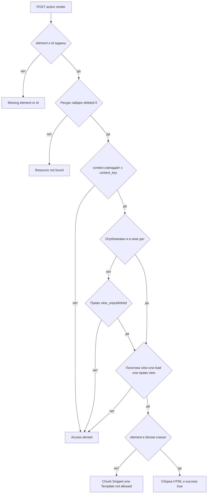

# Права доступа

У `mxQuickView` нет страницы в разделе **Компоненты** и нет своего права панели управления.

## Что проверяется при отрисовке

Ресурс для отрисовки задаёт клиент: `data-mxqv-id` триггера. Сервер берёт ресурс по `id` с `deleted=0`, при переданном `context` сверяет его с `context_key` ресурса, переключает контекст на контекст ресурса и проверяет право просмотра.

Доступа к ресурсу достаточно, если выполняется **одно** из условий:

- `resource->checkPolicy('view')`
- `resource->checkPolicy('load')`
- `$modx->hasPermission('view')`

Ресурс должен быть доступен по публикации: `published=1`, корректные `pub_date/unpub_date`, либо право `view_unpublished`.

Если права на просмотр нет, коннектор вернёт `Access denied`. Если ресурса нет или `id <= 0` — `Resource not found` либо `Missing element or id`.

Права на сам компонент не проверяются: ни своего пункта в меню, ни плагинов, ни MODX-процессоров у `mxQuickView` нет. Всё держится на политиках MODX и белых списках `mxquickview_allowed_chunk`, `mxquickview_allowed_snippet`, `mxquickview_allowed_template`.

Порядок проверок в `Render::run` определяет, какое сообщение вернёт коннектор:

Сверка контекста идёт до переключения: переданный `context` должен совпасть с `context_key` ресурса, иначе доступ закрывается даже при правах на просмотр.

## Границы защиты

CSRF-токен в `connector.php` не требуется и не проверяется: запрос принимается, если это `POST` с `action=render`. Единственный барьер для посетителя без прав — белые списки и проверки доступа к ресурсу.

::: warning
Если нужно отдавать в quick view закрытые данные, не добавляйте их чанк или сниппет в белый список. Публичный чанк из белого списка доступен любому посетителю, если он знает ID ресурса. Для чувствительных сценариев используйте `data-mxqv-mode="selector"` и проверку прав в своём коде.
:::

## Практика

Отдельные права на страницу компонента не нужны. Доступ задают стандартные политики MODX на ресурсы и контексты.
