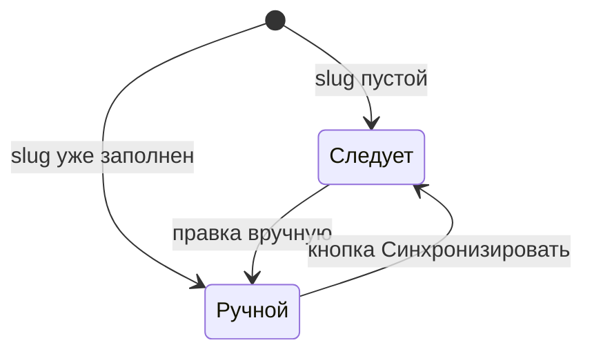

# Поле slug

Версия: **Free**.

<!--  -->

## Зачем этот тип

Сегмент адреса страницы, не произвольный текст. Пока slug пустой и редактор не правил его вручную, значение следует за `sourceField` при изменении источника. После ручного ввода — блокировка до кнопки «Синхронизировать».



## Когда использовать

- Якорь секции, slug карточки, сегмент фильтра
- ЧПУ в каталоге или landing block
- Ключ для табов и anchor-навигации

## Советы

Полный URL: [url](url), не slug.

## Похожие типы

- [text](text) для видимого заголовка-источника
- [url](url) для готовой ссылки с протоколом

## Настройка

```json
{
  "name": "slug",
  "type": "slug",
  "label": "Slug",
  "sourceField": "title",
  "separator": "-",
  "tab": "Контент",
  "width": 100,
  "active": true
}
```

## Значение

Строка slug.

## Данные секции {#vyvod-v-section-data}

Ключ `slug` в данных секции:

```json
{
  "slug": "zagolovok-sekcii"
}
```

## Пример в chunk

::: code-group

```modx
[[+slug]]
```

```fenom
{$slug|escape}
```

:::

## Примечание

Источник: `sourceField`, `slugSource` или алиас `from`. Разделитель: `separator`.

## Общие свойства

Для полей с `name`, которые сохраняются в данных секции:

| Ключ | Тип | Роль | Панель |
| --- | --- | --- | --- |
| `tab` | string | Подзаголовок группы в инспекторе | да |
| `width` | 25, 33, 50, 66, 75, 100 | Ширина поля в % строки (flex); в CMP только эти значения | да |
| `description` | string | Подсказка под подписью | да |
| `default` | any | Начальное значение новой секции | да |
| `active` | bool | `false`: скрыть поле в инспекторе | да |
| `required` | bool | Обязательно при **publish** (черновик сохраняется) | да |

**Pro** (capability `responsive`): при `responsive: true` в данных секции — ключи `desktop`, `tablet`, `mobile` вместо скаляра. Для имени `slug` карта по экранам отключена.

- Дополнительно: `sourceField` / `from`, `separator`.

Подробнее: [обзор полей](overview#общие-свойства-поля).

## Дальше

- [Справочник типов](types)
- [Обзор полей](overview)
