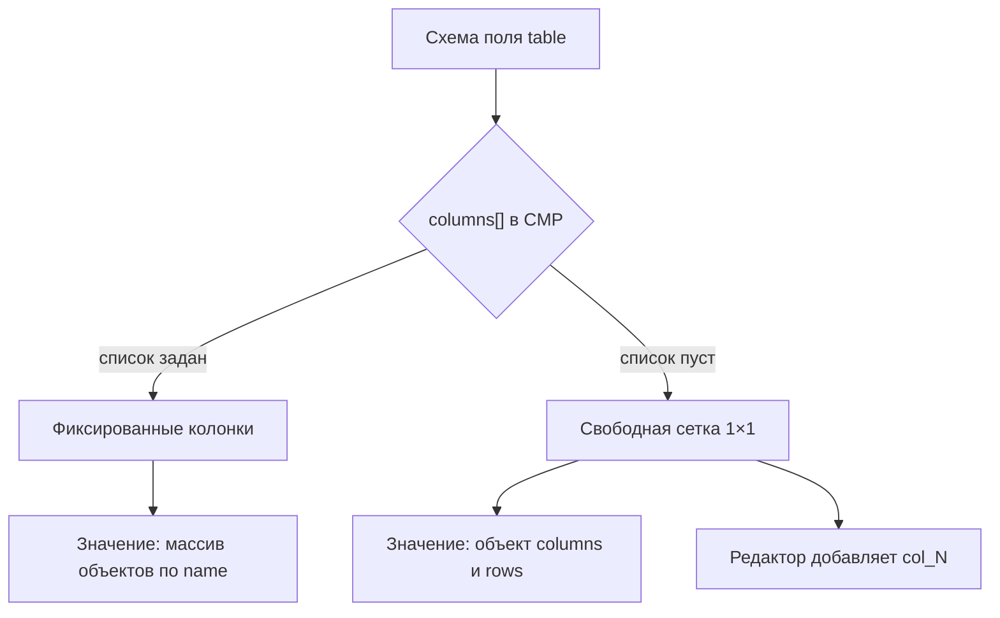

# Поле table

Версия: **Pro** (`advanced-fields`).

<!--  -->

## Зачем этот тип

Редактор правит строки таблицей в инспекторе. Колонки: текст, число, картинка, цвет, дата, метка, сумма и ссылка. Строки лежат в данных секции.

## Когда использовать

- Таблица характеристик продукта
- Сравнительная таблица с картинками в ячейках
- Немного строк характеристик в секции

## Советы

Пустой `columns` даёт свободную сетку 1×1: редактор добавляет столбцы сам. Заполненный список фиксирует `name`, `label` и `type`, как у характеристик. Черновик `key|Key|text` при выборе типа больше не подставляется. Большие выборки из БД: [embeddedTable](embeddedTable).

Лимиты схемы: `rows` (точное число строк, важнее `maxRows`), `maxRows`, `columnCount` (точное число столбцов, важнее `maxColumns`, только свободная сетка), `maxColumns`, `columnWidth` (px), `headerDefault`.

## Похожие типы

- [keyvalue](keyvalue) для простых пар ключ/значение
- [embeddedTable](embeddedTable) для table_key и runtime rows

## Настройка

```json
{
  "name": "specs",
  "type": "table",
  "label": "Характеристики",
  "columns": [
    {
      "name": "key",
      "label": "Ключ",
      "type": "text"
    },
    {
      "name": "value",
      "label": "Значение",
      "type": "text"
    }
  ],
  "tab": "Контент",
  "width": 100,
  "active": true
}
```

## Значение

Колонки заданы: массив объектов по `columns[].name`. Пустая таблица без лишних строк хранится как `[]`.

Колонки не заданы: объект с `columns` и `rows`. Ключи новых столбцов: `col_1`, `col_2`. Подпись — из `headerDefault` или «Столбец N». В свободной сетке её правят в шапке. `columnCount` доливает пустые столбцы и держит это число.



Кнопки инспектора берутся из PrimeVue. **Добавить столбец** и **Удалить столбец** всегда на тулбаре. В свободной сетке они работают в пределах `columnCount` и `maxColumns`. Если в типе задан `columns[]`, кнопки видны и не нажимаются. Под тулбаром строка статуса поясняет режим.

Под сеткой редактора — превью: шапка, группы, `colspan`/`rowspan`, картинки и цвета как на сайте.

Номер столбца стоит над подписью. Левый край подписи совпадает с полем ячейки. Ширина колонки зависит от `type` (текст тянется, число уже, image и color узкие), пока не задан `columnWidth`. У image превью 40×40 рядом с URL. Color — квадрат 2.25rem. Номер строки слева, плюс и минус строки справа. **Очистить** появляется, когда в ячейках есть данные. Группа и импорт CSV в том же тулбаре. Объединение вправо и вниз открывается при наведении и фокусе. Пустой фильтр показывает «Ничего не найдено».

- Столбец добавляется только в свободной сетке.
- Удаление непустой строки, столбца, очистка и замена из CSV спрашивают подтверждение.
- Сетка не сжимается ниже 1×1.
- Строка-группа: `"_pbGroup": true`, текст в первой колонке.
- Объединение лежит в `"_span"` по имени колонки (`label` / `value`). Текст ячейки остаётся строкой. На сайте `TableCells::present()` добавляет `_pb_cells` (`hidden`, `colspan`, `rowspan`). У `spec_table` то же в `spec_rows`.

```fenom
{foreach $specs|pb_table:3 as $row}
  {$row.value|pb_text}
{/foreach}
{$specs|pb_table:'cell':'last':'last'}
```

`pb_table` режет строки: первый аргумент — сколько, второй — сдвиг. Режимы `row`, `column` и `cell` принимают индекс, имя столбца, `first` и `last`.

## Данные секции {#vyvod-v-section-data}

```json
{
  "specs": [
    {
      "key": "Вес",
      "value": "1.2 кг"
    },
    {
      "key": "Цвет",
      "value": "#111827"
    },
    {
      "key": "Фото",
      "value": {
        "url": "assets/images/hero.jpg",
        "id": 12,
        "path": "assets/images/",
        "filename": "hero.jpg",
        "extension": "jpg",
        "name": "hero",
        "title": "hero.jpg",
        "width": 1920,
        "height": 1080,
        "size": 245760,
        "type": "image"
      }
    }
  ]
}
```

- Ячейки с `type: image` хранят media-объект, как у поля `image`.

Свободная сетка:

```json
{
  "sheet": {
    "columns": [{ "name": "col_1", "label": "Столбец 1", "type": "text" }],
    "rows": [{ "col_1": "Север" }]
  }
}
```

## Пример в chunk

Цикл — Fenom. В MODX — сниппет или элемент по индексу.

::: code-group

```modx
<div class="spec">
  <span class="spec__key">[[+specs.0.key]]</span>
  <span class="spec__value">[[+specs.0.value]]</span>
</div>
```

```fenom
{foreach $specs as $row}
  <div class="spec">
    <span class="spec__key">{$row.key|pb_text}</span>
    <span class="spec__value">{$row.value|pb_text}</span>
  </div>
{/foreach}
```

:::

## Примечание

Колонки в панели управления: `columnsText` (`name|Подпись|type`). Подсказка CMP: text, number, image, color, date, tag, currency, url. В инспекторе ячейки ещё открывают `yesno`, `toggle`, `checkbox`, `colorpalette`, `time`, `datetime`.

## Общие свойства

Для полей с `name`, которые сохраняются в данных секции:

| Ключ | Тип | Роль | Панель |
| --- | --- | --- | --- |
| `tab` | string | Подзаголовок группы в инспекторе | да |
| `width` | 25, 33, 50, 66, 75, 100 | Ширина поля в % строки (flex); в CMP только эти значения | да |
| `description` | string | Подсказка под подписью | да |
| `default` | any | Начальное значение новой секции | да |
| `active` | bool | `false`: скрыть поле в инспекторе | да |
| `required` | bool | Обязательно при **publish** (черновик сохраняется) | да |

- Дополнительно: `columns[]` (`name`, `label`, `type`) или пустой список для свободной сетки.

Подробнее: [обзор полей](overview#общие-свойства-поля).

## Дальше

- [Справочник типов](types)
- [Обзор полей](overview)
- [Pro в менеджере](../integration)
