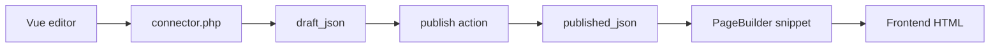

# Менеджер и события

## CMP

<!--  -->

Компонент в менеджере: **Компоненты → PageBuilder** (namespace `pagebuilder`, controller `index`).

В CMP:

- список ресурсов с секциями;
- переход к редактору секций;
- **Типы секций** (Pro + право `pagebuilder_manage_types`);

<!--  -->

- настройки Collections-вкладок при включённых `pagebuilder_collections_*`.

Редактор на форме ресурса и в CMP использует один Vue-бандл через **VueTools**. Connector:

`assets/components/pagebuilder/connector.php`

## Модель данных

Основная запись страницы: таблица `pb_pages` (префикс `modx_pb_`).

| Поле | Назначение |
| --- | --- |
| `resource_id` | Связь с `modResource` |
| `draft_json` | Черновик документа секций |
| `published_json` | Опубликованная версия |
| `draft_revision` / `published_revision` | Счётчики ревизий |

`modResource.content` PageBuilder не перезаписывает. SEO-поля ресурса (pagetitle, description) используются как обычно.

Корзина секций синхронизируется с `pb_basket_items`. Отдельного события `pbOn*` для корзины нет: plugin на `pbOnAfterSave` может читать `record.draft.trash`.

Resource **data tables** хранятся в отдельных таблицах `pb_*` (MVP вкладка «Таблицы»).

<!--  -->

## PageBuilder Pro

Transport `pagebuilderpro` добавляет:

- расширенный каталог секций (forms, maps, commerce, tabs и др.);
- библиотеку секций, версии, пресеты;
- дополнительные processors в connector.

Pro проверяет лицензию через feature providers (`pbOnRegisterFeatureProviders`). Секции с `requires: pro` в JSON-определении недоступны без Pro.

Commerce-секции (`products_grid`, `categories_row` и др.) требуют установленный **miniShop3**.

## События

Подпишите plugin в **Система → События** или static plugin в transport.

### Регистрация при boot

| Событие | Данные |
| --- | --- |
| `pbOnRegisterSectionDefinitions` | `registry` — `SectionRegistry`, добавление custom типов |
| `pbOnRegisterFeatureProviders` | `registry` — `FeatureProviderRegistry` |

### Жизненный цикл страницы

| Событие | Когда |
| --- | --- |
| `pbOnBeforeSave` / `pbOnAfterSave` | Черновик (`mode=draft`) |
| `pbOnBeforePublish` / `pbOnAfterPublish` | Публикация |
| `pbOnBeforeUnpublish` / `pbOnAfterUnpublish` | Снятие с публикации |
| `pbOnBeforeTrash` / `pbOnAfterTrash` | Удаление секций в корзину |

В `pbOnAfterSave` и аналогах: `changes` — `DocumentChangeSet` (added/removed/trashed/restored section ids).

### Копирование

| Событие | Данные |
| --- | --- |
| `pbOnBeforeCopySections` | `sourceResourceId`, `targetResourceId`, `userId` |
| `pbOnAfterCopySections` | + `record` |

### Каталог и поля

| Событие | Назначение |
| --- | --- |
| `pbOnBeforeGetList` / `pbOnAfterGetList` | Список в каталоге |
| `pbOnFieldValues` | `FieldValuesBag` — подстановка значений полей |
| `pbOnCheckSectionRequirement` | `requirement`, `result.satisfied` — проверка depends (pro, minishop3) |

### Resource data tables

| Событие | Когда |
| --- | --- |
| `pbOnBeforeTableGetList` | Фильтрация строк (`criteria` by ref) |
| `pbOnTableRowSave` | Перед сохранением строки (`data` by ref) |

### Рендер на фронте

| Событие | Данные |
| --- | --- |
| `pbOnBeforeRenderDocument` | `resourceId`, `document`, `pipeline`, `options` |
| `pbOnBeforeRenderSection` | `index`, `pipeline` — мутация секции перед chunk |
| `pbOnGetValues` | При `return_values=1` у сниппета |

Пример регистрации секции в plugin:

```php
<?php
switch ($modx->event->name) {
    case 'pbOnRegisterSectionDefinitions':
        /** @var \PageBuilder\Section\SectionRegistry $registry */
        $registry = $modx->event->params['registry'];
        $registry->registerFromFile($modx->getOption('core_path') . 'components/mypackage/sections/custom.json');
        break;
}
```

Custom JSON-определения должны соответствовать схеме built-in секций (поля, chunk, category).

## Mermaid: save → publish → frontend



## Связанные страницы

- [Быстрый старт](quick-start)
- [Каталог секций](sections/)
- [FAQ](faq)
