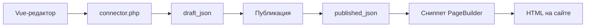

# Менеджер и события

## Панель управления


Компонент в менеджере: **Компоненты → PageBuilder** (namespace `pagebuilder`, controller `index`).

В панели управления:

- список ресурсов с секциями
- переход к редактору секций
- **Типы секций** (право `pagebuilder_manage_types`): UI-типы, скрытие и восстановление встроенных JSON-типов

<!--  -->

- **Корзина** (Pro, флаг `basket`): глобальная корзина удалённых секций и строк таблиц
- настройки вкладок Collections при включённых `pagebuilder_collections_*`

Редактор на форме ресурса и в панели управления использует один Vue-бандл через **VueTools**. Точка входа API менеджера:

`assets/components/pagebuilder/connector.php`

## Модель данных

Основная запись страницы: таблица `pb_pages` (префикс `modx_pb_`).

| Поле | Назначение |
| --- | --- |
| `resource_id` | Связь с `modResource` |
| `draft_json` | Черновик документа секций |
| `published_json` | Опубликованная версия |
| `revision` | Номер ревизии черновика (optimistic locking) |
| `published_revision` | Ревизия последней публикации |
| `publishedon` / `publishedby` | Время и пользователь публикации |
| `editedon` / `editedby` | Последнее изменение черновика |

`modResource.content` PageBuilder не перезаписывает. SEO-поля ресурса (pagetitle, description) используются как обычно.

Корзина на странице хранит удалённые секции в `document.trash`. При сохранении черновика плагин синхронизирует индекс `pb_basket_items`. Отдельного события `pbOn*` для корзины нет: плагин на `pbOnAfterSave` может читать `record.draft.trash`. Глобальное восстановление и окончательное удаление выполняют действия connector Pro (`mgr/basket/*`).

Табличные данные ресурса хранятся в отдельных таблицах `pb_*` (вкладка «Таблицы»).

<!--  -->

## PageBuilder Pro

Дополнение `pagebuilderpro` добавляет библиотеку, версии, пресеты, поля по breakpoints, 20 расширенных типов полей, глобальную корзину в панели управления и [Agent API](agent-api).

Подробно: [PageBuilder Pro](pro). Секции витрины требуют **miniShop3**.

## События {#sobytiya}

При установке дополнение регистрирует 20 событий `pbOn*` в MODX. Подпишите плагин в **Система → События** или используйте статический плагин из состава пакета.

Исключение: **`pbOnBeforeTableGetList`** и **`pbOnTableRowSave`** установщик не создаёт. Если нужны хуки табличных данных, добавьте события вручную и подпишите плагин.

### Регистрация при загрузке

| Событие | Данные |
| --- | --- |
| `pbOnRegisterSectionDefinitions` | `registry`: `SectionRegistry`, добавление своих типов |
| `pbOnRegisterFeatureProviders` | `registry`: `FeatureProviderRegistry` |

### Жизненный цикл страницы

| Событие | Когда |
| --- | --- |
| `pbOnBeforeSave` / `pbOnAfterSave` | Черновик (`mode=draft`) |
| `pbOnBeforePublish` / `pbOnAfterPublish` | Публикация |
| `pbOnBeforeUnpublish` / `pbOnAfterUnpublish` | Снятие с публикации |
| `pbOnBeforeTrash` / `pbOnAfterTrash` | Удаление секций в корзину |

В `pbOnAfterSave` и аналогах поле `changes` содержит `DocumentChangeSet` (id добавленных, удалённых, отправленных в корзину и восстановленных секций).

### Копирование

| Событие | Данные |
| --- | --- |
| `pbOnBeforeCopySections` | `sourceResourceId`, `targetResourceId`, `userId` |
| `pbOnAfterCopySections` | + `record` |

### Каталог и поля

| Событие | Назначение |
| --- | --- |
| `pbOnBeforeGetList` / `pbOnAfterGetList` | Список в каталоге (`mgr/catalog/list`) |
| `pbOnFieldValues` | `FieldValuesBag`: подстановка значений полей (`mgr/field/options`, picker) |
| `pbOnCheckSectionRequirement` | `requirement`, `result.satisfied`: проверка depends (pro, minishop3) |
| `pbOnCheckSectionVisibility` | Pro: `settings.conditions`, `result.visible`, видимость секции на фронте |

### Табличные данные ресурса

::: warning Ручная регистрация
События ниже **не** регистрируются при установке. Добавьте их в **Система → События**, если плагин должен на них реагировать.
:::

| Событие | Когда |
| --- | --- |
| `pbOnBeforeTableGetList` | Фильтрация строк (`criteria` передаётся по ссылке) |
| `pbOnTableRowSave` | Перед сохранением строки (`data` передаётся по ссылке) |

### Рендер на фронте {#рендер-на-фронте}

| Событие | Данные |
| --- | --- |
| `pbOnBeforeRenderDocument` | `resourceId`, `document`, `pipeline`, `options` |
| `pbOnBeforeRenderSection` | `index`, `pipeline`: мутация секции перед chunk |
| `pbOnGetValues` | При `return_values=1` у сниппета |

Пример регистрации секции в плагине:

```php
<?php
switch ($modx->event->name) {
    case 'pbOnRegisterSectionDefinitions':
        /** @var \PageBuilder\Section\SectionRegistry $registry */
        $registry = $modx->event->params['registry'];
        $registry->registerFromFile($modx->getOption('core_path') . 'components/mypackage/sections/custom.json');
        break;
}
```

Свои JSON-определения должны соответствовать схеме встроенных секций: поля, chunk, category.

## Сохранение, публикация и вывод на сайте

Редактор пишет черновик через connector, публикация копирует snapshot в `published_json`, сниппет на сайте читает только опубликованную версию.



## Связанные страницы

- [Рабочий процесс](workflow)
- [Панель управления](cmp)
- [PageBuilder Pro](pro)
- [Agent API](agent-api)
- [Разработчик](developer)
- [Быстрый старт](quick-start)
- [Каталог секций](sections/)
- [FAQ](faq)
