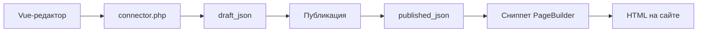

# Менеджер и события

## Панель управления


Компонент в менеджере: **Компоненты → PageBuilder** (namespace `pagebuilder`, controller `index`).

В панели управления:

- **Типы секций** (право `pagebuilder_manage_types`): UI-типы, скрытие и восстановление встроенных JSON-типов
- **Корзина** (Pro, флаг `basket`): глобальная корзина удалённых секций и строк таблиц
- настройки вкладок Collections при включённых `pagebuilder_collections_*`

Списка ресурсов с секциями и перехода к редактору вкладки **Секции** в CMP нет. Редактор — вкладка ресурса (VueTools).

Редактор на форме ресурса и в панели управления использует один Vue-бандл через **VueTools**. Точка входа API менеджера:

`assets/components/pagebuilder/connector.php`

## Модель данных

Основная запись страницы: таблица `pb_pages` (префикс `modx_pb_`).

| Поле | Назначение |
| --- | --- |
| `resource_id` | Связь с `modResource` |
| `draft_json` | Черновик документа секций |
| `published_json` | Опубликованная версия |
| `revision` | Номер ревизии черновика (оптимистичная блокировка) |
| `published_revision` | Ревизия последней публикации |
| `publishedon` / `publishedby` | Время и пользователь публикации |
| `editedon` / `editedby` | Последнее изменение черновика |

`modResource.content` PageBuilder не перезаписывает. SEO-поля ресурса (pagetitle, description) используются как обычно.

Корзина на странице хранит удалённые секции в `document.trash`. При сохранении черновика с непустыми `trashedSectionIds` срабатывают `pbOnBeforeTrash` / `pbOnAfterTrash`. Плагин на `pbOnAfterSave` может читать `record.draft.trash`. Глобальное восстановление и окончательное удаление — connector Pro (`mgr/basket/*`).

Табличные данные ресурса хранятся в отдельных таблицах `pb_*` (вкладка «Таблицы»).

<!--  -->

## PageBuilder Pro

Дополнение `pagebuilderpro` добавляет общие блоки, версии, примеры в каталоге, поля по breakpoints, 27 расширенных типов полей, глобальную корзину в панели управления и [Agent API](agent-api).

Подробно: [PageBuilder Pro](pro). Секции витрины требуют **miniShop3**.

## События {#sobytiya}

При установке дополнение регистрирует 20 событий `pbOn*` в MODX. Подпишите плагин в **Система → События** или используйте статический плагин из состава пакета.

Исключение: **`pbOnBeforeTableGetList`** и **`pbOnTableRowSave`** установщик не создаёт. Если нужны хуки табличных данных, добавьте события вручную и подпишите плагин.

### Регистрация при загрузке

| Событие | Данные |
| --- | --- |
| `pbOnRegisterSectionDefinitions` | `registry`: `SectionRegistry`, добавление своих типов |
| `pbOnRegisterFeatureProviders` | `registry`: `FeatureProviderRegistry` |

### Жизненный цикл страницы

| Событие | Когда | Данные |
| --- | --- | --- |
| `pbOnBeforeSave` | Перед записью черновика | `resourceId`, `document`, `documentBag`, `revision`, `userId`, `mode`=`draft`, `changes` |
| `pbOnAfterSave` | После записи черновика | `resourceId`, `record`, `userId`, `mode`=`draft`, `changes` |
| `pbOnBeforePublish` | Перед публикацией | `resourceId`, `document`, `revision`, `userId` |
| `pbOnAfterPublish` | После публикации | `resourceId`, `record`, `userId` |
| `pbOnBeforeUnpublish` | Перед снятием | `resourceId`, `record`, `revision`, `userId` |
| `pbOnAfterUnpublish` | После снятия | `resourceId`, `record`, `userId` |
| `pbOnBeforeTrash` | Перед корзиной, только если есть удалённые секции | `resourceId`, `sectionIds`, `document`, `userId` |
| `pbOnAfterTrash` | После записи черновика с теми же id | `resourceId`, `sectionIds`, `record`, `userId` |

`documentBag` это `PageDocumentBag`. Слушатель подменяет документ до `saveDraft`. `changes` это массив `DocumentChangeSet`: `addedSectionIds`, `removedSectionIds`, `trashedSectionIds`, `restoredSectionIds`, `updatedSectionIds`, `enabledSectionIds`, `disabledSectionIds`. События trash идут из того же `saveDraft`, отдельного действия корзины нет.

### Копирование

| Событие | Данные |
| --- | --- |
| `pbOnBeforeCopySections` | `sourceResourceId`, `targetResourceId`, `userId` |
| `pbOnAfterCopySections` | + `record` |

### Библиотека (Pro, runtime)

::: warning Ручная регистрация
`pbOnLibraryItemSave` установщик не создаёт. Добавьте событие в **Система → События**, если нужен плагин.
:::

| Событие | Когда | Данные |
| --- | --- | --- |
| `pbOnLibraryItemSave` | После записи элемента Library | параметры из `LibraryService` (id, payload) |

### Каталог и поля

| Событие | Данные |
| --- | --- |
| `pbOnBeforeGetList` | `resourceContext` |
| `pbOnAfterGetList` | `resourceContext`, `items`, `result` (`FieldValuesBag`, ключ `items`) |
| `pbOnFieldValues` | В каталоге: `resourceContext`, `fieldValues`. В `mgr/field/options`: `field`, `fieldValues` |
| `pbOnCheckSectionRequirement` | `requirement`, `result` (`FieldValuesBag`, ключ `satisfied`) |
| `pbOnCheckSectionVisibility` | `section`, `conditions`, `result` (`FieldValuesBag`, ключ `visible`) |

### Табличные данные ресурса

::: warning Ручная регистрация
События ниже **не** регистрируются при установке. Добавьте их в **Система → События**, если плагин должен на них реагировать.
:::

| Событие | Данные |
| --- | --- |
| `pbOnBeforeTableGetList` | `table`, `query`, `criteria` по ссылке |
| `pbOnTableRowSave` | `table`, `data` по ссылке, `row_id` |

### Рендер на фронте {#рендер-на-фронте}

| Событие | Данные |
| --- | --- |
| `pbOnBeforeRenderDocument` | `resourceId`, `document`, `pipeline`, `options` |
| `pbOnBeforeRenderSection` | `resourceId`, `pipeline` с одной секцией, `index`, `options` |
| `pbOnGetValues` | `resourceId`, `document`, `values` (`SectionValuesBag`). Сниппет при `return_values=1` и Public API, если в `include` есть `values` |

### Кадрирование

| Событие | Когда | Данные |
| --- | --- | --- |
| `pbOnAfterMediaCrop` | После записи кадра, до ответа менеджеру | `sourceUrl`, `sourcePath`, `path`, `geometry`, `result` (`MediaCropResult`) |

Плагин дописывает `$result->variants`. Они лежат в `crops` поля `image`. Пример: [поле image](fields/image#crop-plugin).

Пример регистрации секции в плагине:

```php
<?php
switch ($modx->event->name) {
    case 'pbOnRegisterSectionDefinitions':
        /** @var \PageBuilder\Section\SectionRegistry $registry */
        $registry = $modx->event->params['registry'];
        $registry->registerFromFile($modx->getOption('core_path') . 'components/mypackage/sections/custom.json');
        break;
}
```

Свои JSON-определения должны соответствовать схеме встроенных секций: поля, chunk, category.

## Сохранение, публикация и вывод на сайте

Редактор пишет черновик через connector. Публикация копирует снимок в `published_json`. Сниппет на сайте читает только опубликованную версию.



## Связанные страницы

- [Рабочий процесс](workflow)
- [Панель управления](cmp)
- [PageBuilder Pro](pro)
- [Agent API](agent-api)
- [Разработчик](developer)
- [Быстрый старт](quick-start)
- [Каталог секций](sections/)
- [FAQ](faq)
