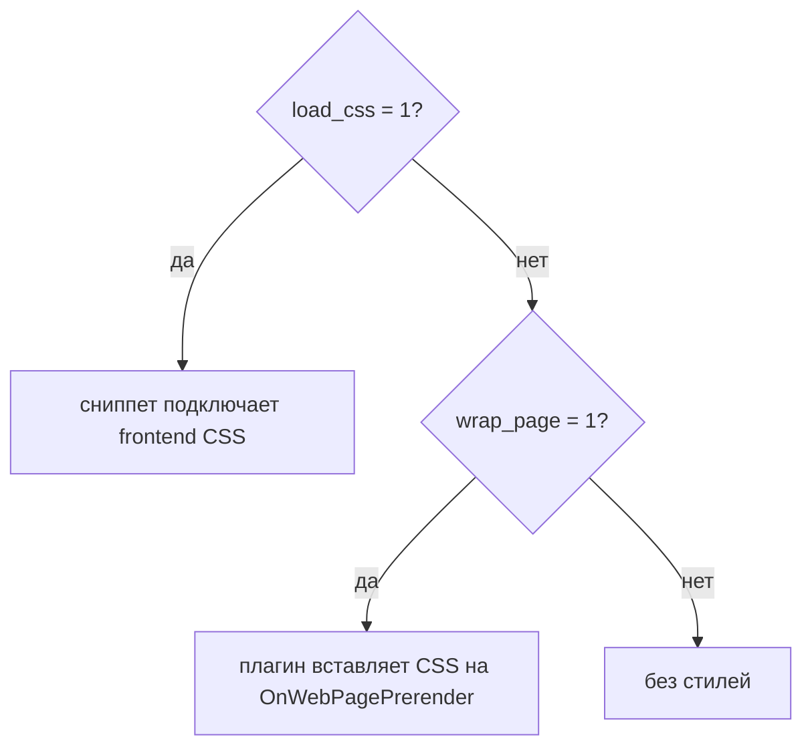
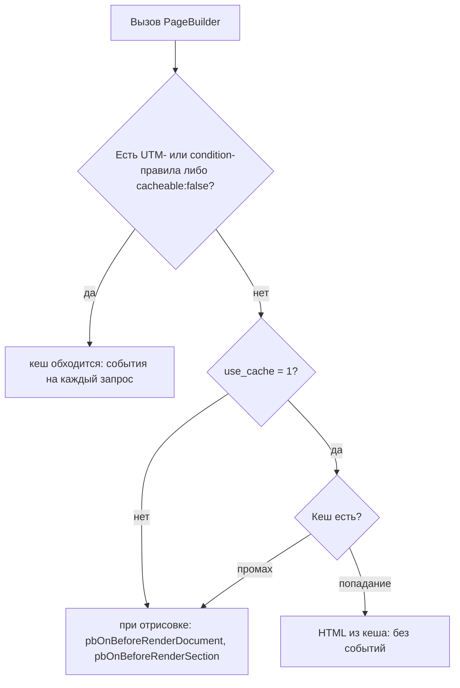

# Сниппет PageBuilder

Выводит **опубликованные** секции ресурса в HTML. Черновик на сайте не показывается: HTML-путь (`return_values=0`) отдаёт пустую строку, пока страницу не опубликовали. Секция выводится своим Fenom-chunk: Free — `pagebuilder_{key}`, Pro — `pagebuilderpro_{key}` (`data_table` → `pagebuilder_data_table`).

## Где вызывать

- Шаблон страницы, собранной во вкладке **Секции**.
- Поле content, если шаблон выводит `[[*content]]`.
- Только некэшированный вызов (`[[!PageBuilder]]`). Без `!` HTML может устареть после публикации секций.

## Зависимости

- Установленное дополнение **pagebuilder** (или **pagebuilderpro**).
- **pdoTools** 3.0+ для Fenom в чанках секций.
- Опубликованный snapshot секций на ресурсе.

Плагин pagebuilder на `pdoToolsOnFenomInit` регистрирует модификаторы Fenom: `utm_query`, `pb_href`, `pb_text`, `pb_image_src`, `pb_table`, `default`. В шаблонах они доступны без вызова сниппетов.

## Параметры

| Параметр | По умолчанию | Описание |
| --- | --- | --- |
| `resource_id` | `0` | ID ресурса. `0` = текущий |
| `section_types` | пусто | Ключи секций через запятую (`hero,gallery`). Пусто = все опубликованные |
| `return_values` | `0` | `1` → JSON `{ plainText, sections }` вместо HTML |
| `use_cache` | `1` | Кеш MODX для HTML. `0` при отладке событий отрисовки |
| `load_css` | из `pagebuilder_load_frontend_css` | Подключить `pagebuilder-sections.css` и связанные стили |
| `wrap_page` | как `load_css` | Обёртка `<div class="pb-page">` |
| `qa_css` | `0` | `1` → подключить `pagebuilder-qa.css`. Иначе CSS QA подключается сам, если на странице есть QA-секции |

В properties сниппета нет `load_css`, `wrap_page` и `qa_css`, но код их поддерживает; `qa_css` действует только при `load_css=1`. См. [Системные настройки → Связь со сниппетом](../settings#связь-со-сниппетом).

## Базовый вызов

::: code-group

```modx
[[!PageBuilder]]
```

```fenom
{'!PageBuilder' | snippet}
```

:::

## Фильтр по типам секций

Только hero и CTA:

::: code-group

```modx
[[!PageBuilder?
  &section_types=`hero,cta`
]]
```

```fenom
{'!PageBuilder' | snippet : [
  'section_types' => 'hero,cta'
]}
```

:::

## return_values

JSON для SEO-плагинов и headless-гибридов. Структура совпадает с полем `values` в [Public API](../public-api):

::: code-group

```modx
[[!PageBuilder? &return_values=`1`]]
```

```fenom
{'!PageBuilder' | snippet : ['return_values' => 1]}
```

:::

При `return_values=1` срабатывает событие `pbOnGetValues`, CSS и обёртка `pb-page` не подключаются. Источник данных — опубликованный snapshot, если `publishedRevision > 0`, иначе черновик.

## CSS и обёртка

При `load_css=1` сниппет подключает frontend CSS (см. [Дизайн-система](../design-system)). Стили Pro и commerce включаются при флаге `pro`.

Глобально отключить: `pagebuilder_load_frontend_css = 0`. На одном вызове: `` &load_css=`0` ``.

При `&wrap_page=1` плагин вставит CSS на `OnWebPagePrerender`, даже если `load_css=0`: он ищет в выводе `class="pb-page"` и на настройку не смотрит. Полностью без стилей — с `wrap_page=0`.



## Кеш HTML

Кеш MODX: partition `pagebuilder/{resourceId}`, ключ `render/{context}/{resourceId}/{publishedRevision}[/{typeHash}]`. Сбрасывается при publish/unpublish, ошибки отрисовки в кеш не попадают.

Кеш обходится полностью, если у документа есть UTM- или condition-правила секций либо секция с `cacheable:false`: на таком документе события вызываются на каждый запрос.

События `pbOnBeforeRenderDocument` и `pbOnBeforeRenderSection` вызываются при промахе кеша. Кеш отключается на один вызов:

::: code-group

```modx
[[!PageBuilder? &use_cache=`0`]]
```

```fenom
{'!PageBuilder' | snippet : ['use_cache' => 0]}
```

:::



## Пропуск секций

Секция с невыполненным `requires` (Pro, miniShop3) не попадает в HTML. Неизвестный тип логируется, блок пропускается.

## См. также

- [PageBuilderResource](PageBuilderResource)
- [Вывод на сайте](../frontend)
- [Public API](../public-api)
