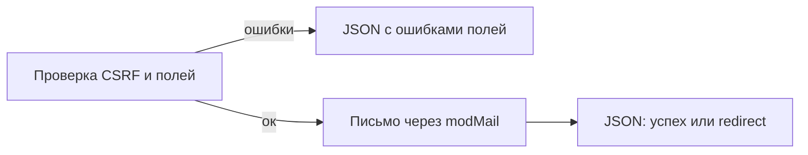

# Сниппет PageBuilderContactForm

Обработчик AJAX-отправки секции Pro [contact_form](../sections/contact_form). Чанк секции вызывает его через **FetchIt**. Из шаблона ресурса сниппет не вызывайте.

## Назначение

Валидация полей, письмо через `modMail`, JSON-ответ FetchIt (success / field errors / redirect).

## Где вызывается

Chunk `pagebuilderpro_contact_form` вызывает [PageBuilderFetchIt](PageBuilderFetchIt) со свойствами `snippet` = `PageBuilderContactForm` и `form` = `pagebuilderpro_contact_form_fields`.

## Параметры

Отдельных свойств для вызова из шаблона нет. POST формы:

| Поле | Назначение |
| --- | --- |
| `pb_form_key` | Ключ формы из данных секции. Пустой ключ — ошибка валидации |
| `pb_csrf` | Токен из скрытого поля чанка. Неверный или пустой — лексикон `pagebuilder_fe_form_validation_error` |
| поля repeater | Имена и правила из секции |
| `nospam` | Honeypot. Заполненное поле отвечает success, письмо не отправляется |
| `pageId` | Необязательный id ресурса со страницы формы |

`resource_id` страницы, где искать секцию:

| Источник | Приоритет |
| --- | --- |
| POST `pageId` | 1 |
| свойство `resource_id` в action FetchIt | 2 |
| текущий ресурс MODX | 3 |

### Ошибки

| Ситуация | Ответ |
| --- | --- |
| Секция с тем же `form_key` не найдена | `pagebuilder_fe_form_not_found` |
| Прямой вызов обработчика без сервиса FetchIt | JSON с `pagebuilder_fe_fetchit_unavailable` |
| Отрисовка формы без FetchIt | Чанк показывает `pagebuilder_fe_form_unavailable`, см. [PageBuilderFetchIt](PageBuilderFetchIt) |

## Зависимости

| Пакет | Зачем |
| --- | --- |
| pagebuilderpro | Секция `contact_form` |
| FetchIt | AJAX и ошибки в полях |

## См. также

- [Секция contact_form](../sections/contact_form)
- [PageBuilderQuiz](PageBuilderQuiz)
- [Обзор сниппетов](index)
