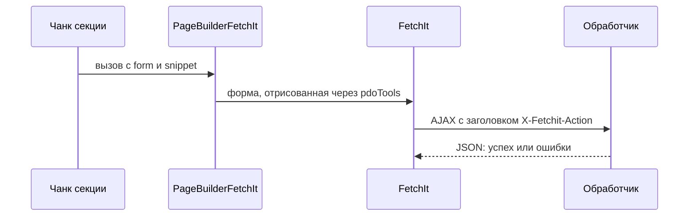

# Сниппет PageBuilderFetchIt

Обёртка над FetchIt для форм Pro. Чанки `pagebuilderpro_quiz`, `pagebuilderpro_contact_form` и `pagebuilderpro_form_builder` вызывают её некэшированно. Из шаблона ресурса сниппет не вызывайте.

В типичной сборке FetchIt для MODX 3 проверка `class_exists('pdoTools')` может не находить класс `ModxPro\PdoTools\Fetch`. Тогда форма остаётся сырым Fenom. `PageBuilderFetchIt` отрисовывает chunk формы через pdoTools и сам выставляет `method="post"` и `data-fetchit`. Поведение самого FetchIt зависит от установленной версии.

## Параметры

| Параметр | Назначение |
| --- | --- |
| `form` | Имя chunk с разметкой `<form>`. Пустое значение даёт лексикон `pagebuilder_fe_form_unavailable` |
| `snippet` | Обработчик, который FetchIt вызовет при отправке: `PageBuilderQuiz`, `PageBuilderContactForm` или `PageBuilderFormBuilder` |

Остальные свойства чанк передаёт в форму и обработчик. Если пакет FetchIt не установлен, обёртка возвращает лексикон `pagebuilder_fe_form_unavailable`. Прямой вызов обработчиков (`PageBuilderContactForm`, `PageBuilderQuiz`, `PageBuilderFormBuilder`) без сервиса FetchIt отвечает JSON с `pagebuilder_fe_fetchit_unavailable`.

Обработчик на странице выполняется только при AJAX-запросе с заголовком `X-Fetchit-Action` (его ставит JS FetchIt): обычный POST без JS его не вызывает.

## Зависимости

| Пакет | Зачем |
| --- | --- |
| pagebuilderpro | Сниппет и чанки форм |
| FetchIt | AJAX-отправка |
| pdoTools | Отрисовка Fenom |

## См. также

- [PageBuilderFormBuilder](PageBuilderFormBuilder)
- [PageBuilderQuiz](PageBuilderQuiz)
- [PageBuilderContactForm](PageBuilderContactForm)
