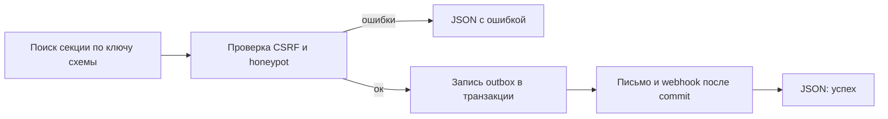

# Сниппет PageBuilderFormBuilder

Обработчик AJAX-отправки секции Pro [form_builder](../sections/form_builder). Чанк вызывает его через [PageBuilderFetchIt](PageBuilderFetchIt). Из шаблона ресурса сниппет не вызывайте.

## Назначение

1. Ищет секцию `form_builder` с тем же ключом схемы на странице ресурса: в опубликованном документе, если `publishedRevision > 0`, иначе в черновике.
2. Проверяет CSRF и honeypot.
3. Пишет outbox в транзакции, после commit отправляет письмо и webhook.

Submissions в БД не хранятся. Нужна capability `forms`.

## Где вызывается

Chunk `pagebuilderpro_form_builder` передаёт в `PageBuilderFetchIt` свойства `snippet` = `PageBuilderFormBuilder` и `form` = `pagebuilderpro_form_builder_fields`.

## Параметры

Отдельных свойств для вызова из шаблона нет. POST формы:

| Поле | Назначение |
| --- | --- |
| `pb_form_key` | Ключ схемы. Пустой ключ даёт ошибку валидации |
| `pb_csrf` | Токен. Неверный токен: `CSRF token is invalid.` |
| `nospam` | Honeypot. Заполненное поле отвечает success и письмо не шлёт |
| `pageId` | Необязательный id ресурса со страницы формы. Имеет приоритет над `resource_id` в свойствах FetchIt |

`resource_id` страницы, где искать секцию (тот же порядок, что у [PageBuilderContactForm](PageBuilderContactForm) и [PageBuilderQuiz](PageBuilderQuiz)):

| Источник | Приоритет |
| --- | --- |
| POST `pageId` | 1 |
| свойство `resource_id` в action FetchIt | 2 |
| текущий ресурс MODX | 3 |

### Ошибки

| Ситуация | Ответ |
| --- | --- |
| Нет секции или схемы | `pagebuilder_fe_form_not_found` |
| Нет capability `forms` | `pagebuilder_fe_form_unavailable` |
| Слишком частые запросы | `Too many requests` |
| Прямой вызов обработчика без [PageBuilderFetchIt](PageBuilderFetchIt) | JSON с `pagebuilder_fe_fetchit_unavailable` |
| Отрисовка формы без FetchIt | Чанк показывает `pagebuilder_fe_form_unavailable`, см. [PageBuilderFetchIt](PageBuilderFetchIt) |

## Зависимости

| Пакет | Зачем |
| --- | --- |
| pagebuilderpro | Секция `form_builder`, capability `forms` |
| FetchIt | AJAX и ошибки в полях |

## См. также

- [Секция form_builder](../sections/form_builder)
- [PageBuilderFetchIt](PageBuilderFetchIt)
- [Панель управления, Forms](../cmp#forms)
